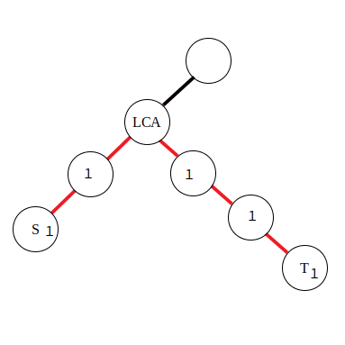

## 前缀和

前缀和是一种重要的预处理，能大大降低查询的时间复杂度。可以简单理解为“数列的前 $n$ 项的和”。[^note1]

C++ 标准库中实现了前缀和函数 [`std::partial_sum`](https://zh.cppreference.com/w/cpp/algorithm/partial_sum)，定义于头文件 `<numeric>` 中。

### 一维前缀和

> [!NOTE] **例题**
> 
> 有 $N$ 个的正整数放到数组 $A$ 里，现在要求一个新的数组 $B$，新数组的第 $i$ 个数 $B[i]$ 是原数组 $A$ 第 $0$ 到第 $i$ 个数的和。
> 
> 输入：
> 
> ```text
> 5
> 1 2 3 4 5
> ```
> 
> 输出：
>   
> ```text
> 1 3 6 10 15
> ```

> [!TIP] **解题思路**
> 
> 递推：`B[0] = A[0]`，对于 $i \ge 1$ 则 `B[i] = B[i-1] + A[i]`。

### 二维/多维前缀和

多维前缀和的普通求解方法几乎都是基于容斥原理。

> [!NOTE] **示例：一维前缀和扩展到二维前缀和**


> [!TIP]
> 
> 比如我们有这样一个矩阵 $a$，可以视为二维数组：
> 
> ```text
> 1 2 4 3
> 5 1 2 4
> 6 3 5 9
> ```
> 
> 我们定义一个矩阵 $\textit{sum}$ 使得 $\textit{sum}_{x,y} = \sum\limits_{i=1}^x \sum\limits_{j=1}^y a_{i,j}$，  
> 
> 那么这个矩阵长这样：
> 
> ```text
> 1  3  7  10
> 6  9  15 22
> 12 18 29 45
> ```
> 第一个问题就是递推求 $\textit{sum}$ 的过程，$\textit{sum}_{i,j} = \textit{sum}_{i - 1,j} + \textit{sum}_{i,j - 1} - \textit{sum}_{i - 1,j - 1} + a_{i,j}$。
> 
> 因为同时加了 $\textit{sum}_{i - 1,j}$ 和 $\textit{sum}_{i,j - 1}$，故重复了 $\textit{sum}_{i - 1,j - 1}$，减去。
> 
> 第二个问题就是如何应用，譬如求 $(x_1,y_1) - (x_2,y_2)$ 子矩阵的和。
> 
> 那么，根据类似的思考过程，易得答案为 $\textit{sum}_{x_2,y_2} - \textit{sum}_{x_1 - 1,y_2} - sum_{x_2,y_1 - 1} + sum_{x_1 - 1,y_1 - 1}$。

#### 例题

> [!NOTE] **[洛谷 P1387 最大正方形](https://www.luogu.com.cn/problem/P1387)**
> 
> 在一个 $n\times m$ 的只包含 $0$ 和 $1$ 的矩阵里找出一个不包含 $0$ 的最大正方形，输出边长。

> [!TIP] 类似思路 略


### 基于 DP 计算高维前缀和

基于容斥原理来计算高维前缀和的方法，其优点在于形式较为简单，无需特别记忆，但当维数升高时，其复杂度较高。这里介绍一种基于 [DP](dp/basic.md) 计算高维前缀和的方法。该方法即通常语境中所称的 **高维前缀和**。

设高维空间 $U$ 共有 $D$ 维，需要对 $f[\cdot]$ 求高维前缀和 $\text{sum}[\cdot]$。令 $\text{sum}[i][\text{state}]$ 表示同 $\text{state}$ 后 $D - i$ 维相同的所有点对于 $\text{state}$ 点高维前缀和的贡献。由定义可知 $\text{sum}[0][\text{state}] = f[\text{state}]$，以及 $\text{sum}[\text{state}] = \text{sum}[D][\text{state}]$。

其递推关系为 $\text{sum}[i][\text{state}] = \text{sum}[i - 1][\text{state}] + \text{sum}[i][\text{state}']$，其中 $\text{state}'$ 为第 $i$ 维恰好比 $\text{state}$ 少 $1$ 的点。该方法的复杂度为 $O(D \times |U|)$，其中 $|U|$ 为高维空间 $U$ 的大小。

一种实现的伪代码如下：

```python
for state
    sum[state] = f[state];
for i = 0;i <= D;i += 1
    for 以字典序从小到大枚举 state
        sum[state] += sum[state‘]
```

> [!TIP] **高维前缀和与二进制**
>
> 如果我们把 n 位二进制数看成一个n维坐标，如 $(10101)2$ 看成 $sum[1][0][1][0][1]$ ,此时维数比较高，高维前缀和的优势就很明显了。
> 
> 运用状态压缩的思想,二进制高维前缀和可以处理一些集合问题.因为一个二进制数可以看成一个集合，位运算与、或对应集合的并、交。
> 
> 我们考虑一个大小为 𝑛 的集合 𝑆 ,求 $f(S)=\sum_{T⊆S}𝑓(𝑇)$ ,那么按照高维前缀和的思想求 f ,可以写出如下代码
> 
> ```cpp
> for (int i = 0; i < n; i++)
>     for (int j = 0; j < (1 << n); j++)
>         if (j >> i & 1) f[j] += f[j ^ (1 << i)];
> ```

### 树上前缀和

设 $\textit{sum}_i$ 表示结点 $i$ 到根节点的权值总和。  
然后：

- 若是点权，$x,y$ 路径上的和为 $\textit{sum}_x + \textit{sum}_y - \textit{sum}_\textit{lca} - \textit{sum}_{\textit{fa}_\textit{lca}}$。
- 若是边权，$x,y$ 路径上的和为 $\textit{sum}_x + \textit{sum}_y - 2\cdot\textit{sum}_{lca}$。

LCA 的求法参见 [最近公共祖先](graph/lca.md)。

## 差分

差分是一种和前缀和相对的策略，可以当做是求和的逆运算。

这种策略的定义是令 $b_i=\begin{cases}a_i-a_{i-1}\,&i \in[2,n] \\ a_1\,&i=1\end{cases}$

简单性质：

- $a_i$ 的值是 $b_i$ 的前缀和，即 $a_n=\sum\limits_{i=1}^nb_i$
- 计算 $a_i$ 的前缀和 $sum=\sum\limits_{i=1}^na_i=\sum\limits_{i=1}^n\sum\limits_{j=1}^{i}b_j=\sum\limits_{i}^n(n-i+1)b_i$

它可以维护多次对序列的一个区间加上一个数，并在最后询问某一位的数或是多次询问某一位的数。注意修改操作一定要在查询操作之前。

> [!NOTE] **示例**
> 
> 譬如使 $[l,r]$ 中的每个数加上一个 $k$，即
> 
> $$
> b_l \leftarrow b_l + k,b_{r + 1} \leftarrow b_{r + 1} - k
> $$
> 
> 其中 $b_l+k=a_l+k-a_{l-1}$，$b_{r+1}-k=a_{r+1}-(a_r+k)$
> 
> 最后做一遍前缀和就好了。

C++ 标准库中实现了差分函数 [`std::adjacent_difference`](https://zh.cppreference.com/w/cpp/algorithm/adjacent_difference)，定义于头文件 `<numeric>` 中。

### 树上差分

树上差分可以理解为对树上的某一段路径进行差分操作，这里的路径可以类比一维数组的区间进行理解。例如在对树上的一些路径进行频繁操作，并且询问某条边或者某个点在经过操作后的值的时候，就可以运用树上差分思想了。

树上差分通常会结合 [树基础](graph/tree-basic.md) 和 [最近公共祖先](graph/lca.md) 来进行考察。树上差分又分为 **点差分** 与 **边差分**，在实现上会稍有不同。

#### 点差分

举例：对域树上的一些路径 $\delta(s_1,t_1), \delta(s_2,t_2), \delta(s_3,t_3)\dots$ 进行访问，问一条路径 $\delta(s,t)$ 上的点被访问的次数。

对于一次 $\delta(s,t)$ 的访问，需要找到 $s$ 与 $t$ 的公共祖先，然后对这条路径上的点进行访问（点的权值加一），若采用 DFS 算法对每个点进行访问，由于有太多的路径需要访问，时间上承受不了。这里进行差分操作：

$$
\begin{aligned}
&d_s\leftarrow d_s+1\\
&d_{lca}\leftarrow d_{\textit{lca}}-1\\
&d_t\leftarrow d_t+1\\
&d_{f(\textit{lca})}\leftarrow d_{f(\textit{lca})}-1\\
\end{aligned}
$$

其中 $f(x)$ 表示 $x$ 的父亲节点，$d_i$ 为点权 $a_i$ 的差分数组。


可以认为公式中的前两条是对蓝色方框内的路径进行操作，后两条是对红色方框内的路径进行操作。不妨令 $\textit{lca}$ 左侧的直系子节点为 $\textit{left}$。那么有 $d_{\textit{lca}}-1=a_{\textit{lca}}-(a_{\textit{left}}+1)$，$d_{f(\textit{lca})}-1=a_{f(\textit{lca})}-(a_{\textit{lca}}+1)$。可以发现实际上点差分的操作和上文一维数组的差分操作是类似的。

#### 边差分

若是对路径中的边进行访问，就需要采用边差分策略了，使用以下公式：

$$
\begin{aligned}
&d_s\leftarrow d_s+1\\
&d_t\leftarrow d_t+1\\
&d_{\textit{lca}}\leftarrow d_{\textit{lca}}-2\\
\end{aligned}
$$



由于在边上直接进行差分比较困难，所以将本来应当累加到红色边上的值向下移动到附近的点里，那么操作起来也就方便了。对于公式，有了点差分的理解基础后也不难推导，同样是对两段区间进行差分。

### 例题

> [!NOTE] **[洛谷 3128 最大流](https://www.luogu.com.cn/problem/P3128)**
> 
> FJ 给他的牛棚的 $N(2 \le N \le 50,000)$ 个隔间之间安装了 $N-1$ 根管道，隔间编号从 $1$ 到 $N$。所有隔间都被管道连通了。
> 
> FJ 有 $K(1 \le K \le 100,000)$ 条运输牛奶的路线，第 $i$ 条路线从隔间 $s_i$ 运输到隔间 $t_i$。一条运输路线会给它的两个端点处的隔间以及中间途径的所有隔间带来一个单位的运输压力，你需要计算压力最大的隔间的压力是多少。

> [!TIP] **解题思路**
> 
> 需要统计每个点经过了多少次，那么就用树上差分将每一次的路径上的点加一，可以很快得到每个点经过的次数。这里采用倍增法计算 LCA，最后对 DFS 遍历整棵树，在回溯时对差分数组求和就能求得答案了。

<details>
<summary>详细代码</summary>
<!-- tabs:start -->

##### **C++**

```cpp
```

##### **Python**

```python
```

<!-- tabs:end -->
</details>

<br>

## 习题

* * *

前缀和：

- [洛谷 U53525 前缀和（例题）](https://www.luogu.com.cn/problem/U53525)
- [洛谷 U69096 前缀和的逆](https://www.luogu.com.cn/problem/U69096)
- [AT2412 最大の和](https://vjudge.net/problem/AtCoder-joi2007ho_a#author=wuyudi)
- [「USACO16JAN」子共七 Subsequences Summing to Sevens](https://www.luogu.com.cn/problem/P3131)

* * *

二维/多维前缀和：

- [HDU 6514 Monitor](http://acm.hdu.edu.cn/showproblem.php?pid=6514)
- [洛谷 P1387 最大正方形](https://www.luogu.com.cn/problem/P1387)
- [「HNOI2003」激光炸弹](https://www.luogu.com.cn/problem/P2280)

* * *

树上前缀和：

- [LOJ 10134.Dis](https://loj.ac/problem/10134)
- [LOJ 2491. 求和](https://loj.ac/problem/2491)

* * *

差分：

- [树状数组 3：区间修改，区间查询](https://loj.ac/problem/132)
- [P3397 地毯](https://www.luogu.com.cn/problem/P3397)
- [「Poetize6」IncDec Sequence](https://www.luogu.com.cn/problem/P4552)

* * *

树上差分：

- [洛谷 3128 最大流](https://www.luogu.com.cn/problem/P3128)
- [JLOI2014 松鼠的新家](https://loj.ac/problem/2236)
- [NOIP2015 运输计划](http://uoj.ac/problem/150)
- [NOIP2016 天天爱跑步](http://uoj.ac/problem/261)

* * *


## 习题

### 一般前缀和

> [!NOTE] **[LeetCode 303. 区域和检索 - 数组不可变](https://leetcode-cn.com/problems/range-sum-query-immutable/)**
> 
> 题意: TODO

> [!TIP] **思路**
> 
> 

<details>
<summary>详细代码</summary>
<!-- tabs:start -->

##### **C++ 1**

```cpp
class NumArray {
public:
    vector<int> sum;
    NumArray(vector<int>& nums) {
        sum.push_back(0);
        for (int i = 1; i <= nums.size(); ++ i )
            sum.push_back(sum[i - 1] + nums[i - 1]);
    }
    
    int sumRange(int i, int j) {
        return sum[j + 1] - sum[i];
    }
};

/**
 * Your NumArray object will be instantiated and called as such:
 * NumArray* obj = new NumArray(nums);
 * int param_1 = obj->sumRange(i,j);
 */
```

##### **C++ 2**

```cpp
class NumArray {
public:
    vector<int> s;

    NumArray(vector<int>& nums) {
        s.resize(nums.size() + 1);
        for (int i = 1; i <= nums.size(); i ++ ) s[i] = s[i - 1] + nums[i - 1];
    }

    int sumRange(int i, int j) {
        ++i, ++j;
        return s[j] - s[i - 1];
    }
};
```

##### **Python**

```python

```

<!-- tabs:end -->
</details>

<br>

* * *

> [!NOTE] **[LeetCode 304. 二维区域和检索 - 矩阵不可变](https://leetcode-cn.com/problems/range-sum-query-2d-immutable/)**
> 
> 题意: TODO

> [!TIP] **思路**
> 
> 

<details>
<summary>详细代码</summary>
<!-- tabs:start -->

##### **C++**

```cpp
class NumMatrix {
public:
    vector<vector<int>> s;

    NumMatrix(vector<vector<int>>& matrix) {
        if (matrix.empty() || matrix[0].empty()) return;
        s = vector<vector<int>>(matrix.size() + 1, vector<int>(matrix[0].size() + 1));
        for (int i = 1; i <= matrix.size(); i ++ )
            for (int j = 1; j <= matrix[0].size(); j ++ )
                s[i][j] = s[i - 1][j] + s[i][j - 1] - s[i - 1][j - 1] + matrix[i - 1][j - 1];
    }

    int sumRegion(int x1, int y1, int x2, int y2) {
        ++x1, ++y1, ++x2, ++y2;
        return s[x2][y2] - s[x1 - 1][y2] - s[x2][y1 - 1] + s[x1 - 1][y1 - 1];
    }
};

/**
 * Your NumMatrix object will be instantiated and called as such:
 * NumMatrix* obj = new NumMatrix(matrix);
 * int param_1 = obj->sumRegion(row1,col1,row2,col2);
 */
```

##### **Python**

```python

```

<!-- tabs:end -->
</details>

<br>

* * *

> [!NOTE] **[LeetCode 307. 区域和检索 - 数组可修改](https://leetcode-cn.com/problems/range-sum-query-mutable/)**
> 
> 题意: TODO

> [!TIP] **思路**
>
> 1. 树状数组模板题，树状数组是特殊的前缀和数组，可以维护原数组每次变化的增量。
> 2. 树状数组在每次修改时，并不总是修改 i 之后的所有点，而是根据 lowbit 操作依次向后修改影响到的点。
> 3. 同样，在查询时，也是根据 lowbit 序列向前统计前缀和，两次前缀和的差值就是区间和。
> 4. 注意，树状数组的下标必须从 1 开始。
> 5. 对于此题，由于题目每次是更新值，并不是更新增量，故需要用原数组记录每次更新后的点的值。
> 6. 为了节约初始化的时间，仍需要一个普通前缀和数组记录初始数组的每个点的前缀和，树状数组用来维护修改增量的前缀和。

<details>
<summary>详细代码</summary>
<!-- tabs:start -->

##### **C++**

```cpp
class NumArray {
public:
    int n;
    vector<int> tr, nums;
    int lowbit(int x) {
        return x & -x;
    }
    int query(int x) {
        int res = 0;
        for (int i = x; i; i -= lowbit(i))
            res += tr[i];
        return res;
    }
    void add(int x, int v) {
        for (int i = x; i <= n; i += lowbit(i))
            tr[i] += v;
    }

    NumArray(vector<int>& nums) {
        this->nums = nums;
        n = nums.size();
        tr.resize(n + 1);
        for (int i = 1; i <= n; ++ i ) {
            // Op 1:
            // tr[i] = nums[i - 1];
            // for (int j = i - 1; j > i - lowbit(i); j -= lowbit(j))
            //     tr[i] += tr[j];

            // Op 2:
            tr[i] += nums[i - 1];
            if (i + lowbit(i) <= n)
                tr[i + lowbit(i)] += tr[i]; // ATTENTION: tr[i] instead of nums[i]
        }
    }
    
    void update(int index, int val) {
        add(index + 1, val - nums[index]);
        nums[index] = val;
    }
    
    int sumRange(int left, int right) {
        return query(right + 1) - query(left);
    }
};

/**
 * Your NumArray object will be instantiated and called as such:
 * NumArray* obj = new NumArray(nums);
 * obj->update(index,val);
 * int param_2 = obj->sumRange(left,right);
 */

/**
 * Your NumArray object will be instantiated and called as such:
 * NumArray* obj = new NumArray(nums);
 * obj->update(i,val);
 * int param_2 = obj->sumRange(i,j);
 */
```

##### **Python**

```python

```

<!-- tabs:end -->
</details>

<br>

* * *

> [!NOTE] **[LeetCode 437. 路径总和 III](https://leetcode-cn.com/problems/path-sum-iii/)**
> 
> 题意: TODO

> [!TIP] **思路**
> 
> 

<details>
<summary>详细代码</summary>
<!-- tabs:start -->

##### **C++**

```cpp
class Solution {
public:
    int pathSum(TreeNode* root, int sum) {
        return root ? helper(root, sum) + pathSum(root->left, sum) + pathSum(root->right, sum) : 0;
    }
    int helper(TreeNode* root, int sum) {
        if(!root) return 0;
        int count = root->val == sum ? 1 : 0;
        count += helper(root->left, sum - root->val);
        count += helper(root->right, sum - root->val);
        return count;
    }
};
```

##### **C++ yxc**

```cpp
// yxc
class Solution {
public:
    unordered_map<int, int> cnt;
    int res = 0;

    int pathSum(TreeNode* root, int sum) {
        cnt[0] ++ ;
        dfs(root, sum, 0);
        return res;
    }

    void dfs(TreeNode* root, int sum, int cur) {
        if (!root) return;
        cur += root->val;
        res += cnt[cur - sum];
        cnt[cur] ++ ;
        dfs(root->left, sum, cur), dfs(root->right, sum, cur);
        cnt[cur] -- ;
    }
};
```
##### **Python**

```python
# 前缀和的应用；
# 用哈希表维护 从根节点 到 当前节点路径里 每个前缀和 出现的次数。（这个前缀和 指的是 根节点到当前这个点的路径所有点的 前缀和）
# 往下递归时，把当前这个点放入哈希表里；当从这个点回溯的时候，把这个点从哈希表弹出就可以了。
import collections
class Solution:
    def pathSum(self, root: TreeNode, target: int) -> int:
        self.res = 0
        my_dic = collections.defaultdict(int)
    
        def dfs(root, cur):
            if not root:return 
            cur += root.val
            self.res += my_dic[cur - target]
            my_dic[cur] += 1
            dfs(root.left, cur)
            dfs(root.right, cur)
            my_dic[cur] -= 1
        
        my_dic[0] = 1   # 踩坑！作为一个哨兵
        dfs(root, 0)
        return self.res
```

<!-- tabs:end -->
</details>

<br>

* * *

### 前缀和优化

> [!NOTE] **[Luogu [NOIP2015 普及组] 求和](https://www.luogu.com.cn/problem/P2671)**
> 
> 题意: TODO

> [!TIP] **思路**
>
> 思维
> 
> **经验：O(n^2) 公式转化利用前缀和达到 O(n)**
>
> 核心：奇偶性
>
> 易于想到x z颜色相同且同奇偶，且每个三元组其实是 `中间坐标的两倍*左右和`
>
> 显然有O(n^2)做法但会超时
>
> **考虑先按颜色分组，由【同奇偶】的性质每组内再按奇偶分组**
>
> 考虑最终分组后的单个组（总个数为k），组内需如下统计：
>
> ```
> [第i个数的下标用x[i]指代 值用y[i]指代]
> for (int i = 0; i < k; ++ i )
>     for (int j = i + 1; j < k; ++ j )
>         t += (x[i] + x[j]) * (y[i] + y[j]);
> ```
>
> 
>
> 转化（提取x[i]）：
>
> ```
> t = x[1] * ((y[1] + y[2]) + (y[1] + y[3]) + (y[1] + y[4]) + ... + (y[1] + y[k]))
>   + x[2] * ((y[2] + y[1]) + (y[2] + y[3]) + (y[2] + y[4]) + ... + (y[2] + y[k]))
>   + ...
>   + x[k-1] * ((y[k-1] + y[1]) +                                 + (y[k-1] + y[k]))
>   + x[k] * ((y[k] + y[1]) +                                     + (y[k] + y[k-1]))
> ```
>
> 也即（注意k-2）：
>
> ```
> t = x[1] * (y[1] * (k-2) + y[1] + y[2] + ... + y[k])
>   + x[2] * (y[2] * (k-2) + y[1] + y[2] + ... + y[k])
>   + ...
>   + x[k-1] * (y[k-1] * (k-2) + y[1] + y[2] + ... + y[k])
>   + x[k] * (y[k] * (k-2) + y[1] + y[2] + ... + y[k])
> ```
>
> 则 可线性求解
>
> 进一步提取公因式：
>
> ```
> t = (k-2) * sum{(x[i] * y[i])} + sum{yi} * sum{xi}
> 因为 sum{(x[i] * y[i])} 的部分只与第i项相关 所以可以
> 以 for (int i = 1; i <= n; ++ i ) 的形式单独累加每一个
> 因而有luogu大多数题解的代码实现如：
> https://www.luogu.com.cn/problem/solution/P2671
> ```

<details>
<summary>详细代码</summary>
<!-- tabs:start -->

##### **C++**

```cpp
#include <bits/stdc++.h>
using namespace std;

using LL = long long;
const int N = 1e5 + 10, MOD = 10007;

int n, m;
int a[N], c[N];
vector<int> g[N][2];  // 分组

int main() {
    ios::sync_with_stdio(false);
    cin.tie(nullptr);
    cout.tie(nullptr);
    
    cin >> n >> m;
    for (int i = 1; i <= n; ++ i )
        cin >> a[i];
    for (int i = 1; i <= n; ++ i )
        cin >> c[i], g[c[i]][i % 2].push_back(i);
    
    int res = 0;
    for (int i = 1; i <= m; ++ i )
        for (int j = 0; j < 2; ++ j ) {
            int sz = g[i][j].size();
            int s = 0, sx = 0, sy = 0;
            for (int k = 0; k < sz; ++ k ) {
                int id = g[i][j][k];
                s = (s + (LL)id * a[id] % MOD) % MOD;
                sx = (sx + a[id]) % MOD;
                sy = (sy + id) % MOD;
            }
            res = (res + (LL)(sz - 2) * s % MOD + sx * sy % MOD) % MOD;
        }
    cout << res << endl;
    
    return 0;
}
```

##### **Python**

```python

```

<!-- tabs:end -->
</details>

<br>

* * *

> [!NOTE] **[LeetCode 2281. 巫师的总力量和](https://leetcode.cn/problems/sum-of-total-strength-of-wizards/)** [TAG]
> 
> 题意: TODO

> [!TIP] **思路**
> 
> 考虑当前值作为最小值，有哪些区间受影响
> 
> 显然有单调栈求左右边界，**注意本题数值可能重复，则需要去重（一侧严格小于，另一侧小于等于）**
> 
> 随后对区间内的所有数组求和即可
> 
> **问题在于时间复杂度，显然可以【公式转化，使用前缀和的前缀和来 $O(1)$ 查询】**
> 
> **深刻理解 重复做**
> 
> TODO: 整理公式转化过程

<details>
<summary>详细代码</summary>
<!-- tabs:start -->

##### **C++**

```cpp
class Solution {
public:
    // https://leetcode.cn/problems/sum-of-total-strength-of-wizards/solution/ji-suan-mei-ge-shu-zi-zuo-wei-zui-xiao-z-3jvr/
    using LL = long long;
    const static int N = 1e5 + 10, MOD = 1e9 + 7;
    
    int n;
    int stk[N], top;
    int l[N], r[N];
    LL s[N], ss[N]; // 原数组前缀和，以及该前缀和的前缀和
    
    int totalStrength(vector<int>& a) {
        n = a.size();
        
        // 求右侧【严格小于】当前值的位置
        {
            top = 0;
            for (int i = 1; i <= n; ++ i ) {
                while (top && a[stk[top - 1] - 1] > a[i - 1])
                    r[stk[top - 1]] = i, top -- ;
                stk[top ++ ] = i;
            }
            while (top)
                r[stk[top - 1]] = n + 1, top -- ;
        }
        // 求左侧【小于等于】当前值的位置
        {
            top = 0;
            for (int i = n; i >= 1; -- i ) {
                while (top && a[stk[top - 1] - 1] >= a[i - 1])  // ATTENTION >= 去重 其实改任意一侧都可以
                    l[stk[top - 1]] = i, top -- ;
                stk[top ++ ] = i;
            }
            while (top)
                l[stk[top - 1]] = 0, top -- ;
        }
        
        memset(s, 0, sizeof s), memset(ss, 0, sizeof ss);
        for (int i = 1; i <= n; ++ i )
            s[i] = (s[i - 1] + a[i - 1]) % MOD;
        for (int i = 1; i <= n; ++ i )
            ss[i] = (ss[i - 1] + s[i]) % MOD;
        
        LL res = 0;
        for (int i = 1; i <= n; ++ i ) {
            int lv = l[i], rv = r[i];
            LL t = a[i - 1];
            
            // cout << " i = " << i << " lv = " << lv << " rv = " << rv << endl;
            // [lv+1,i], [i,rv-1]
            // 以i为右边界起始点，则：
            // - 每个右边界都被使用 i-lv 次，共计 ss[rv-1]-ss[i-1],
            // - 每个左边界都被使用 rv-i 次，共计 ss[i-1]-ss[lv-1]               // ATTENTION ss[lv-1]
            LL tot = (LL)(i - lv) * (ss[rv - 1] - ss[i - 1]) % MOD - (rv - i) * (ss[i - 1] - (lv ? ss[lv - 1] : 0)) % MOD;
            // cout << " i = " << i << " tot = " << tot << endl;
            // cout << " ... " << (i - lv) << " " << ss[rv-1]-ss[i-1] << " " << rv-i << " " << ss[i-1]-ss[lv] << endl;
            
            res = (res + (tot + MOD) % MOD * t % MOD) % MOD;
            
            /*
            for (int j = lv + 1; j <= i; ++ j )
                for (int k = i; k <= rv - 1; ++ k )
                    res = (res + (s[k] - s[j - 1] + MOD) % MOD * t % MOD) % MOD;
            */
        }
        return res;
    }
};
```

##### **Python**

```python

```

<!-- tabs:end -->
</details>

<br>

* * *

> [!NOTE] **[LeetCode 629. K个逆序对数组](https://leetcode-cn.com/problems/k-inverse-pairs-array/)**
> 
> 题意: TODO

> [!TIP] **思路**
> 
> 状态定义思想 **我们假定每次放的都是最大的一个**
> 
> ==》和某次周赛的假定操作一致

<details>
<summary>详细代码</summary>
<!-- tabs:start -->

##### **C++**

```cpp
class Solution {
public:
    const int mod = 1e9 + 7;
    int kInversePairs(int n, int k) {
        // 用了前i个数字 产生了j个逆序对的方案数
        vector<vector<int>> f(n + 1, vector<int>(k + 1));
        f[1][0] = 1;
        // f[i][j] = f[i-1][j] + f[i-1][j-1] + ... + f[i-1][j-(i-1)]
        for (int i = 2; i <= n; ++ i ) {
            long long s = 0;
            for (int j = 0; j <= k; ++ j ) {
                s += f[i - 1][j];
                if (j - i >= 0) s -= f[i - 1][j - i];
                f[i][j] = s % mod;
            }
        }
        return (f[n][k] + mod) % mod;
    }
};
```

##### **Python**

```python

```

<!-- tabs:end -->
</details>

<br>

* * *

> [!NOTE] **[LeetCode 1895. 最大的幻方](https://leetcode-cn.com/problems/largest-magic-square/)**
> 
> 题意: TODO

> [!TIP] **思路**
> 
> 前缀和处理 遍历即可
> 
> 暴力也可过

<details>
<summary>详细代码</summary>
<!-- tabs:start -->

##### **C++**

```cpp
class Solution {
public:
    using LL = long long;
    vector<vector<int>> g;
    int n, m;
    vector<vector<LL>> sr, sd, sadd, ssub;  // i + j, i - j + m
    
    void init() {
        sr = sd = vector<vector<LL>>(n + 1, vector<LL>(m + 1));
        sadd = vector<vector<LL>>(n + m + 1, vector<LL>(n + 1));
        ssub = vector<vector<LL>>(n + m + 1, vector<LL>(m + 1));
        for (int i = 1; i <= n; ++ i )
            for (int j = 1; j <= m; ++ j ) {
                LL v = g[i - 1][j - 1];
                sr[i][j] = sr[i][j - 1] + v;
                sd[i][j] = sd[i - 1][j] + v;
                sadd[i + j][i] = sadd[i + j][i - 1] + v;
                ssub[i - j + m][j] = ssub[i - j + m][j - 1] + v;
            }
    }
    
    bool f(int x, int y, int k) {
        int l = y - k, u = x - k;
        int v = sr[x][y] - sr[x][l];
        for (int i = x - 1; i > u; -- i )
            if (sr[i][y] - sr[i][l] != v)
                return false;
                
        for (int j = y; j > l; -- j )
            if (sd[x][j] - sd[u][j] != v)
                return false;
                
        if (sadd[x + l + 1][x] - sadd[u + y + 1][u] != v ||
            ssub[x - y + m][y] - ssub[u - l + m][l] != v)
            return false;
        return true;
    }
    
    bool check(int k) {
        for (int i = k; i <= n; ++ i )
            for (int j = k; j <= m; ++ j )
                if (f(i, j, k))
                    return true;
        return false;
    }
    
    int largestMagicSquare(vector<vector<int>>& grid) {
        this->g = grid;
        n = g.size(), m = g[0].size();
        init();
        
        for (int k = min(n, m); k; -- k )
            if (check(k))
                return k;
        return 0;   // never
    }
};
```

##### **C++ 暴力**

```cpp
// 暴力
typedef long long LL;

class Solution {
public:
    bool check(vector<vector<int>>& g, int a, int b, int c, int d) {
        LL sum = 0;
        for (int i = a; i <= c; i ++ ) {
            LL s = 0;
            for (int j = b; j <= d; j ++ ) s += g[i][j];
            if (sum && sum != s) return false;
            sum = s;
        }

        for (int i = b; i <= d; i ++ ) {
            LL s = 0;
            for (int j = a; j <= c; j ++ ) s += g[j][i];
            if (sum != s) return false;
        }

        LL s = 0;
        for (int i = a, j = b; i <= c; i ++, j ++ )
            s += g[i][j];
        if (s != sum) return false;

        s = 0;
        for (int i = a, j = d; i <= c; i ++, j -- )
            s += g[i][j];
        return s == sum;
    }

    int largestMagicSquare(vector<vector<int>>& g) {
        int n = g.size(), m = g[0].size();
        for (int k = min(n, m); k; k -- )
            for (int i = 0; i + k - 1 < n; i ++ )
                for (int j = 0; j + k - 1 < m; j ++ )
                    if (check(g, i, j, i + k - 1, j + k - 1))
                        return k;
        return 1;
    }
};
```

##### **Python**

```python

```

<!-- tabs:end -->
</details>

<br>

* * *

### 前缀和维护

> [!NOTE] **[Luogu 最大加权矩形](https://www.luogu.com.cn/problem/P1719)**
> 
> 题意: TODO

> [!TIP] **思路**
>
> [](https://camo.githubusercontent.com/6b106419f0d48329126a7c3efde9328cf291e6d8c1fd976c689f5938059a7a72/68747470733a2f2f63646e2e616377696e672e636f6d2f6d656469612f61727469636c652f696d6167652f323031392f30392f30332f373431325f356466653639613463652d7a312e706e67)
>
> [](https://camo.githubusercontent.com/339966d53a026964d12ebe1489b1c200318348e5c45930072858f6068f806df2/68747470733a2f2f63646e2e616377696e672e636f6d2f6d656469612f61727469636c652f696d6167652f323031392f30392f30332f373431325f363736643435653663652d7a322e706e67)
>
> > https://www.acwing.com/solution/content/4127/

<details>
<summary>详细代码</summary>
<!-- tabs:start -->

##### **C++**

```cpp
#include <bits/stdc++.h>
using namespace std;

const int N = 125;

int n;
int s[N][N];

int main() {
    cin >> n;
    for (int i = 1; i <= n; ++ i )
        for (int j = 1; j <= n; ++ j )
            cin >> s[i][j], s[i][j] += s[i - 1][j];
    
    int res = -2e9;
    for (int i = 1; i <= n; ++ i )
        for (int j = i; j <= n; ++ j ) {
            // s[j][k] - s[i - 1][k] 作为一维
            // 来执行最大子序和过程
            int sum = 0;
            for (int k = 1; k <= n; ++ k ) {
                sum = max(sum, 0) + s[j][k] - s[i - 1][k];
                res = max(res, sum);
            }
        }
    
    cout << res << endl;
    
    return 0;
}
```

##### **Python**

```python

```

<!-- tabs:end -->
</details>

<br>

* * *

> [!NOTE] **[LeetCode 363. 矩形区域不超过 K 的最大数值和](https://leetcode-cn.com/problems/max-sum-of-rectangle-no-larger-than-k/)**
> 
> 题意: TODO

> [!TIP] **思路**
> 
> 

<details>
<summary>详细代码</summary>
<!-- tabs:start -->

##### **C++**

```cpp
class Solution {
public:
    vector<vector<int>> s;
    int get(int x1, int y1, int x2, int y2) {
        return s[x2][y2] - s[x1 - 1][y2] - s[x2][y1 - 1] + s[x1 - 1][y1 - 1];
    }
    int maxSumSubmatrix(vector<vector<int>>& matrix, int K) {
        int n = matrix.size(), m = matrix[0].size();
        s = vector<vector<int>>(n + 1, vector<int>(m + 1));
        for (int i = 1; i <= n; ++ i )
            for (int j = 1; j <= m; ++ j )
                s[i][j] = s[i - 1][j] + s[i][j - 1] - s[i - 1][j - 1] + matrix[i - 1][j - 1];
        int res = INT_MIN;
        for (int l = 1; l <= m; ++ l )
            for (int r = l; r <= m; ++ r ) {
                set<int> S;
                S.insert(0);
                for (int k = 1; k <= n; ++ k ) {
                    int si = get(1, l, k, r);
                    // *it 得到【当前固定左右边界时】的某前缀和的值
                    auto it = S.lower_bound(si - K);
                    if (it != S.end()) res = max(res, si - *it);
                    S.insert(si);
                }
            }
        return res;
    }
};
```

##### **Python**

```python

```

<!-- tabs:end -->
</details>

<br>

* * *

> [!NOTE] **[LeetCode 1074. 元素和为目标值的子矩阵数量](https://leetcode.cn/problems/number-of-submatrices-that-sum-to-target/)**
> 
> 题意: TODO

> [!TIP] **思路**
> 
> 固定左右边界 随后根据预处理的前缀和计算个数即可

<details>
<summary>详细代码</summary>
<!-- tabs:start -->

##### **C++**

```cpp
class Solution {
public:
    const static int N = 110;

    int n, m;
    int s[N][N];

    int numSubmatrixSumTarget(vector<vector<int>>& matrix, int target) {
        this->n = matrix.size(), this->m = matrix[0].size();

        for (int i = 1; i <= n; ++ i )
            for (int j = 1; j <= m; ++ j )
                s[i][j] = s[i - 1][j] + s[i][j - 1] - s[i - 1][j - 1] + matrix[i - 1][j - 1];
        
        int res = 0;
        for (int l = 1; l <= n; ++ l )
            for (int r = l; r <= n; ++ r ) {
                unordered_map<int, int> hash;
                hash[0] = 1;
                for (int k = 1; k <= m; ++ k ) {
                    int x = s[r][k] - s[l - 1][k];
                    int y = x - target;
                    res += hash[y];
                    hash[x] ++ ;
                }
            }
        return res;
    }
};
```

##### **Python**

```python

```

<!-- tabs:end -->
</details>

<br>

* * *

> [!NOTE] **[LeetCode 1139. 最大的以 1 为边界的正方形](https://leetcode-cn.com/problems/largest-1-bordered-square/)**
> 
> 题意: TODO

> [!TIP] **思路**
> 
> 显然前缀和 略

<details>
<summary>详细代码</summary>
<!-- tabs:start -->

##### **C++**

```cpp
class Solution {
public:
    const static int N = 110;
    
    int n, m;
    int sl[N][N], su[N][N];
    
    bool check(int k) {
        for (int i = k; i <= n; ++ i )
            for (int j = k; j <= m; ++ j ) {
                int dv = sl[i][j], rv = su[i][j];
                int uv = sl[i - k + 1][j], lv = su[i][j - k + 1];
                if (dv >= k && rv >= k && uv >= k && lv >= k)
                    return true;
            }
        return false;
    }
    
    int largest1BorderedSquare(vector<vector<int>>& grid) {
        this->n = grid.size(), this->m = grid[0].size();
        memset(sl, 0, sizeof sl);
        memset(su, 0, sizeof su);
        for (int i = 1; i <= n; ++ i )
            for (int j = 1; j <= m; ++ j )
                if (grid[i - 1][j - 1])
                    sl[i][j] = sl[i][j - 1] + 1;
                else
                    sl[i][j] = 0;
        for (int j = 1; j <= m; ++ j )
            for (int i = 1; i <= n; ++ i )
                if (grid[i - 1][j - 1])
                    su[i][j] = su[i - 1][j] + 1;
                else
                    su[i][j] = 0;
        
        for (int k = min(n, m); k; -- k )
            if (check(k))
                return k * k;
        return 0;
    }
};
```

##### **Python**

```python

```

<!-- tabs:end -->
</details>

<br>

* * *

> [!NOTE] **[LeetCode 1248. 统计「优美子数组」](https://leetcode-cn.com/problems/count-number-of-nice-subarrays/)**
> 
> 题意: TODO

> [!TIP] **思路**
> 
> 前缀和统计

<details>
<summary>详细代码</summary>
<!-- tabs:start -->

##### **C++**

```cpp
class Solution {
public:
    int numberOfSubarrays(vector<int>& nums, int k) {
        int n = nums.size(), res = 0, odd = 0;
        vector<int> c(n + 1);
        c[0] = 1;
        for (int i = 0; i < n; ++i) {
            odd += (nums[i] & 1);
            if (odd >= k) res += c[odd - k];
            ++c[odd];
        }
        return res;
    }
};
```

##### **Python**

```python

```

<!-- tabs:end -->
</details>

<br>

* * *

> [!NOTE] **[LeetCode 1658. 将 x 减到 0 的最小操作数](https://leetcode-cn.com/problems/minimum-operations-to-reduce-x-to-zero/)**
> 
> 题意: TODO

> [!TIP] **思路**
> 
> 前缀和 TLE
> 
> 反向求和为 `tot - x` 的最长子数组

<details>
<summary>详细代码</summary>
<!-- tabs:start -->

##### **C++ 前缀和 TLE**

```cpp
// 最后一个用例超时 88 / 88
class Solution {
public:
    typedef long long LL;
    int minOperations(vector<int>& nums, int x) {
        int n = nums.size(), minv = INT_MAX;
        for (int i = 0; i < n; ++ i ) nums.push_back(nums[i]), minv = min(minv, nums[i]);
        if (minv > x) return -1;
        vector<LL> psum(2 * n + 1);
        unordered_map<LL, int> hash;
        hash[0] = 0;
        int res = INT_MAX;
        for (int i = 1; i <= 2 * n; ++ i ) {
            psum[i] = psum[i - 1] + nums[i - 1];
            if (i >= n) {
                LL tar = psum[i] - x;
                if (hash.count(tar) && hash[tar] + n >= i && hash[tar] <= n)
                    res = min(res, i - hash[tar]);
            }
            hash[psum[i]] = i;
        }
        return res == INT_MAX ? -1 : res;
    }
};
```

##### **C++**

```cpp
class Solution {
public:
    int minOperations(vector<int>& nums, int x) {
        int n = nums.size(), tot = 0;
        for (auto v : nums) tot += v;
        if (tot < x) return -1;
        // 区间为空 特判
        if (tot == x) return n;
        
        unordered_map<int, int> hash;
        hash[0] = 0;
        int res = INT_MAX, sum = 0;
        for (int i = 1; i <= n; ++ i ) {
            sum += nums[i - 1];
            // sum - tar = tot - x
            int tar = x + sum - tot;
            if (hash.count(tar)) res = min(res, n - i + hash[tar]);
            if (!hash.count(sum)) hash[sum] = i;
        }
        return res == INT_MAX ? -1 : res;
    }
};
```

##### **Python**

```python

```

<!-- tabs:end -->
</details>

<br>

* * *

> [!NOTE] **[Codeforces D. A and B and Interesting Substrings](https://codeforces.com/problemset/problem/519/D)**
> 
> 题意: TODO

> [!TIP] **思路**
> 
> 前缀和应用 思维题

<details>
<summary>详细代码</summary>
<!-- tabs:start -->

##### **C++**

```cpp
// Problem: D. A and B and Interesting Substrings
// Contest: Codeforces - Codeforces Round #294 (Div. 2)
// URL: https://codeforces.com/problemset/problem/519/D
// Memory Limit: 256 MB
// Time Limit: 2000 ms

#include <bits/stdc++.h>
using namespace std;

// 最初想的是滑动窗口 但显然不符合性质
// 考虑前缀和维护 hash累计

using LL = long long;
using PLL = pair<LL, LL>;
const int N = 100010;

int w[30];
LL s[N];
map<PLL, LL> mp;

int main() {
    for (int i = 0; i < 26; ++i)
        cin >> w[i];

    string str;
    cin >> str;
    int n = str.size();

    LL s = 0, res = 0;
    for (int i = 0; i < n; ++i) {
        res += mp[{s, str[i]}];
        s += w[str[i] - 'a'];
        mp[{s, str[i]}]++;
    }

    cout << res << endl;

    return 0;
}
```

##### **Python**

```python

```

<!-- tabs:end -->
</details>

<br>

* * *

> [!NOTE] **[Codeforces Password](http://codeforces.com/problemset/problem/126/B)**
> 
> 题意: 
> 
> 前缀和 细节很多

> [!TIP] **思路**
> 
> -   正序防超时
> 
> -   LL 防溢出

<details>
<summary>详细代码</summary>
<!-- tabs:start -->

##### **C++**

```cpp
// Problem: B. Password
// Contest: Codeforces - Codeforces Beta Round #93 (Div. 1 Only)
// URL: https://codeforces.com/problemset/problem/126/B
// Memory Limit: 256 MB
// Time Limit: 2000 ms

#include <bits/stdc++.h>
using namespace std;

using LL = long long;
const static int N = 1e6 + 10;

int n;
string s;

vector<int> z_func() {
    vector<int> z(n);
    for (int i = 1, l = 0, r = 0; i < n; ++i) {
        if (i <= r && z[i - l] < r - i + 1)
            z[i] = z[i - l];
        else {
            z[i] = max(0, r - i + 1);
            while (i + z[i] < n && s[z[i]] == s[i + z[i]])
                z[i]++;
        }
        if (i + z[i] - 1 > r)
            l = i, r = i + z[i] - 1;
    }
    return z;
}

int main() {
    ios::sync_with_stdio(false);
    cin.tie(nullptr);
    cout.tie(nullptr);

    cin >> s;
    n = s.size();
    auto z = z_func();

    static LL sum[N];  // ATTENTION: LL 防止溢出
    memset(sum, 0, sizeof sum);
    for (int i = 0; i < n; ++i)
        sum[z[i]]++;  // [0, z[i]] 全部+1
    // 求原数组
    for (int i = n; i >= 0; --i)
        sum[i] += sum[i + 1];
    // 求后缀和
    for (int i = n; i >= 0; --i)
        sum[i] += sum[i + 1];

    string t;
    // 正序防超时
    for (int i = 0; i < n; ++i)
        if (i + z[i] == n) {
            if (sum[z[i]] > 1) {
                // cout << i << " str = " << s.substr(i) << " sz = " <<
                // sum[z[i]]
                // << endl;
                t = s.substr(i);
                break;
            }
        }
    if (t.empty())
        cout << "Just a legend" << endl;
    else
        cout << t << endl;

    return 0;
}
```

##### **Python**

```python

```

<!-- tabs:end -->
</details>

<br>

* * *

> [!NOTE] **[LeetCode 2845. 统计趣味子数组的数目](https://leetcode.cn/problems/count-of-interesting-subarrays/)**
> 
> 题意: TODO

> [!TIP] **思路**
> 
> 前缀和思想 结合取模
> 
> 注意思考细节

<details>
<summary>详细代码</summary>
<!-- tabs:start -->

##### **C++**

```cpp
class Solution {
public:
    using LL = long long;
    const static int N = 1e5 + 10;
    
    vector<int> ns;
    int n;
    
    long long countInterestingSubarrays(vector<int>& nums, int modulo, int k) {
        this->ns = nums, this->n = ns.size();
        
        unordered_map<int, int> h;
        h[0] = 1;
        
        LL res = 0;
        for (int i = 1, s = 0; i <= n; ++ i ) {
            if (nums[i - 1] % modulo == k)
                s = (s + 1) % modulo;
            
            // s - tar = k (mod)
            res += h[(s - k + modulo) % modulo];
            h[s] ++ ;
        }
        return res;
    }
};
```

##### **Python**

```python

```

<!-- tabs:end -->
</details>

<br>

* * *

### 差分

> [!NOTE] **[LeetCode 1674. 使数组互补的最少操作次数](https://leetcode-cn.com/problems/minimum-moves-to-make-array-complementary/)** [TAG]
> 
> 题意: TODO

> [!TIP] **思路**
> 
> 

<details>
<summary>详细代码</summary>
<!-- tabs:start -->

##### **C++**

```cpp
class Solution {
public:
    // ATTENTION 重要条件:  nums[i] <= limit 意味着最终的和一定小于等于2*limit
    // 预处理每对数字，利用差分数组的思想，在分界线插入变更值，最后求前缀和就是 [2,2∗limit] 上的答案
    int minMoves(vector<int>& nums, int limit) {
        int n = nums.size();
        vector<int> sum(limit * 2 + 2);
        for (int i = 0, j = n - 1; i < j; ++ i , -- j ) {
            sum[2] += 2;
            sum[min(nums[i], nums[j]) + 1] -= 2;
            sum[min(nums[i], nums[j]) + 1] += 1;
            sum[nums[i] + nums[j]] -= 1;
            sum[nums[i] + nums[j] + 1] += 1;
            sum[max(nums[i], nums[j]) + limit + 1] -= 1;
            sum[max(nums[i], nums[j]) + limit + 1] += 2;
        }
        int res = n;
        for (int i = 2; i <= 2 * limit; ++ i ) {
            sum[i] += sum[i - 1];
            res = min(res, sum[i]);
        }
        return res;
    }
};
```

##### **Python**

```python

```

<!-- tabs:end -->
</details>

<br>

* * *

> [!NOTE] **[LeetCode 2132. 用邮票贴满网格图](https://leetcode-cn.com/problems/stamping-the-grid/)** [TAG]
> 
> 题意: TODO

> [!TIP] **思路**
> 
> 前缀和处理易想到 **主要是还要想到二维差分**
> 
> 非常好的二维前缀和与差分问题

<details>
<summary>详细代码</summary>
<!-- tabs:start -->

##### **C++**

```cpp
class Solution {
public:
    vector<vector<int>> g, s, d;
    
    bool possibleToStamp(vector<vector<int>>& grid, int h, int w) {
        this->g = grid;
        int n = g.size(), m = g[0].size();
        // 前缀和统计 1 的数量
        s = vector<vector<int>>(n + 1, vector<int>(m + 1));
        for (int i = 1; i <= n; ++ i )
            for (int j = 1; j <= m; ++ j )
                s[i][j] = s[i - 1][j] + s[i][j - 1] - s[i - 1][j - 1] + grid[i - 1][j - 1];
        
        // 差分
        d = vector<vector<int>>(n + 2, vector<int>(m + 2));
        for (int i = 1; i <= n; ++ i )
            for (int j = 1; j <= m; ++ j ) {
                // trick 位移
                // 考虑以该点为左上角 ==> 为什么不是四个角每个都可能? 因为显然每个邮票都会有确定的左上角
                int x = i + h - 1, y = j + w - 1;
                if (x <= n && y <= m && s[x][y] - s[x][j - 1] - s[i - 1][y] + s[i - 1][j - 1] == 0)
                    d[i][j] ++ , d[i][y + 1] -- , d[x + 1][j] -- , d[x + 1][y + 1] ++ ;
            }
        // 差分数组至最终数组
        for (int i = 1; i <= n; ++ i )
            for (int j = 1; j <= m; ++ j ) {
                d[i][j] += d[i - 1][j] + d[i][j - 1] - d[i - 1][j - 1];
                if (g[i - 1][j - 1] == 0 && d[i][j] == 0)
                    return false;
            }
        return true;
    }
};
```

##### **Python**

```python

```

<!-- tabs:end -->
</details>

<br>

* * *

> [!NOTE] **[Codeforces C. Little Girl and Maximum Sum](https://codeforces.com/problemset/problem/276/C)**
> 
> 题意: TODO

> [!TIP] **思路**
> 
> 查分数组 贪心排序即可

<details>
<summary>详细代码</summary>
<!-- tabs:start -->

##### **C++**

```cpp
// Problem: C. Little Girl and Maximum Sum
// Contest: Codeforces - Codeforces Round #169 (Div. 2)
// URL: https://codeforces.com/problemset/problem/276/C
// Memory Limit: 256 MB
// Time Limit: 2000 ms
//
// Powered by CP Editor (https://cpeditor.org)

#include <bits/stdc++.h>
using namespace std;

using LL = long long;
const int N = 200010;

int n, q;
int a[N];
LL d[N];

int main() {
    cin >> n >> q;
    for (int i = 1; i <= n; ++i)
        cin >> a[i];
    sort(a + 1, a + n + 1);

    while (q--) {
        int l, r;
        cin >> l >> r;
        d[l] += 1, d[r + 1] -= 1;
    }

    for (int i = 1; i <= n; ++i)
        d[i] += d[i - 1];
    sort(d + 1, d + n + 1);

    LL res = 0;
    for (int i = 1; i <= n; ++i)
        res += d[i] * a[i];
    cout << res << endl;

    return 0;
}
```

##### **Python**

```python

```

<!-- tabs:end -->
</details>

<br>

* * *

> [!NOTE] **[LeetCode 2772. 使数组中的所有元素都等于零](https://leetcode.cn/problems/apply-operations-to-make-all-array-elements-equal-to-zero/)**
> 
> 题意: TODO

> [!TIP] **思路**
> 
> 差分思想 加快速度

<details>
<summary>详细代码</summary>
<!-- tabs:start -->

##### **C++**

```cpp
class Solution {
public:
    // 差分应用
    const static int N = 1e5 + 10;
    
    int d[N];
    
    bool checkArray(vector<int>& nums, int k) {
        memset(d, 0, sizeof d);
        int n = nums.size();
        d[1] = nums[0];
        for (int i = 2; i <= n; ++ i )
            d[i] = nums[i - 1] - nums[i - 2];
        
        for (int i = 1; i + k - 1 <= n; ++ i ) {
            int x = d[i];
            if (x < 0)
                return false;
            if (x == 0)
                continue;
            d[i] -= x, d[i + k] += x;
        }
        // 后面的必须完全一样
        unordered_set<int> S;
        for (int i = n - k + 1; i <= n; ++ i ) {
            // cout << " i = " << i << " d[i] = " << d[i] << endl;
            S.insert(d[i]);
        }
        
        return S.size() == 1;
    }
};
```

##### **Python**

```python

```

<!-- tabs:end -->
</details>

<br>

* * *

### 差分思想 比如用map / 区间 / trick

> [!NOTE] **[LeetCode 731. 我的日程安排表 II](https://leetcode-cn.com/problems/my-calendar-ii/)**
> 
> 题意: TODO

> [!TIP] **思路**
> 
> 差分的思想
> 
> 借助 map 实现差分

<details>
<summary>详细代码</summary>
<!-- tabs:start -->

##### **C++**

```cpp
class MyCalendarTwo {
public:
    map<int, int> S;

    MyCalendarTwo() {
    }
    
    bool book(int start, int end) {
        S[start] ++ , S[end] -- ;
        int sum = 0;
        for (auto [k, v] : S) {
            sum += v;
            if (sum >= 3) {
                S[start] -- , S[end] ++ ;
                return false;
            }
        }
        return true;
    }
};

/**
 * Your MyCalendarTwo object will be instantiated and called as such:
 * MyCalendarTwo* obj = new MyCalendarTwo();
 * bool param_1 = obj->book(start,end);
 */
```

##### **Python**

```python

```

<!-- tabs:end -->
</details>

<br>

* * *

> [!NOTE] **[LeetCode 732. 我的日程安排表 III](https://leetcode-cn.com/problems/my-calendar-iii/)**
> 
> 题意: TODO

> [!TIP] **思路**
> 
> **借助 map 实现差分**

<details>
<summary>详细代码</summary>
<!-- tabs:start -->

##### **C++ 1**

```cpp
class MyCalendarThree {
public:
    map<int, int> S;
    int ret = 0;

    MyCalendarThree() {
    }
    
    int book(int start, int end) {
        S[start] ++ , S[end] -- ;
        int sum = 0;
        for (auto [k, v] : S) {
            sum += v;
            if (sum > ret)
                ret = sum;
        }
        return ret;
    }
};

/**
 * Your MyCalendarThree object will be instantiated and called as such:
 * MyCalendarThree* obj = new MyCalendarThree();
 * int param_1 = obj->book(start,end);
 */
```

##### **C++ 2**

```cpp
class MyCalendarThree {
public:
    map<int, int> S;

    MyCalendarThree() {
    }

    int book(int start, int end) {
        S[start] ++ , S[end] -- ;
        int sum = 0, res = 0;
        for (auto [k, v]: S) {
            sum += v;
            res = max(res, sum);
        }
        return res;
    }
};

/**
 * Your MyCalendarThree object will be instantiated and called as such:
 * MyCalendarThree* obj = new MyCalendarThree();
 * int param_1 = obj->book(start,end);
 */
```

##### **Python**

```python

```

<!-- tabs:end -->
</details>

<br>

* * *

> [!NOTE] **[LeetCode 798. 得分最高的最小轮调](https://leetcode-cn.com/problems/smallest-rotation-with-highest-score/)**
> 
> 题意: TODO

> [!TIP] **思路**
> 
> 很有意思的题目
> 
> 十分trick的差分

<details>
<summary>详细代码</summary>
<!-- tabs:start -->

##### **C++**

```cpp
class Solution {
public:
    int bestRotation(vector<int>& A) {
        int n = A.size();
        vector<int> b(n + 1);   // 记录每个数不得分的区间
        // i < a[i] 时 a[i] 不得分
        // 故考虑哪些区间不得分
        // 下界： i - k < a[i]  上界：i
        // (i - a[i], i] ==> [i - a[i] + 1, i]
        for (int i = 0; i < n; ++ i ) {
            int l = i - A[i] + 1, r = i;
            if (l >= 0)
                b[l] ++ , b[r + 1] -- ;
            else
                b[0] ++ , b[r + 1] -- , b[l + n] ++ , b[n] -- ;
        }
        int res = INT_MAX, k = 0;
        for (int i = 0, s = 0; i < n; ++ i ) {
            s += b[i];
            if (res > s)
                res = s, k = i;
        }
        return k;
    }
};
```

##### **Python**

```python

```

<!-- tabs:end -->
</details>

<br>

* * *

> [!NOTE] **[Codeforces Fools and Roads](http://codeforces.com/problemset/problem/191/C)**
> 
> 题意: 
> 
> 有一颗 $n$ 个节点的树，$k$ 次旅行，问每一条边被走过的次数。

> [!TIP] **思路**
> 
> 经典边差分
> 
> **非常经典的 trick 思路**
> 
> - 题目要求按边顺序输出，故需要存边
> 
> - **直接用边中深度较大的一个点作为结果输出，因为深度较大的点即可认为是将边向下移动到的点【思考 细节】**

<details>
<summary>详细代码</summary>
<!-- tabs:start -->

##### **C++**

```cpp
// Problem: C. Fools and Roads
// Contest: Codeforces - Codeforces Round #121 (Div. 1)
// URL: https://codeforces.com/problemset/problem/191/C
// Memory Limit: 256 MB
// Time Limit: 2000 ms

#include <bits/stdc++.h>
using namespace std;

using PII = pair<int, int>;
const static int N = 1e5 + 10, M = 2e5 + 10, K = 18;

int h[N], e[M], ne[M], idx;
void init() {
    memset(h, -1, sizeof h);
    idx = 0;
}
void add(int a, int b) { e[idx] = b, ne[idx] = h[a], h[a] = idx++; }

int depth[N], fa[N][K], q[N];
void bfs(int root) {
    memset(depth, 0x3f, sizeof depth);
    depth[0] = 0, depth[root] = 1;
    int hh = 0, tt = -1;
    q[++tt] = root;
    while (hh <= tt) {
        int t = q[hh++];
        for (int i = h[t]; ~i; i = ne[i]) {
            int j = e[i];
            if (depth[j] > depth[t] + 1) {
                depth[j] = depth[t] + 1;
                q[++tt] = j;

                fa[j][0] = t;
                for (int k = 1; k < K; ++k)
                    fa[j][k] = fa[fa[j][k - 1]][k - 1];
            }
        }
    }
}
int lca(int a, int b) {
    if (depth[a] < depth[b])
        swap(a, b);
    for (int k = K - 1; k >= 0; --k)
        if (depth[fa[a][k]] >= depth[b])
            a = fa[a][k];
    if (a == b)
        return a;
    for (int k = K - 1; k >= 0; --k)
        if (fa[a][k] != fa[b][k])
            a = fa[a][k], b = fa[b][k];
    return fa[a][0];
}

int n, k;
int c[N];

void dfs(int u, int fa) {
    for (int i = h[u]; ~i; i = ne[i]) {
        int j = e[i];
        if (j == fa)
            continue;
        dfs(j, u);
        c[u] += c[j];
    }
}

int main() {
    ios::sync_with_stdio(false);
    cin.tie(nullptr);
    cout.tie(nullptr);

    init();

    cin >> n;
    vector<PII> es;
    for (int i = 0; i < n - 1; ++i) {
        int a, b;
        cin >> a >> b;
        add(a, b), add(b, a);
        es.push_back({a, b});  // 需要按顺序输出边的次数
    }

    bfs(1);

    cin >> k;
    for (int i = 0; i < k; ++i) {
        int a, b;
        cin >> a >> b;
        c[a]++, c[b]++, c[lca(a, b)] -= 2;
    }

    dfs(1, -1);

    for (auto& [a, b] : es)
        // TRICK: 要按边的输入顺序 则【把两个顶点中深度较大的那个点输出】
        // ATTENTION: 非常值得思考学习的思路
        if (depth[a] > depth[b])
            cout << c[a] << ' ';
        else
            cout << c[b] << ' ';
    cout << endl;

    return 0;
}
```

##### **Python**

```python

```

<!-- tabs:end -->
</details>

<br>

* * *


### 综合应用

> [!NOTE] **[Codeforces Greg and Array](http://codeforces.com/problemset/problem/295/A)**
> 
> 题意: 
> 
> 应用的是【操作区间】

> [!TIP] **思路**
> 
> 前缀和与差分很好的综合

<details>
<summary>详细代码</summary>
<!-- tabs:start -->

##### **C++**

```cpp
// Problem: A. Greg and Array
// Contest: Codeforces - Codeforces Round #179 (Div. 1)
// URL: https://codeforces.com/problemset/problem/295/A
// Memory Limit: 256 MB
// Time Limit: 1500 ms

#include <bits/stdc++.h>
using namespace std;

using LL = long long;
const static int N = 1e5 + 10;

int n, m, k;
LL a[N], d[N], dop[N];
struct op {
    int l, r, v;
} ops[N];

int main() {
    cin >> n >> m >> k;

    // 原数组差分
    for (int i = 1; i <= n; ++i) cin >> a[i], d[i] = a[i] - a[i - 1];

    // 记录操作
    for (int i = 1; i <= m; ++i) cin >> ops[i].l >> ops[i].r >> ops[i].v;
    for (int i = 1, l, r; i <= k; ++i) {
        cin >> l >> r;
        dop[l]++, dop[r + 1]--;
    }
    for (int i = 1; i <= m; ++i) {
        dop[i] += dop[i - 1];
        auto [l, r, v] = ops[i];
        d[l] += (LL)v * dop[i], d[r + 1] -= (LL)v * dop[i];
    }

    for (int i = 1; i <= n; ++i) {
        d[i] += d[i - 1];
        cout << d[i] << ' ';
    }
    cout << endl;
    return 0;
}
```

##### **Python**

```python

```

<!-- tabs:end -->
</details>

<br>

* * *
