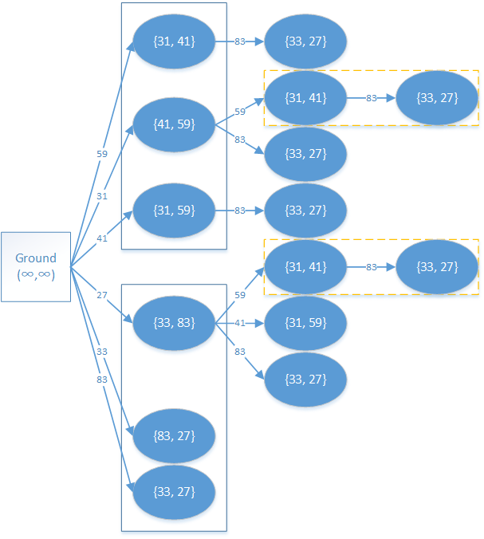

DAG 即 [有向无环图](graph/dag.md)，一些实际问题中的二元关系都可使用 DAG 来建模。

## 例题

> [!NOTE] **例题 [UVa 437 巴比伦塔 The Tower of Babylon](https://cn.vjudge.net/problem/UVA-437)**
> 
> 有 $n (n\leqslant 30)$ 种砖块，已知三条边长，每种都有无穷多个。要求选一些立方体摞成一根尽量高的柱子（每个砖块可以自行选择一条边作为高），使得每个砖块的底面长宽分别严格小于它下方砖块的底面长宽，求塔的最大高度。

### 建立 DAG

由于每个砖块的底面长宽分别严格小于它下方砖块的底面长宽，因此不难将这样一种关系作为建图的依据，而本题也就转化为最长路问题。

也就是说如果砖块 $j$ 能放在砖块 $i$ 上，那么 $i$ 和 $j$ 之间存在一条边 $(i, j)$，且边权就是砖块 $j$ 所选取的高。

本题的另一个问题在于每个砖块的高有三种选法，怎样建图更合适呢？

不妨将每个砖块拆解为三种堆叠方式，即将一个砖块分解为三个砖块，每一个拆解得到的砖块都选取不同的高。

初始的起点是大地，大地的底面是无穷大的，则大地可达任意砖块，当然我们写程序时不必特意写上无穷大。

假设有两个砖块，三条边分别为 $31, 41, 59$ 和 $33, 83, 27$，那么整张 DAG 应该如下图所示。

图中蓝实框所表示的是一个砖块拆解得到的一组砖块，之所以用 $\{\}$ 表示底面边长，是因为砖块一旦选取了高，底面边长就是无序的。

图中黄虚框表示的是重复计算部分，为下文做铺垫。

### 转移

题目要求的是塔的最大高度，已经转化为最长路问题，其起点上文已指出是大地，那么终点呢？

显然终点已经自然确定，那就是某砖块上不能再搭别的砖块的时候。

之前在图上标记的黄虚框表明有重复计算，下面我们开始考虑转移方程。

显然，砖块一旦选取了高，那么这块砖块上最大能放的高度是确定的。

某个砖块 $i$ 有三种堆叠方式分别记为 $0, 1, 2$，那么对于砖块 $i$ 和其堆叠方式 $r$ 来说则有如下转移方程

$d(i, r) = \max\left\{d(j, r') + h'\right\}$

其中 $j$ 是所有那些在砖块 $i$ 以 $r$ 方式堆叠时可放上的砖块，$r'$ 对应 $j$ 此时的摆放方式，也就确定了此时唯一的高度 $h'$。

在实际编写时，将所有 $d(i, r)$ 都初始化为 $-1$，表示未计算过。

在试图计算前，如果发现已经计算过，直接返回保存的值；否则就按步计算，并保存。

最终答案是所有 $d(i, r)$ 的最大值。

## 习题

> [!NOTE] **[Luogu 采蘑菇](https://www.luogu.com.cn/problem/P2656)**
> 
> 题意: TODO

> [!TIP] **思路**
> 
> 经典
> 
> 缩点 + 拓扑 + dp

<details>
<summary>详细代码</summary>
<!-- tabs:start -->

##### **C++**

```cpp
#include <bits/stdc++.h>
using namespace std;

// tarjan 找环 榨干环内所有的蘑菇
// 随后建立新图 跑【拓扑排序 + dp】即可

const int N = 8e4 + 10, M = 4e5 + 10;

int n, m, s;
int h1[N], h2[N], e[M], w[M], ne[M], idx;
double restore[M];

int dfn[N], low[N], ts;
int stk[N], top;
bool in_stk[N];
int id[N], scc_cnt;

int din[N], sum[N];
int q[N], f[N];

void init() {
    memset(h1, -1, sizeof h1);
    memset(h2, -1, sizeof h2);
    idx = 0;
}

void add(int h[], int a, int b, int c, double r) {
    restore[idx] = r;
    e[idx] = b, w[idx] = c, ne[idx] = h[a], h[a] = idx ++ ;
}

void tarjan(int u) {
    dfn[u] = low[u] = ++ ts;
    stk[ ++ top] = u, in_stk[u] = true;
    
    for (int i = h1[u]; ~i; i = ne[i]) {
        int j = e[i];
        if (!dfn[j]) {
            tarjan(j);
            low[u] = min(low[u], low[j]);
        } else if (in_stk[j])
            low[u] = min(low[u], dfn[j]);
    }
    
    if (dfn[u] == low[u]) {
        scc_cnt ++ ;
        int y;
        do {
            y = stk[top -- ];
            in_stk[y] = false;
            
            // id
            id[y] = scc_cnt;
        } while (y != u);
    }
}

void topo(int start) {
    memset(f, 0xcf, sizeof f);  // -INF
    int st = id[start];
    f[st] = sum[st];
    
    int hh = 0, tt = -1;
    for (int i = 1; i <= scc_cnt; ++ i )
        if (!din[i])
            q[ ++ tt] = i;
            
    while (hh <= tt) {
        int t = q[hh ++ ];
        for (int i = h2[t]; ~i; i = ne[i]) {
            int j = e[i];
            f[j] = max(f[j], f[t] + w[i] + sum[j]);
            if ( -- din[j] == 0)
                q[ ++ tt] = j;
        }
    }
}

int main() {
    init();
    cin >> n >> m;
    while (m -- ) {
        int a, b, c;
        double d;
        cin >> a >> b >> c >> d;
        add(h1, a, b, c, d);
    }
    cin >> s;
    
    for (int i = 1; i <= n; ++ i )
        if (!dfn[i])
            tarjan(i);
    
    for (int i = 1; i <= n; ++ i )
        for (int j = h1[i]; ~j; j = ne[j]) {
            int k = e[j];
            int a = id[i], b = id[k];
            if (a != b) {
                add(h2, a, b, w[j], 0); // restore任意 因为不会有用
                din[b] ++ ;
            } else {
                int x = w[j];
                int scc = id[i];
                while (x) {
                    sum[scc] += x;
                    x *= restore[j];
                }
            }
        }
    
    topo(s);
    
    int res = 0;
    for (int i = 1; i <= scc_cnt; ++ i )
        res = max(res, f[i]);
    cout << res << endl;
    
    return 0;
}
```

##### **Python**

```python

```

<!-- tabs:end -->
</details>

<br>

* * *