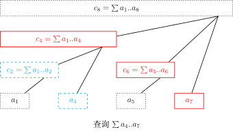

### 特殊初始化方式

BIT 的另一种初始化方式：

传统初始化 $O(nlogn)$ 存在一种 $O(n)$ 的初始化方式 核心在于理解 BIT 位的含义

```cpp
    for (int i = 1; i <= n; ++i) {
        tr[i] = nums[i - 1];    // 初值
        for (int j = i - 1; j > i - lowbit(i); j -= lowbit(j))
            tr[i] += tr[j];
    }
```

具体使用参见 [307. 区域和检索 - 数组可修改](https://leetcode-cn.com/problems/range-sum-query-mutable/)


## 简介

树状数组和线段树具有相似的功能，但他俩毕竟还有一些区别：树状数组能有的操作，线段树一定有；线段树有的操作，树状数组不一定有。但是树状数组的代码要比线段树短，思维更清晰，速度也更快，在解决一些单点修改的问题时，树状数组是不二之选。

* * *

## 原理

下面这张图展示了树状数组的工作原理：


这个结构和线段树有些类似：用一个大节点表示一些小节点的信息，进行查询的时候只需要查询一些大节点而不是所有的小节点。

最上面的八个方块就代表数组 $a$。

他们下面的参差不齐的剩下的方块就代表数组 $a$ 的上级——$c$ 数组。

从图中可以看出：  
$c_2$ 管理的是 $a_1$,$a_2$；  
$c_4$ 管理的是 $a_1$,$a_2$,$a_3$,$a_4$；  
$c_6$ 管理的是 $a_5$,$a_6$；$c_8$ 则管理全部 $8$ 个数。

如果要计算数组 $a$ 的区间和，比如说要算 $a_{51}$~$a_{91}$ 的区间和，可以采用类似倍增的思想：

从 $91$ 开始往前跳，发现 $c_n$（$n$ 我也不确定是多少，算起来太麻烦，就意思一下）只管 $a_{91}$ 这个点，那么你就会找 $a_{90}$，发现 $c_{n - 1}$ 管的是 $a_{90}$&$a_{89}$；那么你就会直接跳到 $a_{88}$，$c_{n - 2}$ 就会管 $a_{81}$~$a_{88}$ 这些数，下次查询从 $a_{80}$ 往前找，以此类推。

* * *

## 用法及操作

那么问题来了，怎么知道 $c_i$ 管理的数组 $a$ 中的哪个区间呢？
这时，我们引入一个函数——`lowbit`：

```cpp
// C++ Version
int lowbit(int x) {
    // x 的二进制表示中，最低位的 1 的位置。
    // lowbit(0b10110000) == 0b00010000
    //          ~~~^~~~~
    // lowbit(0b11100100) == 0b00000100
    //          ~~~~~^~~
    return x & -x;
}
```

```python
# Python Version
def lowbit(x):
    """
    x 的二进制表示中，最低位的 1 的位置。
    lowbit(0b10110000) == 0b00010000
             ~~~^~~~~
    lowbit(0b11100100) == 0b00000100
             ~~~~~^~~
    """
    return x & -x
```

注释说明了 `lowbit` 的意思，对于 $x=88$：$88_{(10)}=1011000_{(2)}$   
发现第一个 $1$ 以及他后面的 $0$ 组成的二进制是 $1000$   
 $1000_{(2)} = 8_{(10)}$   
$1000$ 对应的十进制是 $8$，所以 $c_{88}$ 一共管理 $8$ 个 $a$ 数组中的元素。

在常见的计算机中，有符号数采用补码表示。在补码表示下，数 $x$ 的相反数 $-x$ 为 $~x + 1$。

使用 lowbit 函数，我们可以实现很多操作，例如单点修改，将 $a_x$ 加上 $k$，只需要更新 $a_x$ 的所有上级：

```cpp
// C++ Version
void add(int x, int k) {
    for (int i = x; i <= n; i += lowbit(i) ) c[i] += k;
}
```

```python
# Python Version
def add(x, k):
    while x <= n: # 不能越界
        c[x] = c[x] + k
        x = x + lowbit(x)
```

前缀求和：

```cpp
// C++ Version
int getsum(int x) {  // a[1]..a[x]的和
    int res = 0;
    for (int i = x; i; i -= lowbit(i)) res += c[i];
    return res;
}
```

```python
# Python Version
def getsum(x): # a[1]..a[x]的和
    ans = 0
    while x >= 1:
        ans = ans + c[x]
        x = x - lowbit(x)
    return ans
```

## 区间加 & 区间求和

若维护序列 $a$ 的差分数组 $b$，此时我们对 $a$ 的一个前缀 $r$ 求和，即 $\sum_{i=1}^{r} a_i$，由差分数组定义得 $a_i=\sum_{j=1}^i b_j$

进行推导

$$
\begin{aligned}
&\sum_{i=1}^{r} a_i\\=&\sum_{i=1}^r\sum_{j=1}^i b_j\\=&\sum_{i=1}^r b_i\times(r-i+1)
\\=&\sum_{i=1}^r b_i\times (r+1)-\sum_{i=1}^r b_i\times i
\end{aligned}
$$

区间和可以用两个前缀和相减得到，因此只需要用两个树状数组分别维护 $\sum b_i$ 和 $\sum i \times b_i$，就能实现区间求和。



代码如下

<details>
<summary>详细代码</summary>
<!-- tabs:start -->

##### **C++**

```cpp
```

##### **Python**

```python
```

<!-- tabs:end -->
</details>

<br>

* * *
## Tricks

$O(n)$ 建树：

每一个节点的值是由所有与自己直接相连的儿子的值求和得到的。因此可以倒着考虑贡献，即每次确定完儿子的值后，用自己的值更新自己的直接父亲。

<details>
<summary>详细代码</summary>
<!-- tabs:start -->

##### **C++**

```cpp
// C++ Version
// O(n)建树
void init() {
    for (int i = 1; i <= n; ++i) {
        t[i] += a[i];
        int j = i + lowbit(i);
        if (j <= n) t[j] += t[i];
    }
}
```

##### **Python**

```python
# Python Version
def init():
    for i in range(1, n + 1):
        t[i] = t[i] + a[i]
        j = i + lowbit(i)
        if j <= n:
            t[j] = t[j] + t[i]
```

<!-- tabs:end -->
</details>

<br>

* * *


$O(\log n)$ 查询第 $k$ 小/大元素。在此处只讨论第 $k$ 小，第 $k$ 大问题可以通过简单计算转化为第 $k$ 小问题。

参考 **可持久化线段树" 章节中，关于求区间第 $k$ 小的思想。将所有数字看成一个可重集合，即定义数组 $a$ 表示值为 $i$ 的元素在整个序列重出现了 $a_i$ 次。找第 $k$ 大就是找到最小的 $x$ 恰好满足 $\sum_{i=1}^{x}a_i \geq k$

因此可以想到算法：如果已经找到 $x$ 满足 $\sum_{i=1}^{x}a_i \le k$，考虑能不能让 $x$ 继续增加，使其仍然满足这个条件。找到最大的 $x$ 后，$x+1$ 就是所要的值。
在树状数组中，节点是根据 2 的幂划分的，每次可以扩大 2 的幂的长度。令 $sum$ 表示当前的 $x$ 所代表的前缀和，有如下算法找到最大的 $x$：

1. 求出 $depth=\left \lfloor \log_2n \right \rfloor$
2. 计算 $t=\sum_{i=x+1}^{x+2^{depth}}a_i$
3. 如果 $sum+t \le k$，则此时扩展成功，将 $2^{depth}$ 累加到 $x$ 上；否则扩展失败，对 $x$ 不进行操作
4. 将 $depth$ 减 1，回到步骤 2，直至 $depth$ 为 0


<details>
<summary>详细代码</summary>
<!-- tabs:start -->

##### **C++**

```cpp
// C++ Version
// 权值树状数组查询第k小
int kth(int k) {
    int cnt = 0, ret = 0;
    for (int i = log2(n); ~i; --i) {        // i 与上文 depth 含义相同
        ret += 1 << i;                      // 尝试扩展
        if (ret >= n || cnt + t[ret] >= k)  // 如果扩展失败
            ret -= 1 << i;
        else
            cnt += t[ret];  // 扩展成功后 要更新之前求和的值
    }
    return ret + 1;
}
```

##### **Python**

```python
# Python Version
# 权值树状数组查询第 k 小
def kth(k):
    cnt = 0; ret = 0
    i = log2(n) # i 与上文 depth 含义相同
    while ~i:
        ret = ret + (1 << i) # 尝试扩展
        if ret >= n or cnt + t[ret] >= k: # 如果扩展失败
            ret = ret - (1 << i)
        else:
            cnt = cnt + t[ret] # 扩展成功后 要更新之前求和的值
    return ret + 1
```

<!-- tabs:end -->
</details>

<br>

* * *


时间戳优化：

对付多组数据很常见的技巧。如果每次输入新数据时，都暴力清空树状数组，就可能会造成超时。因此使用 $tag$ 标记，存储当前节点上次使用时间（即最近一次是被第几组数据使用）。每次操作时判断这个位置 $tag$ 中的时间和当前时间是否相同，就可以判断这个位置应该是 0 还是数组内的值。

```cpp
// C++ Version
// 时间戳优化
int tag[MAXN], t[MAXN], Tag;
void reset() { ++Tag; }
void add(int k, int v) {
    while (k <= n) {
        if (tag[k] != Tag) t[k] = 0;
        t[k] += v, tag[k] = Tag;
        k += lowbit(k);
    }
}
int getsum(int k) {
    int ret = 0;
    while (k) {
        if (tag[k] == Tag) ret += t[k];
        k -= lowbit(k);
    }
    return ret;
}
```

```python
# Python Version
# 时间戳优化
tag = [0] * MAXN; t = [0] * MAXN; Tag = 0
def reset():
    Tag = Tag + 1
def add(k, v):
    while k <= n:
        if tag[k] != Tag:
            t[k] = 0
        t[k] = t[k] + v
        tag[k] = Tag
        k = k + lowbit(k)
def getsum(k):
    ret = 0
    while k:
        if tag[k] == Tag:
            ret = ret + t[k]
        k = k - lowbit(k)
    return ret
```

## 例题

- [树状数组 1：单点修改，区间查询](https://loj.ac/problem/130)
- [树状数组 2：区间修改，单点查询](https://loj.ac/problem/131)
- [树状数组 3：区间修改，区间查询](https://loj.ac/problem/132)
- [二维树状数组 1：单点修改，区间查询](https://loj.ac/problem/133)
- [二维树状数组 3：区间修改，区间查询](https://loj.ac/problem/135)

## 习题

### 一般统计问题

> [!NOTE] **[AcWing 241. 楼兰图腾](https://www.acwing.com/problem/content/243/)**
> 
> 题意: TODO

> [!TIP] **思路**
> 
> 统计某个点左右侧各有多少个比它大的数字

<details>
<summary>详细代码</summary>
<!-- tabs:start -->

##### **C++**

```cpp
#include<bits/stdc++.h>
using namespace std;

using LL = long long;

const int N = 200010;

int n;
int a[N];   // 原数组
int tr[N];
int Greater[N], lower[N];   // 1 ~ k-1 中多少个大于y[k]   再逆序 k + 1 ~ n 中有多少大于y[k]

int lowbit(int x) {
    return x & -x;
}

void add(int x, int c) {
    for (int i = x; i <= n; i += lowbit(i)) tr[i] += c;
}

int sum(int x) {
    int res = 0;
    for (int i = x; i; i -= lowbit(i)) res += tr[i];
    return res;
}

int main() {
    cin >> n;
    for (int i = 1; i <= n; ++ i ) cin >> a[i];
    for (int i = 1; i <= n; ++ i ) {
        int y = a[i];
        Greater[i] = sum(n) - sum(y);
        lower[i] = sum(y - 1);
        add(y, 1);
    }
    // 再逆序统计一遍
    memset(tr, 0, sizeof tr);
    LL res1 = 0, res2 = 0;
    for (int i = n; i; -- i ) {
        int y = a[i];
        res1 += Greater[i] * (LL)(sum(n) - sum(y));
        res2 += lower[i] * (LL)(sum(y - 1));
        add(y, 1);
    }
    cout << res1 << " " << res2 << endl;
    return 0;
}
```

##### **Python**

```python

```

<!-- tabs:end -->
</details>

<br>

* * *

### 区间加 区间和

> [!NOTE] **[AcWing 242. 一个简单的整数问题](https://www.acwing.com/problem/content/248/)**
> 
> 题意: TODO

> [!TIP] **思路**
> 
> 区间加

<details>
<summary>详细代码</summary>
<!-- tabs:start -->

##### **C++**

```cpp
#include<bits/stdc++.h>
using namespace std;

using LL = long long;

const int N = 100010;

int n, m;
int a[N];
LL tr[N];

int lowbit(int x) {
    return x & -x;
}

void add(int x, int c) {
    for (int i = x; i <= n; i += lowbit(i)) tr[i] += c;
}

LL sum(int x) {
    LL res = 0;
    for (int i = x; i; i -= lowbit(i)) res += tr[i];
    return res;
}

int main() {
    cin >> n >> m;
    for (int i = 1; i <= n; ++ i ) cin >> a[i];
    for (int i = 1; i <= n; ++ i ) add(i, a[i] - a[i - 1]); // 转化为查分数组存在树中
    while (m -- ) {
        // 用%s读入可以解决制表符 无需后续其他操作
        char op[2];
        int l, r, d;
        scanf("%s%d", op, &l);
        if (*op == 'C') {
            scanf("%d%d", &r, &d);
            add(l, d), add(r + 1, -d);
        } else cout << sum(l) << endl;
    }
    return 0;
}
```

##### **Python**

```python

```

<!-- tabs:end -->
</details>

<br>

* * *

> [!NOTE] **[AcWing 243. 一个简单的整数问题2]()**
> 
> 题意: TODO

> [!TIP] **思路**
>
> **转化**
>
> 区间加 和 区间求和
>
> 对于区间加 仍然想上题那样记录差分
>
> a[i] 原数组 b[i]差分数组
> 
> 对于区间求和 先将原数值补上集合 得到
> 
> $$
> psum[x] = (b1 + b2 + ... + bx) * (x + 1) - (b1 + 2*b2 + ... + x*bx)
>         = bi的前缀和 - x*bi的前缀和
> $$
>   
>   故通过树状数组维护两个前缀和
>     
> > 认真思考【为何维护tr2时一个加 l*d 一个减 (r+1)*d】
> > 
> > tr2维护的是i * b[i]的前缀和，而b[i] = a[i] - a[i - 1]，
> > 
> > 所以当我们给a[L] ~ a[R]加上d时，对i * b[i]的影响只有两处：
> > 
> > 1. L * b[L]，此时由于b[L]增加了d，所以L * b[L]就应该增加L * d；
> > 2. (R + 1) * b[R + 1]由于b[R + 1]减少了d，所以它应该减去(R + 1) * d。

<details>
<summary>详细代码</summary>
<!-- tabs:start -->

##### **C++**

```cpp
#include<bits/stdc++.h>
using namespace std;

using LL = long long;

const int N = 100010;

int n, m;
int a[N];
LL tr1[N];  // 维护b[i]的前缀和
LL tr2[N];  // 维护b[i]*i的前缀和

int lowbit(int x) {
    return x & -x;
}

void add(LL tr[], int x, LL c) {
    for (int i = x; i <= n; i += lowbit(i)) tr[i] += c;
}

LL sum(LL tr[], int x) {
    LL res = 0;
    for (int i = x; i; i -= lowbit(i)) res += tr[i];
    return res;
}

LL prefix_sum(int x) {
    return sum(tr1, x) * (x + 1) - sum(tr2, x);
}

int main() {
    cin >> n >> m;
    for (int i = 1; i <= n; ++ i ) cin >> a[i];
    
    // 差分
    for (int i = 1; i <= n; ++ i ) {
        int b = a[i] - a[i - 1];
        add(tr1, i, b);
        add(tr2, i, (LL)b * i);
    }
    
    while (m -- ) {
        char op[2];
        int l, r, d;
        scanf("%s%d%d", op, &l, &r);
        if (*op == 'C') {
            scanf("%d", &d);
            // a[l] += d
            add(tr1, l, d), add(tr2, l, l * d);
            // a[r + 1] -= d
            add(tr1, r + 1, -d), add(tr2, r + 1, (r + 1) * -d);
        } else {
            cout << prefix_sum(r) - prefix_sum(l - 1) << endl;
        }
    }
    return 0;
}
```

##### **Python**

```python

```

<!-- tabs:end -->
</details>

<br>

* * *

> [!NOTE] **[Luogu 【模板】树状数组 1](https://www.luogu.com.cn/problem/P3374)**
> 
> 题意: 记录值

> [!TIP] **思路**
> 
> 

<details>
<summary>详细代码</summary>
<!-- tabs:start -->

##### **C++**

```cpp
#include <bits/stdc++.h>
using namespace std;

const int N = 5e5 + 10;

int n, m;
int tr[N];

int lowbit(int x) {
    return x & -x;
}

void add(int x, int c) {
    for (int i = x; i <= n; i += lowbit(i))
        tr[i] += c;
}

int sum(int x) {
    int res = 0;
    for (int i = x; i; i -= lowbit(i))
        res += tr[i];
    return res;
}

int main() {
    cin >> n >> m;
    for (int i = 1; i <= n; ++ i ) {
        int c;
        cin >> c;
        add(i, c);
    }
    
    while (m -- ) {
        int op, x, y;
        cin >> op >> x >> y;
        if (op == 1)
            add(x, y);
        else
            cout << sum(y) - sum(x - 1) << endl;
    }
    return 0;
}
```

##### **Python**

```python

```

<!-- tabs:end -->
</details>

<br>

* * *

> [!NOTE] **[Luogu 【模板】树状数组 2](https://www.luogu.com.cn/problem/P3368)**
> 
> 题意: 记录差分

> [!TIP] **思路**
> 
> 

<details>
<summary>详细代码</summary>
<!-- tabs:start -->

##### **C++**

```cpp
#include <bits/stdc++.h>
using namespace std;

const int N = 5e5 + 10;

int n, m;
int a[N], tr[N];

int lowbit(int x) {
    return x & -x;
}

void add(int x, int c) {
    for (int i = x; i <= n; i += lowbit(i))
        tr[i] += c;
}

int sum(int x) {
    int ret = 0;
    for (int i = x; i; i -= lowbit(i))
        ret += tr[i];
    return ret;
}

int main() {
    cin >> n >> m;
    
    for (int i = 1; i <= n; ++ i ) {
        cin >> a[i];
        add(i, a[i] - a[i - 1]);
    }
    
    while (m -- ) {
        int op, x;
        cin >> op >> x;
        if (op == 1) {
            int y, k;
            cin >> y >> k;
            add(x, k), add(y + 1, -k);
        } else
            cout << sum(x) << endl;
    }
    
    return 0;
}
```

##### **Python**

```python

```

<!-- tabs:end -->
</details>

<br>

* * *

### BIT 思想

> [!NOTE] **[AcWing 244. 谜一样的牛](https://www.acwing.com/problem/content/245/)**
> 
> 题意: TODO

> [!TIP] **思路**
> 
> 1. 在剩下的数里面找到 第ai + 1小的数 作为当前身高
> 
> 2. 删除该数
> 
> 显然无法爆搜On^2 平衡树也可以但难写 考虑BIT
> 
> 维护 a[i] 的前缀和 删除比较好做 考虑如何求第k小 显然可以二分

<details>
<summary>详细代码</summary>
<!-- tabs:start -->

##### **C++**

```cpp
#include<bits/stdc++.h>
using namespace std;

const int N = 100010;

int n;
int h[N];
int ans[N];
int tr[N];

int lowbit(int x) {
    return x & -x;
}

void add(int x, int c) {
    for (int i = x; i <= n; i += lowbit(i)) tr[i] += c;
}

int sum(int x) {
    int res = 0;
    for (int i = x; i; i -= lowbit(i)) res += tr[i];
    return res;
}

int main() {
    cin >> n;
    for (int i = 2; i <= n; ++ i ) cin >> h[i];
    
    // 初始化 每一个位置都有1 与add等价
    // for (int i = 1; i <= n; ++ i ) add(i, 1);
    for (int i = 1; i <= n; ++ i ) tr[i] = lowbit(i);
    
    for (int i = n; i; -- i ) {
        int k = h[i] + 1;
        int l = 1, r = n;
        while (l < r) {
            int mid = l + (r - l) / 2;
            if (sum(mid) < k) l = mid + 1;
            else r = mid;
        }
        ans[i] = r;
        add(r, -1);
    }
    for (int i = 1; i <= n; ++ i ) cout << ans[i] << endl;
    return 0;
}
```

##### **Python**

```python

```

<!-- tabs:end -->
</details>

<br>

* * *

> [!NOTE] **[LeetCode 315. 计算右侧小于当前元素的个数](https://leetcode-cn.com/problems/count-of-smaller-numbers-after-self/)**
> 
> 题意: TODO

> [!TIP] **思路**
> 
> 

<details>
<summary>详细代码</summary>
<!-- tabs:start -->

##### **C++**

```cpp
class Solution {
public:
    int n = 20001;
    vector<int> tr;
    int lowbit(int x) {
        return x & -x;
    }
    int query(int x) {
        int res = 0;
        for (int i = x; i; i -= lowbit(i)) res += tr[i];
        return res;
    }
    void add(int x, int v) {
        for (int i = x; i <= n; i += lowbit(i)) tr[i] += v;
    }

    vector<int> countSmaller(vector<int>& nums) {
        tr.resize(n + 1);
        vector<int> res(nums.size());
        for (int i = nums.size() - 1; i >= 0; -- i ) {
            int x = nums[i] + 10001;
            res[i] = query(x - 1);
            add(x, 1);
        }
        return res;
    }
};
```

##### **Python**

```python

```

<!-- tabs:end -->
</details>

<br>

* * *

> [!NOTE] **[LeetCode ]()**
> 
> 题意: TODO

> [!TIP] **思路**
> 
> 贪心 or BIT

<details>
<summary>详细代码</summary>
<!-- tabs:start -->

##### **C++ 贪心**

```cpp
class Solution {
public:
    vector<vector<int>> reconstructQueue(vector<vector<int>>& people) {
        int n = people.size();
        vector<vector<int>> res;
        sort(people.begin(), people.end(), [](vector<int> a, vector<int> b) {
            return a[0] == b[0] ? a[1] < b[1] : a[0] > b[0];
        });
        for (int i = 0; i < n; ++ i )
            res.insert(res.begin() + people[i][1], people[i]);
        return res;
    }
};
```

##### **C++**

```cpp
// yxc
class Solution {
public:
    int n;
    vector<int> tr;

    int lowbit(int x) {
        return x & -x;
    }

    void add(int x, int v) {
        for (int i = x; i <= n; i += lowbit(i)) tr[i] += v;
    }

    int query(int x) {
        int res = 0;
        for (int i = x; i; i -= lowbit(i)) res += tr[i];
        return res;
    }

    vector<vector<int>> reconstructQueue(vector<vector<int>>& people) {
        n = people.size();
        tr.resize(n + 1);

        sort(people.begin(), people.end(), [](vector<int>a, vector<int>b) {
            if (a[0] != b[0]) return a[0] < b[0];
            return a[1] > b[1];
        });

        vector<vector<int>> res(n);
        for (auto p: people) {
            int h = p[0], k = p[1];
            int l = 1, r = n;
            while (l < r) {
                int mid = l + r >> 1;
                // mid - query(mid)
                // 位置总长减去此前较低的，即是将来会放较高的数量
                if (mid - query(mid) >= k + 1) r = mid;
                else l = mid + 1;
            }
            res[r - 1] = p;
            add(r, 1);
        }
        return res;
    }
};
```

##### **Python**

```python
"""
思路：身高高的人只会看到比他高的人，所以当身高高的人固定好了位置，前面插入多少个矮的人都不会破坏高的人的条件限制。所以应该先决定高的人的位置，再决定矮的人的位置；高的人限制条件少，矮的人限制条件多。

先按身高从大到小排序，身高一样则按照k排序：身高大或k小意味着限制条件少，应该被优先考虑。

依次插入元素：由上一点，先进入res的元素不会被后进入的元素影响，因此每一次插入只需要考虑自己不需要考虑别人。当遍历到元素[a,b]的时候，比它大的元素已经进组，比它小的元素还没进组，那么它应该插到res的第b位，从而实现0到b-1的数字都比它大。

举例，输入是[[7,0], [4,4], [7,1], [5,0], [6,1], [5,2]]
排序后是[[7,0],[7,1],[6,1],[5,0],[5,2],[4,4]]

插入[7,0], res=[[7,0]]
插入[7,1], res=[[7,0],[7,1]]
插入[6,1], res=[[7,0],[6,1],[7,1]]
插入[5,0], res=[[5,0],[7,0],[6,1],[7,1]]
插入[5,2], res=[[5,0],[7,0],[5,2],[6,1],[7,1]]
插入[4,4], res=[[5,0],[7,0],[5,2],[4,4],[6,1],[7,1]]

最终答案是[[5,0], [7,0], [5,2], [6,1], [4,4], [7,1]]

"""

#当有两个维度时，很重要的是想如何确定一个维度，然后在按照另外一个维度重新排列
#【如果两个维度一起考虑，一定会顾此失彼】
#按照身高来排列，身高一定是从大到小拍，让高个子在前面；然后按照k维度重新插入队列。

class Solution:
    def reconstructQueue(self, people: List[List[int]]) -> List[List[int]]:
        people.sort(key=lambda x:(-x[0],x[1]))
        res=[]
        for p in people:
            res.insert(p[1],p)
        #等同于如下代码：
        # for i in range(len(people)):
        #     res.insert(people[i][1],people[i])
        return res    

# class Solution:
#     def reconstructQueue(self, people: List[List[int]]) -> List[List[int]]:
#         res = []
#         people = sorted(people, key = lambda x: (-x[0], x[1]))
#         for p in people:
#             if len(res) <= p[1]:
#                 res.append(p)
#             elif len(res) > p[1]:
#                 res.insert(p[1], p)
#         return res
```

<!-- tabs:end -->
</details>

<br>

* * *

### 经典离线+预处理

> [!NOTE] **[Luogu [GZOI2017]配对统计](https://www.luogu.com.cn/problem/P5677)**
> 
> 题意: TODO

> [!TIP] **思路**
> 
> 经典的预处理、离线、BIT计数

<details>
<summary>详细代码</summary>
<!-- tabs:start -->

##### **C++**

```cpp
#include <bits/stdc++.h>
using namespace std;

// 【技巧】
// 对于每次查询，只把【右端点】在 (0,r] 内的好对放进树状数组。
//
// 树状数组 tree[i] 表示【左端点】在 [i-lowbit(i)+1 , i]
// 内的所有好对的的个数。

#define x first
#define y second

using LL = long long;
using PII = pair<int, int>;
const int N = 3e5 + 10, INF = 0x3f3f3f3f;

int n, m;
PII a[N];
vector<PII> ps;

struct Qs {
    int l, r, id;
};
vector<Qs> qs;

// BIT
int tr[N];

int lowbit(int x) {
    return x & -x;
}

void add(int x, int c) {
    for (int i = x; i <= n; i += lowbit(i))
        tr[i] += c;
}

int sum(int x) {
    int ret = 0;
    for (int i = x; i; i -= lowbit(i))
        ret += tr[i];
    return ret;
}

// FUNC
// 右端点在前
void add_l(int i) {
    int l = min(a[i].y, a[i - 1].y), r = max(a[i].y, a[i - 1].y);
    ps.push_back({r, l});
}

void add_r(int i) {
    int l = min(a[i].y, a[i + 1].y), r = max(a[i].y, a[i + 1].y);
    ps.push_back({r, l});
}

int main() {
    cin >> n >> m;
    
    // 排序处理原数据
    for (int i = 1; i <= n; ++ i ) {
        int x;
        cin >> x;
        a[i] = {x, i};
    }
    sort(a + 1, a + n + 1);
    
    for (int i = 1; i <= n; ++ i ) {
        int l = INF, r = INF;
        if (i > 1)
            l = a[i].x - a[i - 1].x;
        if (i < n)
            r = a[i + 1].x - a[i].x;
        
        if (l == r) {
            if (l != INF)
                add_l(i), add_r(i);
        } else {
            if (l < r)
                add_l(i);
            else
                add_r(i);
        }
    }
    sort(ps.begin(), ps.end());

    // 读查询
    for (int i = 0; i < m; ++ i ) {
        int l, r;
        cin >> l >> r;
        qs.push_back({l, r, i});
    }
    sort(qs.begin(), qs.end(), [](const Qs & a, const Qs & b) {
        return a.r < b.r;
    });;
    
    // 离线处理
    LL res = 0;
    int nps = ps.size(), nqs = qs.size();
    for (int i = 0, j = 0; i < nqs; ++ i ) {
        while (j < nps && ps[j].x <= qs[i].r)
            // 继续把【这队的左】加入BIT
            add(ps[j ++ ].y, 1);
        res += LL(sum(qs[i].r) - sum(qs[i].l - 1)) * (qs[i].id + 1);
    }
    cout << res << endl;
    
    return 0;
}
```

##### **Python**

```python

```

<!-- tabs:end -->
</details>

<br>

* * *

> [!NOTE] **[LeetCode 327. 区间和的个数](https://leetcode-cn.com/problems/count-of-range-sum/)**
> 
> 题意: TODO

> [!TIP] **思路**
> 
> 

<details>
<summary>详细代码</summary>
<!-- tabs:start -->

##### **C++**

```cpp
class Solution {
public:
    typedef long long LL;
    int m;
    vector<int> tr;
    vector<LL> numbers;
    int get(LL x) {
        return lower_bound(numbers.begin(), numbers.end(), x) - numbers.begin() + 1;
    }
    int lowbit(int x) {
        return x & -x;
    }
    void add(int x, int v) {
        for (int i = x; i <= m; i += lowbit(i)) tr[i] += v;
    }
    int query(int x) {
        int res = 0;
        for (int i = x; i; i -= lowbit(i)) res += tr[i];
        return res;
    }

    int countRangeSum(vector<int>& nums, int lower, int upper) {
        int n = nums.size();
        vector<LL> s(n + 1);
        numbers.push_back(0);
        for (int i = 1; i <= n; ++ i ) {
            s[i] = s[i - 1] + nums[i - 1];
            numbers.push_back(s[i]);
            numbers.push_back(s[i] - lower);
            numbers.push_back(s[i] - upper - 1);
        }
        sort(numbers.begin(), numbers.end());
        numbers.erase(unique(numbers.begin(), numbers.end()), numbers.end());
        m = numbers.size();
        tr.resize(m + 1);

        int res = 0;
        add(get(0), 1);
        for (int i = 1; i <= n; ++ i ) {
            res += query(get(s[i] - lower)) - query(get(s[i] - upper - 1));
            add(get(s[i]), 1);
        }
        return res;
    }
};
```

##### **Python**

```python

```

<!-- tabs:end -->
</details>

<br>

* * *