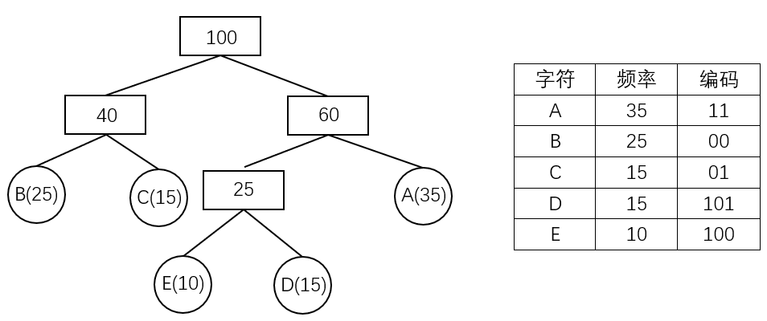

## 树的带权路径长度

设二叉树具有 $n$ 个带权叶结点，从根结点到各叶结点的路径长度与相应叶节点权值的乘积之和称为 **树的带权路径长度（Weighted Path Length of Tree，WPL）**。

设 $w_i$ 为二叉树地 $i$ 个叶结点的权值，$l_i$ 为从根结点到第 $i$ 个叶结点的路径长度，则 WPL 计算公式如下：

$$
WPL=\sum_{i=1}^nw_il_i
$$


如上图所示，其 WPL 计算过程与结果如下：

$$
WPL=2*2+3*2+4*2+7*2=4+6+8+14=32
$$

## 结构

对于给定一组具有确定权值的叶结点，可以构造出不同的二叉树，其中，**WPL 最小的二叉树** 称为 **霍夫曼树（Huffman Tree）**。

对于霍夫曼树来说，其叶结点权值越小，离根越远，叶结点权值越大，离根越近，此外其仅有叶结点的度为 $0$，其他结点度均为 $2$。

## 霍夫曼算法

霍夫曼算法用于构造一棵霍夫曼树，算法步骤如下：

1. **初始化**：由给定的 $n$ 个权值构造 $n$ 棵只有一个根节点的二叉树，得到一个二叉树集合 $F$。
2. **选取与合并**：从二叉树集合 $F$ 中选取根节点权值 **最小的两棵** 二叉树分别作为左右子树构造一棵新的二叉树，这棵新二叉树的根节点的权值为其左、右子树根结点的权值和。
3. **删除与加入**：从 $F$ 中删除作为左、右子树的两棵二叉树，并将新建立的二叉树加入到 $F$ 中。
4. 重复 2、3 步，当集合中只剩下一棵二叉树时，这棵二叉树就是霍夫曼树。


## 霍夫曼编码

在进行程序设计时，通常给每一个字符标记一个单独的代码来表示一组字符，即 **编码**。

在进行二进制编码时，假设所有的代码都等长，那么表示 $n$ 个不同的字符需要 $\left \lceil \log_2 n \right \rceil$ 位，称为 **等长编码**。

如果每个字符的 **使用频率相等**，那么等长编码无疑是空间效率最高的编码方法，而如果字符出现的频率不同，则可以让频率高的字符采用尽可能短的编码，频率低的字符采用尽可能长的编码，来构造出一种 **不等长编码**，从而获得更好的空间效率。

在设计不等长编码时，要考虑解码的唯一性，如果一组编码中任一编码都不是其他任何一个编码的前缀，那么称这组编码为 **前缀编码**，其保证了编码被解码时的唯一性。

霍夫曼树可用于构造 **最短的前缀编码**，即 **霍夫曼编码（Huffman Code）**，其构造步骤如下：

1. 设需要编码的字符集为：$d_1,d_2,\dots,d_n$，他们在字符串中出现的频率为：$w_1,w_2,\dots,w_n$。
2. 以 $d_1,d_2,\dots,d_n$ 作为叶结点，$w_1,w_2,\dots,w_n$ 作为叶结点的权值，构造一棵霍夫曼树。
3. 规定哈夫曼编码树的左分支代表 $0$，右分支代表 $1$，则从根结点到每个叶结点所经过的路径组成的 $0$、$1$ 序列即为该叶结点对应字符的编码。



## 示例代码

> [!NOTE] **霍夫曼树的构建**
```cpp
typedef struct HNode {
    int weight;
    HNode *lchild, *rchild;
} * Htree;
Htree createHuffmanTree(int arr[], int n) {
    Htree forest[N];
    Htree root = NULL;
    for (int i = 0; i < n; i++) {  // 将所有点存入森林
        Htree temp;
        temp = (Htree)malloc(sizeof(HNode));
        temp->weight = arr[i];
        temp->lchild = temp->rchild = NULL;
        forest[i] = temp;
    }

    for (int i = 1; i < n; i++) {  // n-1 次循环建哈夫曼树
        int minn = -1,
            minnSub;  // minn 为最小值树根下标，minnsub 为次小值树根下标
        for (int j = 0; j < n; j++) {
            if (forest[j] != NULL && minn == -1) {
                minn = j;
                continue;
            }
            if (forest[j] != NULL) {
                minnSub = j;
                break;
            }
        }

        for (int j = minnSub; j < n; j++) {  // 根据 minn 与 minnSub 赋值
            if (forest[j] != NULL) {
                if (forest[j]->weight < forest[minn]->weight) {
                    minnSub = minn;
                    minn = j;
                } else if (forest[j]->weight < forest[minnSub]->weight) {
                    minnSub = j;
                }
            }
        }

        // 建新树
        root = (Htree)malloc(sizeof(HNode));
        root->weight = forest[minn]->weight + forest[minnSub]->weight;
        root->lchild = forest[minn];
        root->rchild = forest[minnSub];

        forest[minn] = root;     //指向新树的指针赋给 minn 位置
        forest[minnSub] = NULL;  // minnSub 位置为空
    }
    return root;
}
```

> [!NOTE] **计算构成霍夫曼树的 WPL**
```cpp
typedef struct HNode {
    int weight;
    HNode *lchild, *rchild;
} * Htree;
int getWPL(Htree root, int len) {  //递归实现，对于已经建好的霍夫曼树，求 WPL
    if (root == NULL)
        return 0;
    else {
        if (root->lchild == NULL && root->rchild == NULL)  // 叶节点
            return root->weight * len;
        else {
            int left = getWPL(root->lchild, len + 1);
            int right = getWPL(root->rchild, len + 1);
            return left + right;
        }
    }
}
```

> [!NOTE] **对于未建好的霍夫曼树，直接求其 WPL**
```cpp
int getWPL(int arr[], int n) {  // 对于未建好的霍夫曼树，直接求其 WPL
    priority_queue<int, vector<int>, greater<int>> huffman;  // 小根堆
    for (int i = 0; i < n; i++) huffman.push(arr[i]);

    int res = 0;
    for (int i = 0; i < n - 1; i++) {
        int x = huffman.top();
        huffman.pop();
        int y = huffman.top();
        huffman.pop();
        int temp = x + y;
        res += temp;
        huffman.push(temp);
    }
    return res;
}
```

> [!NOTE] **对于给定序列，计算霍夫曼编码**
```cpp
typedef struct HNode {
    int weight;
    HNode *lchild, *rchild;
} * Htree;
void huffmanCoding(Htree root, int len, int arr[]) {  // 计算霍夫曼编码
    if (root != NULL) {
        if (root->lchild == NULL && root->rchild == NULL) {
            printf("结点为 %d 的字符的编码为: ", root->weight);
            for (int i = 0; i < len; i++) printf("%d", arr[i]);
            printf("\n");
        } else {
            arr[len] = 0;
            huffmanCoding(root->lchild, len + 1, arr);
            arr[len] = 1;
            huffmanCoding(root->rchild, len + 1, arr);
        }
    }
}
```

## 习题

### 进阶 huffman 思想

> [!NOTE] **[LeetCode 1199. 建造街区的最短时间](https://leetcode-cn.com/problems/minimum-time-to-build-blocks/)** [TAG]
> 
> 题意: TODO

> [!TIP] **思路**
>
> 贪心: 哈夫曼树合并
>
> >   分裂工人的操作，实际上就等价于把这两个街区合并为了一个建造时间为
> >
> >   split + max(blocks[0], blocks[1])
> >
> >   的新街区。
>
> 贪婪: 挑最小的两个合并(取大值+split)成新节点

<details>
<summary>详细代码</summary>
<!-- tabs:start -->

##### **C++**

```cpp
class Solution {
public:
    int minBuildTime(vector<int>& blocks, int split) {
        priority_queue<int, vector<int>, greater<int>> heap;
        for (auto v : blocks) heap.push(v);
        
        while (heap.size() > 1) {
            int minv = heap.top(); heap.pop();  // 最小值
            int secv = heap.top(); heap.pop();  // 次小值
            heap.push(split + secv);
        }
        return heap.top();
    }
};
```

##### **Python**

```python

```

<!-- tabs:end -->
</details>

<br>

* * *