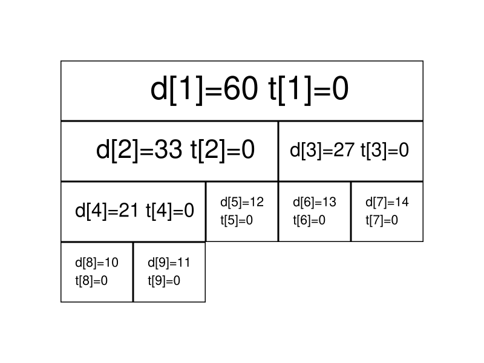

线段树是算法竞赛中常用的用来维护 **区间信息** 的数据结构。

线段树可以在 $O(\log N)$ 的时间复杂度内实现单点修改、区间修改、区间查询（区间求和，求区间最大值，求区间最小值）等操作。

线段树维护的信息在很多时候可以认为是满足（幺）半群的性质的信息。

一个幺半群 $M=(S,\circ ,e)$，其中 $\circ$ 为在集合 $S$ 上定义的二元运算符，幺半群具有以下性质：

- 封闭性：$\forall x\in S$ 和 $\forall y\in S$ 有 $x\circ y\in S$。
- 结合律：$\forall x,y,z\in S$ 有 $(x\circ y)\circ z=x\circ (y\circ z)$。
- 存在幺元：即 $\exists e\in S$ 满足 $\forall x \in S$ 有 $e\circ x=x$，$e$ 为左幺元；或 $x\circ e=x$，$e$ 为右幺元。

我们观察到线段树上的信息一般满足这样的性质，一些数域上的加法与乘法自然，考虑二元的 $\max(x,y)$ 运算，此时幺元为 $-\infty$ 也满足这样的性质（一般左右幺元相同时简称为幺元）。

## 线段树

### 线段树的基本结构与建树

线段树将每个长度不为 $1$ 的区间划分成左右两个区间递归求解，把整个线段划分为一个树形结构，通过合并左右两区间信息来求得该区间的信息。这种数据结构可以方便的进行大部分的区间操作。

有个大小为 $5$ 的数组 $a=\{10,11,12,13,14\}$，要将其转化为线段树，有以下做法：设线段树的根节点编号为 $1$，用数组 $d$ 来保存我们的线段树，$d_i$ 用来保存线段树上编号为 $i$ 的节点的值（这里每个节点所维护的值就是这个节点所表示的区间总和）。

我们先给出这棵线段树的形态，如图所示：


图中每个节点中用红色字体标明的区间，表示该节点管辖的 $a$ 数组上的位置区间。如 $d_1$ 所管辖的区间就是 $[1,5]$（$a_1,a_2, \cdots ,a_5$），即 $d_1$ 所保存的值是 $a_1+a_2+ \cdots +a_5$，$d_1=60$ 表示的是 $a_1+a_2+ \cdots +a_5=60$。

通过观察不难发现，$d_i$ 的左儿子节点就是 $d_{2\times i}$，$d_i$ 的右儿子节点就是 $d_{2\times i+1}$。如果 $d_i$ 表示的是区间 $[s,t]$（即 $d_i=a_s+a_{s+1}+ \cdots +a_t$) 的话，那么 $d_i$ 的左儿子节点表示的是区间 $[ s, \frac{s+t}{2} ]$，$d_i$ 的右儿子表示的是区间 $[ \frac{s+t}{2} +1,t ]$。

在实现时，我们考虑递归建树。设当前的根节点为 $p$，如果根节点管辖的区间长度已经是 $1$，则可以直接根据 $a$ 数组上相应位置的值初始化该节点。否则我们将该区间从中点处分割为两个子区间，分别进入左右子节点递归建树，最后合并两个子节点的信息。

此处给出 C++ 的代码实现，可参考注释理解：

```cpp
// C++ Version
void build(int s, int t, int p) {
    // 对 [s,t] 区间建立线段树,当前根的编号为 p
    if (s == t) {
        d[p] = a[s];
        return;
    }
    int m = s + ((t - s) >> 1);
    // 移位运算符的优先级小于加减法，所以加上括号
    // 如果写成 (s + t) >> 1 可能会超出 int 范围
    build(s, m, p * 2), build(m + 1, t, p * 2 + 1);
    // 递归对左右区间建树
    d[p] = d[p * 2] + d[(p * 2) + 1];
}
```

```python
# Python Version
def build(s, t, p):
    # 对 [s,t] 区间建立线段树,当前根的编号为 p
    if s == t:
        d[p] = a[s]
        return
    m = s + ((t - s) >> 1)
    # 移位运算符的优先级小于加减法，所以加上括号
    # 如果写成 (s + t) >> 1 可能会超出 int 范围
    build(s, m, p * 2); build(m + 1, t, p * 2 + 1)
    # 递归对左右区间建树
    d[p] = d[p * 2] + d[(p * 2) + 1]
```

关于线段树的空间：如果采用堆式存储（$2p$ 是 $p$ 的左儿子，$2p+1$ 是 $p$ 的右儿子），若有 $n$ 个叶子结点，则 d 数组的范围最大为 $2^{\left\lceil\log{n}\right\rceil+1}$。

分析：容易知道线段树的深度是 $\left\lceil\log{n}\right\rceil$ 的，则在堆式储存情况下叶子节点（包括无用的叶子节点）数量为 $2^{\left\lceil\log{n}\right\rceil}$ 个，又由于其为一棵完全二叉树，则其总节点个数 $2^{\left\lceil\log{n}\right\rceil+1}-1$。当然如果你懒得计算的话可以直接把数组长度设为 $4n$，因为 $\frac{2^{\left\lceil\log{n}\right\rceil+1}-1}{n}$ 的最大值在 $n=2^{x}+1(x\in N_{+})$ 时取到，此时节点数为 $2^{\left\lceil\log{n}\right\rceil+1}-1=2^{x+2}-1=4n-5$。

### 线段树的区间查询

区间查询，比如求区间 $[l,r]$ 的总和（即 $a_l+a_{l+1}+ \cdots +a_r$）、求区间最大值/最小值等操作。


仍然以最开始的图为例，如果要查询区间 $[1,5]$ 的和，那直接获取 $d_1$ 的值（$60$）即可。

如果要查询的区间为 $[3,5]$，此时就不能直接获取区间的值，但是 $[3,5]$ 可以拆成 $[3,3]$ 和 $[4,5]$，可以通过合并这两个区间的答案来求得这个区间的答案。

一般地，如果要查询的区间是 $[l,r]$，则可以将其拆成最多为 $O(\log n)$ 个 **极大** 的区间，合并这些区间即可求出 $[l,r]$ 的答案。

此处给出 C++ 的代码实现，可参考注释理解：

```cpp
// C++ Version
int getsum(int l, int r, int s, int t, int p) {
    // [l, r] 为查询区间, [s, t] 为当前节点包含的区间, p 为当前节点的编号
    if (l <= s && t <= r)
        return d[p];  // 当前区间为询问区间的子集时直接返回当前区间的和
    int m = s + ((t - s) >> 1), sum = 0;
    if (l <= m) sum += getsum(l, r, s, m, p * 2);
    // 如果左儿子代表的区间 [l, m] 与询问区间有交集, 则递归查询左儿子
    if (r > m) sum += getsum(l, r, m + 1, t, p * 2 + 1);
    // 如果右儿子代表的区间 [m + 1, r] 与询问区间有交集, 则递归查询右儿子
    return sum;
}
```

```python
# Python Version
def getsum(l, r, s, t, p):
    # [l, r] 为查询区间, [s, t] 为当前节点包含的区间, p 为当前节点的编号
    if l <= s and t <= r:
        return d[p] # 当前区间为询问区间的子集时直接返回当前区间的和
    m = s + ((t - s) >> 1); sum = 0
    if l <= m:
        sum = sum + getsum(l, r, s, m, p * 2)
    # 如果左儿子代表的区间 [l, m] 与询问区间有交集, 则递归查询左儿子
    if r > m:
        sum = sum + getsum(l, r, m + 1, t, p * 2 + 1)
    # 如果右儿子代表的区间 [m + 1, r] 与询问区间有交集, 则递归查询右儿子
    return sum
```

### 线段树的区间修改与懒惰标记

如果要求修改区间 $[l,r]$，把所有包含在区间 $[l,r]$ 中的节点都遍历一次、修改一次，时间复杂度无法承受。我们这里要引入一个叫做 **「懒惰标记」** 的东西。

懒惰标记，简单来说，就是通过延迟对节点信息的更改，从而减少可能不必要的操作次数。每次执行修改时，我们通过打标记的方法表明该节点对应的区间在某一次操作中被更改，但不更新该节点的子节点的信息。实质性的修改则在下一次访问带有标记的节点时才进行。

仍然以最开始的图为例，我们将执行若干次给区间内的数加上一个值的操作。我们现在给每个节点增加一个 $t_i$，表示该节点带的标记值。

最开始时的情况是这样的（为了节省空间，这里不再展示每个节点管辖的区间）：



现在我们准备给 $[3,5]$ 上的每个数都加上 $5$。根据前面区间查询的经验，我们很快找到了两个极大区间 $[3,3]$ 和 $[4,5]$（分别对应线段树上的 $3$ 号点和 $5$ 号点）。

我们直接在这两个节点上进行修改，并给它们打上标记：


我们发现，$3$ 号节点的信息虽然被修改了（因为该区间管辖两个数，所以 $d_3$ 加上的数是 $5 \times 2=10$），但它的两个子节点却还没更新，仍然保留着修改之前的信息。不过不用担心，虽然修改目前还没进行，但当我们要查询这两个子节点的信息时，我们会利用标记修改这两个子节点的信息，使查询的结果依旧准确。

接下来我们查询一下 $[4,4]$ 区间上各数字的和。

我们通过递归找到 $[4,5]$ 区间，发现该区间并非我们的目标区间，且该区间上还存在标记。这时候就到标记下放的时间了。我们将该区间的两个子区间的信息更新，并清除该区间上的标记。


现在 $6$、$7$ 两个节点的值变成了最新的值，查询的结果也是准确的。

接下来给出在存在标记的情况下，区间修改和查询操作的参考实现。

区间修改（区间加上某个值）：

```cpp
// C++ Version
void update(int l, int r, int c, int s, int t, int p) {
    // [l, r] 为修改区间, c 为被修改的元素的变化量, [s, t] 为当前节点包含的区间,
    // p 为当前节点的编号
    if (l <= s && t <= r) {
        d[p] += (t - s + 1) * c, b[p] += c;
        return;
    }  // 当前区间为修改区间的子集时直接修改当前节点的值,然后打标记,结束修改
    int m = s + ((t - s) >> 1);
    if (b[p] && s != t) {
        // 如果当前节点的懒标记非空,则更新当前节点两个子节点的值和懒标记值
        d[p * 2] += b[p] * (m - s + 1), d[p * 2 + 1] += b[p] * (t - m);
        b[p * 2] += b[p], b[p * 2 + 1] += b[p];  // 将标记下传给子节点
        b[p] = 0;                                // 清空当前节点的标记
    }
    if (l <= m) update(l, r, c, s, m, p * 2);
    if (r > m) update(l, r, c, m + 1, t, p * 2 + 1);
    d[p] = d[p * 2] + d[p * 2 + 1];
}
```

```python
# Python Version
def update(l, r, c, s, t, p):
    # [l, r] 为修改区间, c 为被修改的元素的变化量, [s, t] 为当前节点包含的区间, p
    # 为当前节点的编号
    if l <= s and t <= r:
        d[p] = d[p] + (t - s + 1) * c
        b[p] = b[p] + c
        return
    # 当前区间为修改区间的子集时直接修改当前节点的值, 然后打标记, 结束修改
    m = s + ((t - s) >> 1)
    if b[p] and s != t:
        # 如果当前节点的懒标记非空, 则更新当前节点两个子节点的值和懒标记值
        d[p * 2] = d[p * 2] + b[p] * (m - s + 1)
        d[p * 2 + 1] = d[p * 2 + 1] + b[p] * (t - m)
        # 将标记下传给子节点
        b[p * 2] = b[p * 2] + b[p]
        b[p * 2 + 1] = b[p * 2 + 1] + b[p]
        # 清空当前节点的标记
        b[p] = 0
    if l <= m:
        update(l, r, c, s, m, p * 2)
    if r > m:
        update(l, r, c, m + 1, t, p * 2 + 1)
    d[p] = d[p * 2] + d[p * 2 + 1]
```

区间查询（区间求和）：

```cpp
// C++ Version
int getsum(int l, int r, int s, int t, int p) {
    // [l, r] 为查询区间, [s, t] 为当前节点包含的区间, p 为当前节点的编号
    if (l <= s && t <= r) return d[p];
    // 当前区间为询问区间的子集时直接返回当前区间的和
    int m = s + ((t - s) >> 1);
    if (b[p]) {
        // 如果当前节点的懒标记非空,则更新当前节点两个子节点的值和懒标记值
        d[p * 2] += b[p] * (m - s + 1), d[p * 2 + 1] += b[p] * (t - m),
            b[p * 2] += b[p], b[p * 2 + 1] += b[p];  // 将标记下传给子节点
        b[p] = 0;  // 清空当前节点的标记
    }
    int sum = 0;
    if (l <= m) sum = getsum(l, r, s, m, p * 2);
    if (r > m) sum += getsum(l, r, m + 1, t, p * 2 + 1);
    return sum;
}
```

```python
# Python Version
def getsum(l, r, s, t, p):
    # [l, r] 为查询区间, [s, t] 为当前节点包含的区间, p为当前节点的编号
    if l <= s and t <= r:
        return d[p]
    # 当前区间为询问区间的子集时直接返回当前区间的和
    m = s + ((t - s) >> 1)
    if b[p]:
        # 如果当前节点的懒标记非空, 则更新当前节点两个子节点的值和懒标记值
        d[p * 2] = d[p * 2] + b[p] * (m - s + 1)
        d[p * 2 + 1] = d[p * 2 + 1] + b[p] * (t - m)
        # 将标记下传给子节点
        b[p * 2] = b[p * 2] + b[p]
        b[p * 2 + 1] = b[p * 2 + 1] + b[p]
        # 清空当前节点的标记
        b[p] = 0
    sum = 0
    if l <= m:
        sum = getsum(l, r, s, m, p * 2)
    if r > m:
        sum = sum + getsum(l, r, m + 1, t, p * 2 + 1)
    return sum
```

如果你是要实现区间修改为某一个值而不是加上某一个值的话，代码如下：

```cpp
// C++ Version
void update(int l, int r, int c, int s, int t, int p) {
    if (l <= s && t <= r) {
        d[p] = (t - s + 1) * c, b[p] = c;
        return;
    }
    int m = s + ((t - s) >> 1);
    if (b[p]) {
        d[p * 2] = b[p] * (m - s + 1), d[p * 2 + 1] = b[p] * (t - m),
              b[p * 2] = b[p * 2 + 1] = b[p];
        b[p] = 0;
    }
    if (l <= m) update(l, r, c, s, m, p * 2);
    if (r > m) update(l, r, c, m + 1, t, p * 2 + 1);
    d[p] = d[p * 2] + d[p * 2 + 1];
}
int getsum(int l, int r, int s, int t, int p) {
    if (l <= s && t <= r) return d[p];
    int m = s + ((t - s) >> 1);
    if (b[p]) {
        d[p * 2] = b[p] * (m - s + 1), d[p * 2 + 1] = b[p] * (t - m),
              b[p * 2] = b[p * 2 + 1] = b[p];
        b[p] = 0;
    }
    int sum = 0;
    if (l <= m) sum = getsum(l, r, s, m, p * 2);
    if (r > m) sum += getsum(l, r, m + 1, t, p * 2 + 1);
    return sum;
}
```

```python
# Python Version
def update(l, r, c, s, t, p):
    if l <= s and t <= r:
        d[p] = (t - s + 1) * c
        b[p] = c
        return
    m = s + ((t - s) >> 1)
    if b[p]:
        d[p * 2] = b[p] * (m - s + 1)
        d[p * 2 + 1] = b[p] * (t - m)
        b[p * 2] = b[p * 2 + 1] = b[p]
        b[p] = 0
    if l <= m:
        update(l, r, c, s, m, p * 2)
    if r > m:
        update(l, r, c, m + 1, t, p * 2 + 1)
    d[p] = d[p * 2] + d[p * 2 + 1]

def getsum(l, r, s, t, p):
    if l <= s and t <= r:
        return d[p]
    m = s + ((t - s) >> 1)
    if b[p]:
        d[p * 2] = b[p] * (m - s + 1)
        d[p * 2 + 1] = b[p] * (t - m)
        b[p * 2] = b[p * 2 + 1] = b[p]
        b[p] = 0
    sum = 0
    if l <= m:
        sum = getsum(l, r, s, m, p * 2)
    if r > m:
        sum = sum + getsum(l, r, m + 1, t, p * 2 + 1)
    return sum
```

## 一些优化

这里总结几个线段树的优化：

- 在叶子节点处无需下放懒惰标记，所以懒惰标记可以不下传到叶子节点。

- 下放懒惰标记可以写一个专门的函数 `pushdown`，从儿子节点更新当前节点也可以写一个专门的函数 `maintain`（或者对称地用 `pushup`），降低代码编写难度。

- 标记永久化：如果确定懒惰标记不会在中途被加到溢出（即超过了该类型数据所能表示的最大范围），那么就可以将标记永久化。标记永久化可以避免下传懒惰标记，只需在进行询问时把标记的影响加到答案当中，从而降低程序常数。具体如何处理与题目特性相关，需结合题目来写。这也是树套树和可持久化数据结构中会用到的一种技巧。

## 例题

> [!NOTE] **[luogu P3372【模板】线段树 1](https://www.luogu.com.cn/problem/P3372)**
> 
> 已知一个数列，你需要进行下面两种操作：
> 
> - 将某区间每一个数加上 $k$。
> 
> - 求出某区间每一个数的和。
    


<details>
<summary>详细代码</summary>
<!-- tabs:start -->

##### **C++**

```cpp
```

##### **Python**

```python
```

<!-- tabs:end -->
</details>

<br>

> [!NOTE] **[luogu P3373【模板】线段树 2](https://www.luogu.com.cn/problem/P3373)**
> 
> 已知一个数列，你需要进行下面三种操作：
> 
> - 将某区间每一个数乘上 $x$。
> 
> - 将某区间每一个数加上 $x$。
> 
> - 求出某区间每一个数的和。
    


<details>
<summary>详细代码</summary>
<!-- tabs:start -->

##### **C++**

```cpp
```

##### **Python**

```python
```

<!-- tabs:end -->
</details>

<br>

> [!NOTE] **[HihoCoder 1078 线段树的区间修改](https://cn.vjudge.net/problem/HihoCoder-1078)**
> 
> 假设货架上从左到右摆放了 $N$ 种商品，并且依次标号为 $1$ 到 $N$，其中标号为 $i$ 的商品的价格为 $Pi$。小 Hi 的每次操作分为两种可能，第一种是修改价格：小 Hi 给出一段区间 $[L, R]$ 和一个新的价格 $\textit{NewP}$，所有标号在这段区间中的商品的价格都变成 $\textit{NewP}$。第二种操作是询问：小 Hi 给出一段区间 $[L, R]$，而小 Ho 要做的便是计算出所有标号在这段区间中的商品的总价格，然后告诉小 Hi。
    


<details>
<summary>详细代码</summary>
<!-- tabs:start -->

##### **C++**

```cpp
```

##### **Python**

```python
```

<!-- tabs:end -->
</details>

<br>

> [!NOTE] **[2018 Multi-University Training Contest 5 Problem G. Glad You Came](https://vjudge.net/problem/HDU-6356)**

> [!TIP] **解题思路**
> 维护一下每个区间的永久标记就可以了，最后在线段树上跑一边 DFS 统计结果即可。注意打标记的时候加个剪枝优化，否则会 TLE。

## 拓展 - 猫树

众所周知线段树可以支持高速查询某一段区间的信息和，比如区间最大子段和，区间和，区间矩阵的连乘积等等。

但是有一个问题在于普通线段树的区间询问在某些毒瘤的眼里可能还是有些慢了。

简单来说就是线段树建树的时候需要做 $O(n)$ 次合并操作，而每一次区间询问需要做 $O(\log{n})$ 次合并操作，询问区间和这种东西的时候还可以忍受，但是当我们需要询问区间线性基这种合并复杂度高达 $O(\log^2{w})$ 的信息的话，此时就算是做 $O(\log{n})$ 次合并有些时候在时间上也是不可接受的。

而所谓“猫树”就是一种不支持修改，仅仅支持快速区间询问的一种静态线段树。

构造一棵这样的静态线段树需要 $O(n\log{n})$ 次合并操作，但是此时的查询复杂度被加速至 $O(1)$ 次合并操作。

在处理线性基这样特殊的信息的时候甚至可以将复杂度降至 $O(n\log^2{w})$。

### 原理

在查询 $[l,r]$ 这段区间的信息和的时候，将线段树树上代表 $[l,l]$ 的节点和代表 $[r,r]$ 这段区间的节点在线段树上的 LCA 求出来，设这个节点 $p$ 代表的区间为 $[L,R]$，我们会发现一些非常有趣的性质：

1. $[L,R]$ 这个区间一定包含 $[l,r]$。显然，因为它既是 $l$ 的祖先又是 $r$ 的祖先。

2. $[l,r]$ 这个区间一定跨越 $[L,R]$ 的中点。由于 $p$ 是 $l$ 和 $r$ 的 LCA，这意味着 $p$ 的左儿子是 $l$ 的祖先而不是 $r$ 的祖先，$p$ 的右儿子是 $r$ 的祖先而不是 $l$ 的祖先。因此，$l$ 一定在 $[L,\mathit{mid}]$ 这个区间内，$r$ 一定在 $(\mathit{mid},R]$ 这个区间内。

有了这两个性质，我们就可以将询问的复杂度降至 $O(1)$ 了。

### 实现

具体来讲我们建树的时候对于线段树树上的一个节点，设它代表的区间为 $(l,r]$。

不同于传统线段树在这个节点里只保留 $[l,r]$ 的和，我们在这个节点里面额外保存 $(l,\mathit{mid}]$ 的后缀和数组和 $(\mathit{mid},r]$ 的前缀和数组。

这样的话建树的复杂度为 $T(n)=2T(n/2)+O(n)=O(n\log{n})$ 同理空间复杂度也从原来的 $O(n)$ 变成了 $O(n\log{n})$。

下面是最关键的询问了。

如果我们询问的区间是 $[l,r]$ 那么我们把代表 $[l,l]$ 的节点和代表 $[r,r]$ 的节点的 LCA 求出来，记为 $p$。

根据刚才的两个性质，$l,r$ 在 $p$ 所包含的区间之内并且一定跨越了 $p$ 的中点。

这意味这一个非常关键的事实是我们可以使用 $p$ 里面的前缀和数组和后缀和数组，将 $[l,r]$ 拆成 $[l,\mathit{mid}]+(\mathit{mid},r]$ 从而拼出来 $[l,r]$ 这个区间。

而这个过程仅仅需要 $O(1)$ 次合并操作！

不过我们好像忽略了点什么？

似乎求 LCA 的复杂度似乎还不是 $O(1)$，暴力求是 $O(\log{n})$ 的，倍增法则是 $O(\log{\log{n}})$ 的，转 ST 表的代价又太大……

### 堆式建树

具体来将我们将这个序列补成 $2$ 的整次幂，然后建线段树。

此时我们发现线段树上两个节点的 LCA 编号，就是两个节点二进制编号的最长公共前缀 LCP。

稍作思考即可发现发现在 $x$ 和 $y$ 的二进制下 `lcp(x,y)=x>>log[x^y]`。

所以我们预处理一个 `log` 数组即可轻松完成求 LCA 的工作。

这样我们就构建了一个猫树。

由于建树的时候涉及到求前缀和和求后缀和，所以对于线性基这种虽然合并是 $O(\log^2{w})$ 但是求前缀和却是 $O(n\log{n})$ 的信息，使用猫树可以将静态区间线性基从 $O(n\log^2{w}+m\log^2{w}\log{n})$ 优化至 $O(n\log{n}\log{w}+m\log^2{w})$ 的复杂度。

### 参考

- [immortalCO 大爷的博客](https://immortalco.blog.uoj.ac/blog/2102)
- [\[Kle77\]](http://ieeexplore.ieee.org/document/1675628/) V. Klee,“Can the Measure of be Computed in Less than O (n log n) Steps?,”Am. Math. Mon., vol. 84, no. 4, pp. 284–285, Apr. 1977.
- [\[BeW80\]](https://www.tandfonline.com/doi/full/10.1080/00029890.1977.11994336) Bentley and Wood,“An Optimal Worst Case Algorithm for Reporting Intersections of Rectangles,”IEEE Trans. Comput., vol. C–29, no. 7, pp. 571–577, Jul. 1980.


## 习题

### 一般线段树

> [!NOTE] **[AcWing 245. 你能回答这些问题吗](https://www.acwing.com/problem/content/246/)**
> 
> 题意: TODO

> [!TIP] **思路**
> 
> 查询某个区间的最大子段和 原来想的是求最大值再求左侧最小值 但是显然先确定右端点这样的贪心不对
> 
> 查询某个区间时 本质也需要对子区间进行合并 故创建新的node并依据子区间pushup流程更新

<details>
<summary>详细代码</summary>
<!-- tabs:start -->

##### **C++**

```cpp
#include<bits/stdc++.h>
using namespace std;

const int N = 500010, M = N << 2;

int n, m;
int w[N];

struct Node{
    int l, r;
    // 最大连续子段和 只依赖tmax不足以从子节点更新当前节点
    // 对于横跨两个区间的区块 总要记录一个横跨左右的 最大前缀 和 最大后缀
    // 即 父区间的最大值可能是横跨左右子区间 则其值为左的最大后缀加右的最大前缀
    // tmax 最大连续子段和 lmax最大前缀和 rmax最大后缀和
    // ATTENTION: 对于包含整个左子的情况 还需要左侧区间和 故sum记录区间总和
    int tmax, lmax, rmax, sum;
}tr[M];

void pushup(Node & u, Node & l, Node & r) {
    u.sum = l.sum + r.sum;
    u.lmax = max(l.lmax, l.sum + r.lmax);
    u.rmax = max(r.rmax, l.rmax + r.sum);
    u.tmax = max(max(l.tmax, r.tmax), l.rmax + r.lmax);
}

void pushup(int u) {
    pushup(tr[u], tr[u << 1], tr[u << 1 | 1]);
}

void build(int u, int l, int r) {
    if (l == r) tr[u] = {l, r, w[r], w[r], w[r], w[r]};
    else {
        tr[u] = {l, r};
        int mid = l + (r - l) / 2;
        build(u << 1, l, mid), build(u << 1 | 1, mid + 1, r);
        pushup(u);
    }
}

void modify(int u, int x, int v) {
    if (tr[u].l == x && tr[u].r == x) tr[u] = {x, x, v, v, v, v};
    else {
        int mid = tr[u].l + (tr[u].r - tr[u].l) / 2;
        if (x <= mid) modify(u << 1, x, v);
        else modify(u << 1 | 1, x, v);
        pushup(u);
    }
}

Node query(int u, int l, int r) {
    if (tr[u].l >= l && tr[u].r <= r) return tr[u];
    else {
        int mid = tr[u].l + (tr[u].r - tr[u].l) / 2;
        if (r <= mid) return query(u << 1, l, r);
        else if (l > mid) return query(u << 1 | 1, l, r);
        else {
            auto left = query(u << 1, l, r);
            auto right = query(u << 1 | 1, l, r);
            // 思路
            Node res;
            pushup(res, left, right);
            return res;
        }
    }
}

int main() {
    scanf("%d%d", &n, &m);
    for (int i = 1; i <= n; ++ i ) scanf("%d", &w[i]);
    build(1, 1, n);
    
    int k, x, y;
    while (m -- ) {
        scanf("%d%d%d", &k, &x, &y);
        if (k == 1) {
            if (x > y) swap(x, y);
            printf("%d\n", query(1, x, y).tmax);
        } else modify(1, x, y);
    }
    return 0;
}
```

##### **Python**

```python

```

<!-- tabs:end -->
</details>

<br>

* * *

> [!NOTE] **[AcWing 246. 区间最大公约数](https://www.acwing.com/problem/content/247/)**
> 
> 题意: TODO

> [!TIP] **思路**
> 
> 做到这题 其实写俩pushup函数就是为了query的时候方便合并左右区间的查询结果
> 
> 区间增加 看似可以直接差分 但要求gcd 就不行了
> 
> 考虑区间内维护哪些信息：
> 
> - 首先gcd显然要存，但是在区间修改的情况下存这个没啥意义
> 
> - 因为gcd更相减损 考虑转化为维护差的形式
> 
> 修改区间改为修改单点 则差分
> 原理：
> $$
> d = gcd(x, y, z) = gcd(x, y - x, z - y)
> d = gcd(a1, a2, a3, ... , an) = gcd(a1, a2-a1, a3-a2, ... , an-an-1)
> $$
> 
> 则题目变为 单点修改&区间查询
> 
> 考虑：能否只用一个BIT？【不能 因为BIT求的是前缀和 这里求的是区间 只是维护sum的值类似BIT差分】

<details>
<summary>详细代码</summary>
<!-- tabs:start -->

##### **C++**

```cpp
#include<bits/stdc++.h>
using namespace std;

using LL = long long;

const int N = 500010, M = N << 2;

int n, m;
LL w[N];
struct Node{
    int l, r;
    LL sum, d;
}tr[M];

LL gcd(LL a, LL b) {
    return b ? gcd(b, a % b) : a;
}

void pushup(Node & u, Node & l, Node & r) {
    u.sum = l.sum + r.sum;
    u.d = gcd(l.d, r.d);
}

void pushup(int u) {
    pushup(tr[u], tr[u << 1], tr[u << 1 | 1]);
}

void build(int u, int l, int r) {
    if (l == r) {
        LL b = w[r] - w[r - 1];
        tr[u] = {l, r, b, b};
    } else {
        tr[u] = {l, r};
        int mid = l + (r - l) / 2;
        build(u << 1, l, mid), build(u << 1 | 1, mid + 1, r);
        pushup(u);
    }
}

void modify(int u, int x, LL v) {
    if (tr[u].l == x && tr[u].r == x) {
        LL b = tr[u].sum + v;
        tr[u] = {x, x, b, b};
    } else {
        int mid = tr[u].l + (tr[u].r - tr[u].l) / 2;
        if (x <= mid) modify(u << 1, x, v);
        else modify(u << 1 | 1, x, v);
        pushup(u);
    }
}

Node query(int u, int l, int r) {
    if (tr[u].l >= l && tr[u].r <= r) return tr[u];
    else {
        int mid = tr[u].l + (tr[u].r - tr[u].l) / 2;
        if (r <= mid) return query(u << 1, l, r);
        else if (l > mid) return query(u << 1 | 1, l, r);
        else {
            auto left = query(u << 1, l, r);
            auto right = query(u << 1 | 1, l, r);
            Node res;
            pushup(res, left, right);
            return res;
        }
    }
}

int main() {
    scanf("%d%d", &n, &m);
    for (int i = 1; i <= n; ++ i ) scanf("%lld", &w[i]);
    build(1, 1, n);
    
    char op[2];
    int l, r;
    LL d;
    while (m -- ) {
        scanf("%s%d%d", op, &l, &r);
        if (*op == 'Q') {
            // 获取l值
            auto left = query(1, 1, l);
            // 处理 l = r 的特例 只要r.d为0即可
            Node right({0, 0, 0, 0});
            if (l + 1 <= r) right = query(1, l + 1, r);
            printf("%lld\n", abs(gcd(left.sum, right.d)));
        } else {
            scanf("%lld", &d);
            modify(1, l, d);
            if (r + 1 <= n) modify(1, r + 1, -d);
        }
    }
    return 0;
}
```

##### **Python**

```python

```

<!-- tabs:end -->
</details>

<br>

* * *

> [!NOTE] **[AcWing 243. 一个简单的整数问题2](https://www.acwing.com/problem/content/244/)**
> 
> 题意: TODO

> [!TIP] **思路**
> 
> 懒标记 处理区间变化
> 
> 本题 sum 为当前区间的总和
> 
> add 懒标记：
> 
> 给【以当前节点为根的子树中的每一个节点加上一个值】，【不含根节点】这样方便在当前区间被包括时直接返回 而不用再计算add
> 
> 从上至下时为了累计所积累的add 每次都pushdown
> 
> 不统一的区间 一定要裂开

<details>
<summary>详细代码</summary>
<!-- tabs:start -->

##### **C++**

```cpp
#include<bits/stdc++.h>
using namespace std;

using LL = long long;

const int N = 100010, M = N << 2;

int n, m;
int w[N];
struct Node{
    int l, r;
    // 
    LL sum, add;
}tr[M];

void pushup(int u) {
    tr[u].sum = tr[u << 1].sum + tr[u << 1 | 1].sum;
}

void pushdown(int u) {
    auto &root = tr[u], &left = tr[u << 1], &right = tr[u << 1 | 1];
    if (root.add) {
        left.add += root.add, left.sum += (LL)(left.r - left.l + 1) * root.add;
        right.add += root.add, right.sum += (LL)(right.r - right.l + 1) * root.add;
        root.add = 0;
    }
}

void build(int u, int l, int r) {
    if (l == r) tr[u] = {l, r, w[r], 0};
    else {
        tr[u] = {l, r};
        int mid = l + (r - l) / 2;
        build(u << 1, l, mid), build(u << 1 | 1, mid + 1, r);
        pushup(u);
    }
}

void modify(int u, int l, int r, int d) {
    if (tr[u].l >= l && tr[u].r <= r) {
        tr[u].sum += (LL)(tr[u].r - tr[u].l + 1) * d;
        tr[u].add += d;
    } else {
        // 不统一的 一定要分裂
        pushdown(u);
        int mid = tr[u].l + (tr[u].r - tr[u].l) / 2;
        if (l <= mid) modify(u << 1, l, r, d);
        if (r > mid) modify(u << 1 | 1, l, r, d);
        pushup(u);
    }
}

LL query(int u, int l, int r) {
    if (tr[u].l >= l && tr[u].r <= r) return tr[u].sum;
    else {
        pushdown(u);
        int mid = tr[u].l + (tr[u].r - tr[u].l) / 2;
        LL sum = 0;
        if (l <= mid) sum += query(u << 1, l, r);
        if (r > mid) sum += query(u << 1 | 1, l, r);
        return sum;
    }
}

int main() {
    scanf("%d%d", &n, &m);
    for (int i = 1; i <= n; ++ i ) scanf("%d", &w[i]);
    
    build(1, 1, n);
    
    char op[2];
    int l, r, d;
    while (m -- ) {
        scanf("%s%d%d", op, &l, &r);
        if (*op == 'C') {
            scanf("%d", &d);
            modify(1, l, r, d);
        } else printf("%lld\n", query(1, l, r));
    }
    return 0;
}
```

##### **Python**

```python

```

<!-- tabs:end -->
</details>

<br>

* * *


> [!NOTE] **[AcWing 1277. 维护序列](https://www.acwing.com/problem/content/1279/)**
> 
> 题意: TODO

> [!TIP] **思路**
> 
> 区间修改和区间查询 考虑懒标记
> 
> 考虑需要记录哪些信息:
> 
>     l, r        以及 sum add mul
> 
>     考虑是先加再乘还是先乘再加  前者很难维护 故先乘再加
>     
> **重要小技巧【代数表达式】 把乘和加统一**
> 
>     1. *c :  x * c + d == x * c + 0
> 
>     2. +d :  x * c + d == x * 1 + d

<details>
<summary>详细代码</summary>
<!-- tabs:start -->

##### **C++**

```cpp
#include<bits/stdc++.h>
using namespace std;

using LL = long long;

const int N = 100010;

int n, p, m;
int w[N];
struct Node {
    int l, r;
    int sum, add, mul;
}tr[N * 4];

void pushup(int u) {
    tr[u].sum = (tr[u << 1].sum + tr[u << 1 | 1].sum) % p;
}

// 先乘再加
void eval(Node & t, int add, int mul) {
    t.sum = ((LL)t.sum * mul + (LL)(t.r - t.l + 1) * add) % p;
    t.mul = (LL)t.mul * mul % p;
    t.add = ((LL)t.add * mul + add) % p;
}

void pushdown(int u) {
    eval(tr[u << 1], tr[u].add, tr[u].mul);
    eval(tr[u << 1 | 1], tr[u].add, tr[u].mul);
    tr[u].add = 0, tr[u].mul = 1;
}

void build(int u, int l, int r) {
    if (l == r) tr[u] = {l, r, w[r], 0, 1};
    else {
        tr[u] = {l, r, 0, 0, 1};
        int mid = l + (r - l) / 2;
        build(u << 1, l, mid), build(u << 1 | 1, mid + 1, r);
        pushup(u);
    }
}

void modify(int u, int l, int r, int add, int mul) {
    if (tr[u].l >= l && tr[u].r <= r) eval(tr[u], add, mul);
    else {
        pushdown(u);
        int mid = tr[u].l + (tr[u].r - tr[u].l) / 2;
        if (l <= mid) modify(u << 1, l, r, add, mul);
        if (r > mid) modify(u << 1 | 1, l, r, add, mul);
        pushup(u);
    }
}

int query(int u, int l, int r) {
    if (tr[u].l >= l && tr[u].r <= r) return tr[u].sum;
    else {
        pushdown(u);
        int mid = tr[u].l + (tr[u].r - tr[u].l) / 2;
        int sum = 0;
        if (l <= mid) sum += query(u << 1, l, r) % p;
        if (r > mid) sum += query(u << 1 | 1, l, r) % p;
        return sum % p;
    }
}

int main() {
    scanf("%d%d", &n, &p);
    for (int i = 1; i <= n; ++ i ) scanf("%d", &w[i]);
    build(1, 1, n);
    
    scanf("%d", &m);
    while (m -- ) {
        int t, l, r, d;
        scanf("%d%d%d", &t, &l, &r);
        if (t == 1) {
            scanf("%d", &d);
            modify(1, l, r, 0, d);
        } else if (t == 2) {
            scanf("%d", &d);
            modify(1, l, r, d, 1);
        } else printf("%d\n", query(1, l, r));
    }
    return 0;
}
```

##### **Python**

```python

```

<!-- tabs:end -->
</details>

<br>

* * *

> [!NOTE] **[Luogu 【模板】线段树 1](https://www.luogu.com.cn/problem/P3372)**
> 
> 题意: TODO

> [!TIP] **思路**
> 
> 一般修改和查询

<details>
<summary>详细代码</summary>
<!-- tabs:start -->

##### **C++**

```cpp
#include <bits/stdc++.h>
using namespace std;

// sum, add

using LL = long long;
const int N = 1e5 + 10;

int n, m;
LL w[N];
struct Node {
    int l, r;
    LL sum, add;
} tr[N << 2];

void pushup(int u) {
    tr[u].sum = tr[u << 1].sum + tr[u << 1 | 1].sum;
}

void eval(Node & t, LL add) {
    t.sum += (LL)(t.r - t.l + 1) * add;
    t.add += add;
}

void pushdown(int u) {
    // 代表u的所有子段都要加tr[u].add
    eval(tr[u << 1], tr[u].add);
    eval(tr[u << 1 | 1], tr[u].add);
    tr[u].add = 0;
}

void build(int u, int l, int r) {
    if (l == r)
        tr[u] = {l, r, w[l], 0};
    else {
        tr[u] = {l, r, 0, 0};
        int mid = l + r >> 1;
        build(u << 1, l, mid), build(u << 1 | 1, mid + 1, r);
        pushup(u);
    }
}

void modify(int u, int l, int r, LL k) {
    if (tr[u].l >= l && tr[u].r <= r)
        eval(tr[u], k);
    else {
        pushdown(u);
        int mid = tr[u].l + tr[u].r >> 1;
        if (l <= mid)
            modify(u << 1, l, r, k);
        if (r > mid)
            modify(u << 1 | 1, l, r, k);
        pushup(u);
    }
}

LL query(int u, int l, int r) {
    if (tr[u].l >= l && tr[u].r <= r)
        return tr[u].sum;
    else {
        pushdown(u);
        int mid = tr[u].l + tr[u].r >> 1;
        // ATTENTION LL instead of int WA
        LL sum = 0;
        if (l <= mid)
            sum += query(u << 1, l, r);
        if (r > mid)
            sum += query(u << 1 | 1, l, r);
        // pushup(u);
        return sum;
    }
}

int main() {
    cin >> n >> m;
    
    // 与查询的坐标对应
    for (int i = 1; i <= n; ++ i )
        cin >> w[i];
    
    build(1, 1, n);
    
    while (m -- ) {
        LL op, x, y, k;
        cin >> op >> x >> y;
        if (op == 1) {
            cin >> k;
            modify(1, x, y, k);
        } else
            cout << query(1, x, y) << endl;
    }
    
    return 0;
}
```

##### **Python**

```python

```

<!-- tabs:end -->
</details>

<br>

* * *

> [!NOTE] **[Luogu 【模板】线段树 2](https://www.luogu.com.cn/problem/P3373)**
> 
> 题意: TODO

> [!TIP] **思路**
> 
> 经典
> 乘 + 加

<details>
<summary>详细代码</summary>
<!-- tabs:start -->

##### **C++**

```cpp
#include <bits/stdc++.h>
using namespace std;

// 先乘后加
// 每次修改都作为 ax + b的整体
// new_a = a0 * a, new_b = b0 * a + b;

using LL = long long;
const int N = 1e5 + 10;

int n, m, p;
int w[N];
struct Node {
    int l, r;
    int sum, mul, add;
} tr[N << 2];

void pushup(int u) {
    tr[u].sum = (tr[u << 1].sum + tr[u << 1 | 1].sum) % p;
}

void eval(Node & t, int mul, int add) {
    t.sum = ((LL)t.sum * mul + (LL)(t.r - t.l + 1) * add) % p;
    t.mul = (LL)t.mul * mul % p;
    t.add = ((LL)t.add * mul % p + add) % p;
}

void pushdown(int u) {
    eval(tr[u << 1], tr[u].mul, tr[u].add);
    eval(tr[u << 1 | 1], tr[u].mul, tr[u].add);
    tr[u].mul = 1, tr[u].add = 0;
}

void build(int u, int l, int r) {
    if (l == r)
        tr[u] = {l, r, w[l], 1, 0};
    else {
        // ATTENTION
        tr[u] = {l, r, 0, 1, 0};
        int mid = l + r >> 1;
        build(u << 1, l, mid), build(u << 1 | 1, mid + 1, r);
        pushup(u);
    }
}

void modify(int u, int l, int r, int a, int b) {
    if (tr[u].l >= l && tr[u].r <= r)
        eval(tr[u], a, b);
    else {
        pushdown(u);
        int mid = tr[u].l + tr[u].r >> 1;
        if (l <= mid)
            modify(u << 1, l, r, a, b);
        if (r > mid)
            modify(u << 1 | 1, l, r, a, b);
        pushup(u);
    }
}

int query(int u, int l, int r) {
    if (tr[u].l >= l && tr[u].r <= r)
        return tr[u].sum;
    else {
        pushdown(u);
        int mid = tr[u].l + tr[u].r >> 1;
        int sum = 0;
        if (l <= mid)
            sum = (sum + query(u << 1, l, r)) % p;
        if (r > mid)
            sum = (sum + query(u << 1 | 1, l, r)) % p;
        return sum;
    }
}

int main() {
    cin >> n >> m >> p;
    
    for (int i = 1; i <= n; ++ i )
        cin >> w[i];
    
    build(1, 1, n);
    
    while (m -- ) {
        int op, x, y, k;
        cin >> op >> x >> y;
        if (op == 1) {
            cin >> k;
            modify(1, x, y, k, 0);
        } else if (op == 2) {
            cin >> k;
            modify(1, x, y, 1, k);
        } else
            cout << query(1, x, y) << endl;
    }
    
    return 0;
}
```

##### **Python**

```python

```

<!-- tabs:end -->
</details>

<br>

* * *

> [!NOTE] **[Luogu [TJOI2018]数学计算](https://www.luogu.com.cn/problem/P4588)**
> 
> 题意: TODO

> [!TIP] **思路**
> 
> 独立1A... 思维题
> 
> 推导知线段树维护每次操作乘积
> 
> 节点维护乘积取模即可

<details>
<summary>详细代码</summary>
<!-- tabs:start -->

##### **C++**

```cpp
#include <bits/stdc++.h>
using namespace std;

using LL = long long;
const int N = 1e5 + 10;

int t, q, m;
struct Node {
    int l, r;
    LL product;
} tr[N << 2];

void pushup(int u) {
    tr[u].product = tr[u << 1].product * tr[u << 1 | 1].product % m;
}

void eval(Node & t, int op, int k) {
    if (op == 1)
        t.product = t.product * k % m;
    else
        t.product = 1;
}

void build(int u, int l, int r) {
    if (l == r)
        tr[u] = {l, r, 1};
    else {
        tr[u] = {l, r, 1};
        int mid = l + r >> 1;
        build(u << 1, l, mid), build(u << 1 | 1, mid + 1, r);
        pushup(u);
    }
}

void modify(int u, int l, int r, int op, int k) {
    if (tr[u].l >= l && tr[u].r <= r)
        eval(tr[u], op, k);
    else {
        // nothing to pushdown
        int mid = tr[u].l + tr[u].r >> 1;
        // In fact, only one will be executed cause l == r always
        if (l <= mid)
            modify(u << 1, l, r, op, k);
        if (r > mid)
            modify(u << 1 | 1, l, r, op, k);
        pushup(u);
    }
}

LL query(int u, int l, int r) {
    if (tr[u].l >= l && tr[u].r <= r)
        return tr[u].product;
    else {
        // no pushdown
        int mid = tr[u].l + tr[u].r >> 1;
        
        LL p = 1;
        if (l <= mid)
            p = (p * query(u << 1, l, r)) % m;
        if (r > mid)
            p = (p * query(u << 1 | 1, l, r)) % m;
        return p;
    }
}

int main() {
    cin >> t;
    while (t -- ) {
        cin >> q >> m;
        
        // 0 init
        build(1, 0, q);
        
        for (int i = 1; i <= q; ++ i ) {
            LL op, y;
            cin >> op >> y;
            if (op == 1) {
                modify(1, i, i, 1, y);
            } else {
                modify(1, y, y, 2, 0);
            }
            cout << query(1, 0, i) << endl;
        }
    }
    return 0;
}
```

##### **Python**

```python

```

<!-- tabs:end -->
</details>

<br>

* * *


> [!NOTE] **[Luogu 楼房重建](https://www.luogu.com.cn/problem/P4198)**
> 
> 题意: TODO

> [!TIP] **思路**
> 
> **思维 将 pushup logN 化**
> 
> pushup维护的推导
> 
> **以及何时pushup**

<details>
<summary>详细代码</summary>
<!-- tabs:start -->

##### **C++**

```cpp
#include <bits/stdc++.h>
using namespace std;

const int N = 1e5 + 10;

int n, m;
double w[N];
struct Node {
    int l, r;
    int len;
    double mx;
} tr[N << 2];

int pushup_log(double lmx, int u) {
    int l = tr[u].l, r = tr[u].r;
    
    // 右侧都不合法
    if (tr[u].mx <= lmx)
        return 0;
    // 右侧最左侧的都比左侧最高的高
    if (w[l] > lmx)
        return tr[u].len;
    if (l == r)
        return w[l] > lmx;
    
    if (tr[u << 1].mx <= lmx)   // 左侧不会产生贡献 直接找右侧
        return pushup_log(lmx, u << 1 | 1);
    else                        // 左侧会产生贡献 单独求左侧加上右侧已有的贡献
        return pushup_log(lmx, u << 1) + (tr[u].len - tr[u << 1].len);
}

void pushup(int u) {
    tr[u].mx = max(tr[u << 1].mx, tr[u << 1 | 1].mx);
    
    // update len
    tr[u].len = tr[u << 1].len + pushup_log(tr[u << 1].mx, u << 1 | 1);
}

void build(int u, int l, int r) {
    if (l == r)
        tr[u] = {l, r, 0, 0};
    else {
        tr[u] = {l, r, 0, 0};
        int mid = l + r >> 1;
        build(u << 1, l, mid), build(u << 1 | 1, mid + 1, r);
        pushup(u);
    }
}

void modify(int u, int l, int r, double k) {
    if (tr[u].l >= l && tr[u].r <= r) {
        // eval
        tr[u].mx = k;
        tr[u].len = 1;
        // NOT PUSHUP
        // pushup(u);
    } else {
        int mid = tr[u].l + tr[u].r >> 1;
        if (l <= mid)
            modify(u << 1, l, r, k);
        if (r > mid)
            modify(u << 1 | 1, l, r, k);
        pushup(u);
    }
}

int main() {
    cin >> n >> m;
    build(1, 1, n);
    
    for (int i = 1; i <= m; ++ i ) {
        int x, y;
        cin >> x >> y;
        double k = (double)y / x;
        w[x] = k;
        modify(1, x, x, k);
        cout << tr[1].len << endl;
    }
    return 0;
}
```

##### **Python**

```python

```

<!-- tabs:end -->
</details>

<br>

* * *

> [!NOTE] **[Luogu XOR的艺术](https://www.luogu.com.cn/problem/P2574)**
> 
> 题意: TODO

> [!TIP] **思路**
> 
> **经典 标准的lazy线段树**
> 
> eval(u)形式
> 
> **区别【表示本段的部分】与【表示子段lazy的部分】**

<details>
<summary>详细代码</summary>
<!-- tabs:start -->

##### **C++**

```cpp
#include <bits/stdc++.h>
using namespace std;

const int N = 2e5 + 10;

int n, m;
int w[N];
struct Node {
    int l, r;
    int c0, c1;
    bool f; // 只代表子
} tr[N << 2];

void pushup(int u) {
    tr[u].c0 = tr[u << 1].c0 + tr[u << 1 | 1].c0;
    tr[u].c1 = tr[u << 1].c1 + tr[u << 1 | 1].c1;
}

void eval(Node & t) {
    swap(t.c0, t.c1);
    t.f ^= 1;
}

void pushdown(int u) {
    if (tr[u].f) {
        eval(tr[u << 1]), eval(tr[u << 1 | 1]);
        tr[u].f = false;
    }
}

void build(int u, int l, int r) {
    if (l == r)
        tr[u] = {l, r, (w[l] == 0), (w[l] == 1), false};
    else {
        tr[u] = {l, r, 0, 0, false};
        int mid = l + r >> 1;
        build(u << 1, l, mid), build(u << 1 | 1, mid + 1, r);
        pushup(u);
    }
}

void modify(int u, int l, int r) {
    if (tr[u].l >= l && tr[u].r <= r) {
        eval(tr[u]);
    } else {
        pushdown(u);
        int mid = tr[u].l + tr[u].r >> 1;
        if (l <= mid)
            modify(u << 1, l, r);
        if (r > mid)
            modify(u << 1 | 1, l, r);
        pushup(u);
    }
}

int query(int u, int l, int r) {
    if (tr[u].l >= l && tr[u].r <= r)
        return tr[u].c1;
    else {
        pushdown(u);
        int mid = tr[u].l + tr[u].r >> 1;
        int ret = 0;
        if (l <= mid)
            ret += query(u << 1, l, r);
        if (r > mid)
            ret += query(u << 1 | 1, l, r);
        return ret;
    }
}

int main() {
    string s;
    cin >> n >> m >> s;
    
    for (int i = 0; i < s.size(); ++ i )
        w[i + 1] = s[i] - '0';
    
    build(1, 1, n);
    
    while (m -- ) {
        int op, l, r;
        cin >> op >> l >> r;
        if (op == 0) {
            modify(1, l, r);
        } else {
            cout << query(1, l, r) << endl;
        }
    }
    return 0;
}
```

##### **Python**

```python

```

<!-- tabs:end -->
</details>

<br>

* * *

> [!NOTE] **[LeetCode 699. 掉落的方块](https://leetcode-cn.com/problems/falling-squares/)**
> 
> 题意: TODO

> [!TIP] **思路**
> 
> 线段树做法重复做

<details>
<summary>详细代码</summary>
<!-- tabs:start -->

##### **C++**

```cpp
const int N = 3010;

struct Node {
    int l, r, v, c;
}tr[N << 2];

class Solution {
public:
    vector<int> xs;

    int get(int x) {
        return lower_bound(xs.begin(), xs.end(), x) - xs.begin();
    }

    void pushup(int u) {
        tr[u].v = max(tr[u << 1].v, tr[u << 1 | 1].v);
    }

    void pushdown(int u) {
        int c = tr[u].c;
        if (c) {
            auto &l = tr[u << 1], &r = tr[u << 1 | 1];
            tr[u].c = 0;
            l.v = r.v = c;
            l.c = r.c = c;
        }
    }

    void build(int u, int l, int r) {
        tr[u] = {l, r};
        if (l == r) return;
        int mid = l + r >> 1;
        build(u << 1, l, mid), build(u << 1 | 1, mid + 1, r);
    }

    void update(int u, int l, int r, int c) {
        if (tr[u].l >= l && tr[u].r <= r) {
            tr[u].c = tr[u].v = c;
            return;
        }
        pushdown(u);
        int mid = tr[u].l + tr[u].r >> 1;
        if (l <= mid) update(u << 1, l, r, c);
        if (r > mid) update(u << 1 | 1, l, r, c);
        pushup(u);
    }

    int query(int u, int l, int r) {
        if (tr[u].l >= l && tr[u].r <= r) return tr[u].v;
        pushdown(u);
        int mid = tr[u].l + tr[u].r >> 1;
        int res = 0;
        if (l <= mid) res = query(u << 1, l, r);
        if (r > mid) res = max(res, query(u << 1 | 1, l, r));
        return res;
    }

    vector<int> fallingSquares(vector<vector<int>>& pos) {
        for (auto& p: pos) {
            int a = p[0], b = a + p[1];
            // 对中点离散化 故坐标都*2压入和
            xs.push_back(a * 2), xs.push_back(b * 2), xs.push_back(a + b);
        }
        sort(xs.begin(), xs.end());
        xs.erase(unique(xs.begin(), xs.end()), xs.end());

        build(1, 0, xs.size() - 1);
        vector<int> res;
        for (auto& p: pos) {
            int a = p[0], b = a + p[1];
            a = get(a * 2), b = get(b * 2);
            // 离散化
            int h = query(1, a + 1, b - 1);
            update(1, a, b, h + p[1]);
            res.push_back(tr[1].v);
        }
        return res;
    }
};
```

##### **Python**

```python

```

<!-- tabs:end -->
</details>

<br>

* * *

### 扫描线

> [!NOTE] **[AcWing 247. 亚特兰蒂斯](https://www.acwing.com/problem/content/249/)**
> 
> 题意: TODO

> [!TIP] **思路**
> 
> 线段树 扫描线
> 
> 求所有长方形覆盖的总面积
> 
> 本题做法很难拓展 不需要和传统扫描线板子一致
> 
> 注意：
> 
>     扫描线中间的矩阵面积是不变的（参见视频）
> 
> 在扫描线方向切割 在垂直方向做线段树 矩形加入段+1 离开段-1 则高度为区间内多少个位置值>0
> 
> 
> 故线段树维护：
> 
> - 多少个值大于0 也即 当前区间整个被覆盖次数cnt
> - len 不考虑祖先节点cnt的前提下 cnt > 0 的区间总长
> - 【统计信息时线段树节点永远只往下看】
>  
> 因为扫描线特殊的性质，本题可以不写pushdown
> 
> 【求矩形面积并的扫描线可以，其他图形不一定】
> 
> 【对于查询：因为每次都是在求根节点1 所以不需要pushdown】
> 
> 【对于修改：每次操作都是成对出现的，且先加后减 不管cnt>0还是=0都不需要 故不需要pushdown】、
> 
> 如果题目给的是 平行四边形 梯形 ..... 等等非矩形。那么这个方法就不可用了。需要lazy标记。

<details>
<summary>详细代码</summary>
<!-- tabs:start -->

##### **C++**

```cpp
#include<bits/stdc++.h>
using namespace std;

const int N = 100010;

int n;
struct Segment{
    double x, y1, y2;
    int k;
    bool operator< (const Segment &t) const {
        return x < t.x;
    }
}seg[N << 1];

struct Node{
    int l, r;
    int cnt;
    double len;
}tr[N << 3];

vector<double> ys;

int find(double y) {
    return lower_bound(ys.begin(), ys.end(), y) - ys.begin();
}

void pushup(int u) {
    // tr[u].r + 1 获得的是下标
    if (tr[u].cnt) tr[u].len = ys[tr[u].r + 1] - ys[tr[u].l];
    else if (tr[u].l == tr[u].r) tr[u].len = 0;
    else tr[u].len = tr[u << 1].len + tr[u << 1 | 1].len;
}

void build(int u, int l, int r) {
    if (l == r) tr[u] = {l, r, 0, 0};
    else {
        // 注意
        tr[u] = {l, r, 0, 0};
        int mid = l + (r - l) / 2;
        build(u << 1, l, mid), build(u << 1 | 1, mid + 1, r);
    }
}

void modify(int u, int l, int r, int k) {
    if (tr[u].l >= l && tr[u].r <= r) {
        tr[u].cnt += k;
        pushup(u);
    } else {
        int mid = tr[u].l + (tr[u].r - tr[u].l) / 2;
        if (l <= mid) modify(u << 1, l, r, k);
        if (r > mid) modify(u << 1 | 1, l, r, k);
        pushup(u);
    }
}

int main() {
    int t = 0;
    while (scanf("%d", &n), n) {
        ys.clear();
        for (int i = 0, j = 0; i < n; ++ i ) {
            double x1, y1, x2, y2;
            scanf("%lf%lf%lf%lf", &x1, &y1, &x2, &y2);
            seg[j ++ ] = {x1, y1, y2, 1};
            seg[j ++ ] = {x2, y1, y2, -1};
            ys.push_back(y1), ys.push_back(y2);
        }
        
        sort(ys.begin(), ys.end());
        ys.erase(unique(ys.begin(), ys.end()), ys.end());
        
        // 保存的区间 比点数size-1还要小1
        // 结合题面图去理解
        build(1, 0, ys.size() - 2);
        
        sort(seg, seg + 2 * n);
        
        double res = 0;
        for (int i = 0; i < 2 * n; ++ i ) {
            // 从第二条线开始累计答案
            // 累计时计算所有区间的总覆盖长度 tr[1].len * x间的宽度
            if (i > 0) res += tr[1].len * (seg[i].x - seg[i - 1].x);
            // 加入/消除一个线段
            // y 表示区间 故 yl yr-1
            modify(1, find(seg[i].y1), find(seg[i].y2) - 1, seg[i].k);
        }
        
        // POJ %lf 要换成 %f
        printf("Test case #%d\nTotal explored area: %.2lf\n\n", ++ t, res);
    }
    return 0;
}
```

##### **Python**

```python

```

<!-- tabs:end -->
</details>

<br>

* * *

> [!NOTE] **[Luogu 窗口的星星](https://www.luogu.com.cn/problem/P1502)**
> 
> 题意: TODO

> [!TIP] **思路**
> 
> **转化**
> 
> 考虑两点同窗 则以每个点坐标为坐下角的矩形重叠
> 
> 故转化为求 任意坐标最多有多少个矩形重叠
> 
> 也即：区间最值
> 
> 另外扫描线是特殊的不需要写pushdown的线段树应用

<details>
<summary>详细代码</summary>
<!-- tabs:start -->

##### **C++**

```cpp
#include <bits/stdc++.h>
using namespace std;

using LL = long long;
const int N = 1e5 + 10; // 题面数据范围有误 应该是1e5

int t, n, w, h;
struct Seg {
    int x, y1, y2;
    int k;
    bool operator< (const Seg & t) const {
        // case
        if (x != t.x)
            return x < t.x;
        return k > t.k; // 先算加入再算退出
    }
} seg[N * 2];
struct Node {
    int l, r;
    LL maxv, add;
} tr[N << 2];
vector<int> ys;

int find(int y) {
    return lower_bound(ys.begin(), ys.end(), y) - ys.begin();
}

void pushup(int u) {
    tr[u].maxv = max(tr[u << 1].maxv, tr[u << 1 | 1].maxv) + tr[u].add;
}

void build(int u, int l, int r) {
    if (l == r)
        tr[u] = {l, r, 0, 0};
    else {
        tr[u] = {l, r, 0, 0};
        int mid = l + r >> 1;
        build(u << 1, l, mid), build(u << 1 | 1, mid + 1, r);
    }
}

void modify(int u, int l, int r, LL k) {
    if (tr[u].l >= l && tr[u].r <= r) {
        tr[u].add += k;
        pushup(u);
    } else {
        int mid = tr[u].l + tr[u].r >> 1;
        if (l <= mid)
            modify(u << 1, l, r, k);
        if (r > mid)
            modify(u << 1 | 1, l, r, k);
        pushup(u);
    }
}

int main() {
    cin >> t;
    while (t -- ) {
        cin >> n >> w >> h;
        w -- , h -- ;
        
        ys.clear();
        for (int i = 0, j = 0; i < n; ++ i ) {
            int x, y, l;
            cin >> x >> y >> l;
            seg[j ++ ] = {x, y, y + h, l};
            seg[j ++ ] = {x + w, y, y + h, -l};
            ys.push_back(y), ys.push_back(y + h);
        }
        sort(ys.begin(), ys.end());
        ys.erase(unique(ys.begin(), ys.end()), ys.end());
        
        build(1, 0, ys.size() - 2);
        
        sort(seg, seg + n * 2);
        LL res = 0;
        for (int i = 0; i < 2 * n; ++ i ) {
            // 如果是此处 modify 的 r 是 find(seg[i].y2) - 1 会 WA[9]
            // https://www.luogu.com.cn/discuss/show/64282
            // 因为对于当前节点【其影响范围包含右侧闭区间】
            modify(1, find(seg[i].y1), find(seg[i].y2), seg[i].k);
            res = max(res, tr[1].maxv);
        }
        cout << res << endl;
    }
    return 0;
}
```

##### **Python**

```python

```

<!-- tabs:end -->
</details>

<br>

* * *

### 细节

> [!NOTE] **[Luogu [SCOI2007]降雨量](https://www.luogu.com.cn/problem/P2471)**
> 
> 题意: TODO

> [!TIP] **思路**
> 
> [线段树 / ST表]的简单应用 数据和细节巨坑

<details>
<summary>详细代码</summary>
<!-- tabs:start -->

##### **C++**

```cpp
#include <bits/stdc++.h>
using namespace std;

const int N = 5e4 + 10, INF = 0x3f3f3f3f;

int n, m;
int t[N], w[N];
unordered_map<int, int> mp;
struct Node {
    int l, r;
    int maxv;
} tr[N << 2];

int find(int y) {
    return lower_bound(t, t + n + 1, y) - t;
}

void pushup(int u) {
    tr[u].maxv = max(tr[u << 1].maxv, tr[u << 1 | 1].maxv);
}

void build(int u, int l, int r) {
    if (l == r)
        tr[u] = {l, r, w[l]};
    else {
        tr[u] = {l, r, -INF};   // ATTENTION -INF
        int mid = l + r >> 1;
        build(u << 1, l, mid), build(u << 1 | 1, mid + 1, r);
        pushup(u);
    }
}

int query(int u, int l, int r) {
    if (tr[u].l >= l && tr[u].r <= r)
        return tr[u].maxv;
    else {
        int mid = tr[u].l + tr[u].r >> 1;
        int ret = -INF; // ATTENTION -INF
        if (l <= mid)
            ret = max(ret, query(u << 1, l, r));
        if (r > mid)
            ret = max(ret, query(u << 1 | 1, l, r));
        return ret;
    }
}

int main() {
    cin >> n;
    // 【巨坑。。。不加下面这行初始化就挂 加了就过】
    t[0] = -INF, t[n + 1] = INF;
    for (int i = 1; i <= n; ++ i ) {
        int y, r;
        cin >> t[i] >> w[i];
    }
    build(1, 1, n);

    cin >> m;
    while (m -- ) {
        int l, r;
        cin >> l >> r;

        if (l >= r) {
            cout << "false" << endl;
            continue;
        }
        
        int fl = find(l), fr = find(r);
        bool has_l = t[fl] == l, has_r = t[fr] == r;

        if (!has_l && !has_r) {
            cout << "maybe" << endl;
        } else if (!has_l && has_r) {
            if (fl == fr)   // X和Y见的所有降雨量未知
                cout << "maybe" << endl;
            else {
                int t = query(1, fl, fr - 1);
                if (t >= w[fr])
                    cout << "false" << endl;
                else
                    cout << "maybe" << endl;
            }
        } else if (has_l && !has_r) {
            if (fl + 1 == fr)   // r未知
                cout << "maybe" << endl;
            else {
                int t = query(1, fl + 1, fr - 1);
                if (w[fl] <= t) // fl不可能作为开头
                    cout << "false" << endl;
                else
                    cout << "maybe" << endl;
            }
        } else {
            if (w[fl] < w[fr]) {
                cout << "false" << endl;
            } else {
                if (fl + 1 == fr) {
                    if (l + 1 == r)
                        cout << "true" << endl;
                    else
                        cout << "maybe" << endl;
                } else {
                    int t = query(1, fl + 1, fr - 1);
                    if (w[fr] <= t)
                        cout << "false" << endl;
                    else if (r - l == fr - fl)
                        cout << "true" << endl;
                    else
                        cout << "maybe" << endl;
                }
            }
        }
    }
    return 0;
}
```

##### **Python**

```python

```

<!-- tabs:end -->
</details>

<br>

* * *
