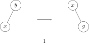

本页面将简要介绍如何用 Splay 维护二叉查找树。

## 简介

Splay 是一种二叉查找树，它通过不断将某个节点旋转到根节点，使得整棵树仍然满足二叉查找树的性质，并且保持平衡而不至于退化为链。它由 Daniel Sleator 和 Robert Tarjan 发明。

## 结构

### 二叉查找树的性质

首先肯定是一棵二叉树！

能够在这棵树上查找某个值的性质：左子树任意节点的值 $<$ 根节点的值 $<$ 右子树任意节点的值。

### 节点维护信息

|   rt  |  tot | fa[i] | ch[i][0/1] | val[i] | cnt[i] | sz[i] |
| :---: | :--: | :---: | :--------: | :----: | :----: | :---: |
| 根节点编号 | 节点个数 |   父亲  |   左右儿子编号   |  节点权值  | 权值出现次数 |  子树大小 |

## 操作

### 基本操作

- `maintain(x)`：在改变节点位置后，将节点 $x$ 的 $\text{size}$ 更新。
- `get(x)`：判断节点 $x$ 是父亲节点的左儿子还是右儿子。
- `clear(x)`：销毁节点 $x$。

```cpp
void maintain(int x) { sz[x] = sz[ch[x][0]] + sz[ch[x][1]] + cnt[x]; }
bool get(int x) { return x == ch[fa[x]][1]; }
void clear(int x) { ch[x][0] = ch[x][1] = fa[x] = val[x] = sz[x] = cnt[x] = 0; }
```

### 旋转操作

为了使 Splay 保持平衡而进行旋转操作，旋转的本质是将某个节点上移一个位置。

**旋转需要保证**：

- 整棵 Splay 的中序遍历不变（不能破坏二叉查找树的性质）。
- 受影响的节点维护的信息依然正确有效。
- `root` 必须指向旋转后的根节点。

在 Splay 中旋转分为两种：左旋和右旋。


**具体分析旋转步骤**（假设需要旋转的节点为 $x$，其父亲为 $y$，以右旋为例）

1. 将 $y$ 的左儿子指向 $x$ 的右儿子，且 $x$ 的右儿子（如果 $x$ 有右儿子的话）的父亲指向 $y$；`ch[y][0]=ch[x][1]; fa[ch[x][1]]=y;`
2. 将 $x$ 的右儿子指向 $y$，且 $y$ 的父亲指向 $x$；`ch[x][chk^1]=y; fa[y]=x;`
3. 如果原来的 $y$ 还有父亲 $z$，那么把 $z$ 的某个儿子（原来 $y$ 所在的儿子位置）指向 $x$，且 $x$ 的父亲指向 $z$。`fa[x]=z; if(z) ch[z][y==ch[z][1]]=x;`

```cpp
void rotate(int x) {
    int y = fa[x], z = fa[y], chk = get(x);
    ch[y][chk] = ch[x][chk ^ 1];
    if (ch[x][chk ^ 1]) fa[ch[x][chk ^ 1]] = y;
    ch[x][chk ^ 1] = y;
    fa[y] = x;
    fa[x] = z;
    if (z) ch[z][y == ch[z][1]] = x;
    maintain(y);
    maintain(x);
}
```

### Splay 操作

Splay 规定：每访问一个节点后都要强制将其旋转到根节点。此时旋转操作具体分为 $6$ 种情况讨论（其中 $x$ 为需要旋转到根的节点）

- 如果 $x$ 的父亲是根节点，直接将 $x$ 左旋或右旋（图 $1,2$）。




- 如果 $x$ 的父亲不是根节点，且 $x$ 和父亲的儿子类型相同，首先将其父亲左旋或右旋，然后将 $x$ 右旋或左旋（图 $3,4$）。


- 如果 $x$ 的父亲不是根节点，且 $x$ 和父亲的儿子类型不同，将 $x$ 左旋再右旋、或者右旋再左旋（图 $5,6$）。


!!! tip
    请读者尝试自行模拟 $6$ 种旋转情况，以理解 Splay 的基本思想。

```cpp
void splay(int x) {
    for (int f = fa[x]; f = fa[x], f; rotate(x))
        if (fa[f]) rotate(get(x) == get(f) ? f : x);
    rt = x;
}
```

### 插入操作

插入操作是一个比较复杂的过程，具体步骤如下（假设插入的值为 $k$）：

- 如果树空了，则直接插入根并退出。
- 如果当前节点的权值等于 $k$ 则增加当前节点的大小并更新节点和父亲的信息，将当前节点进行 Splay 操作。
- 否则按照二叉查找树的性质向下找，找到空节点就插入即可（请不要忘记 Splay 操作）。

```cpp
void ins(int k) {
    if (!rt) {
        val[++tot] = k;
        cnt[tot]++;
        rt = tot;
        maintain(rt);
        return;
    }
    int cur = rt, f = 0;
    while (1) {
        if (val[cur] == k) {
            cnt[cur]++;
            maintain(cur);
            maintain(f);
            splay(cur);
            break;
        }
        f = cur;
        cur = ch[cur][val[cur] < k];
        if (!cur) {
            val[++tot] = k;
            cnt[tot]++;
            fa[tot] = f;
            ch[f][val[f] < k] = tot;
            maintain(tot);
            maintain(f);
            splay(tot);
            break;
        }
    }
}
```

### 查询 x 的排名

根据二叉查找树的定义和性质，显然可以按照以下步骤查询 $x$ 的排名：

- 如果 $x$ 比当前节点的权值小，向其左子树查找。
- 如果 $x$ 比当前节点的权值大，将答案加上左子树（$size$）和当前节点（$cnt$）的大小，向其右子树查找。
- 如果 $x$ 与当前节点的权值相同，将答案加 $1$ 并返回。

注意最后需要进行 Splay 操作。

```cpp
int rk(int k) {
    int res = 0, cur = rt;
    while (1) {
        if (k < val[cur]) {
            cur = ch[cur][0];
        } else {
            res += sz[ch[cur][0]];
            if (k == val[cur]) {
                splay(cur);
                return res + 1;
            }
            res += cnt[cur];
            cur = ch[cur][1];
        }
    }
}
```

### 查询排名 x 的数

设 $k$ 为剩余排名，具体步骤如下：

- 如果左子树非空且剩余排名 $k$ 不大于左子树的大小 $size$，那么向左子树查找。
- 否则将 $k$ 减去左子树的和根的大小。如果此时 $k$ 的值小于等于 $0$，则返回根节点的权值，否则继续向右子树查找。

```cpp
int kth(int k) {
    int cur = rt;
    while (1) {
        if (ch[cur][0] && k <= sz[ch[cur][0]]) {
            cur = ch[cur][0];
        } else {
            k -= cnt[cur] + sz[ch[cur][0]];
            if (k <= 0) {
                splay(cur);
                return val[cur];
            }
            cur = ch[cur][1];
        }
    }
}
```

### 查询前驱

前驱定义为小于 $x$ 的最大的数，那么查询前驱可以转化为：将 $x$ 插入（此时 $x$ 已经在根的位置了），前驱即为 $x$ 的左子树中最右边的节点，最后将 $x$ 删除即可。

```cpp
int pre() {
    int cur = ch[rt][0];
    if (!cur) return cur;
    while (ch[cur][1]) cur = ch[cur][1];
    splay(cur);
    return cur;
}
```

### 查询后继

后继定义为大于 $x$ 的最小的数，查询方法和前驱类似：$x$ 的右子树中最左边的节点。

```cpp
int nxt() {
    int cur = ch[rt][1];
    if (!cur) return cur;
    while (ch[cur][0]) cur = ch[cur][0];
    splay(cur);
    return cur;
}
```

### 合并两棵树

合并两棵 Splay 树，设两棵树的根节点分别为 $x$ 和 $y$，那么我们要求 $x$ 树中的最大值小于 $y$ 树中的最小值。删除操作如下：

- 如果 $x$ 和 $y$ 其中之一或两者都为空树，直接返回不为空的那一棵树的根节点或空树。
- 否则将 $x$ 树中的最大值 $\operatorname{Splay}$ 到根，然后把它的右子树设置为 $y$ 并更新节点的信息，然后返回这个节点。

### 删除操作

删除操作也是一个比较复杂的操作，具体步骤如下：

首先将 $x$ 旋转到根的位置。

- 如果 $cnt[x]>1$（有不止一个 $x$），那么将 $cnt[x]$ 减 $1$ 并退出。
- 否则，合并它的左右两棵子树即可。

```cpp
void del(int k) {
    rk(k);
    if (cnt[rt] > 1) {
        cnt[rt]--;
        maintain(rt);
        return;
    }
    if (!ch[rt][0] && !ch[rt][1]) {
        clear(rt);
        rt = 0;
        return;
    }
    if (!ch[rt][0]) {
        int cur = rt;
        rt = ch[rt][1];
        fa[rt] = 0;
        clear(cur);
        return;
    }
    if (!ch[rt][1]) {
        int cur = rt;
        rt = ch[rt][0];
        fa[rt] = 0;
        clear(cur);
        return;
    }
    int cur = rt, x = pre();
    fa[ch[cur][1]] = x;
    ch[x][1] = ch[cur][1];
    clear(cur);
    maintain(rt);
}
```

## 代码实现

```cpp
#include <cstdio>
const int N = 100005;
int rt, tot, fa[N], ch[N][2], val[N], cnt[N], sz[N];
struct Splay {
    void maintain(int x) { sz[x] = sz[ch[x][0]] + sz[ch[x][1]] + cnt[x]; }
    bool get(int x) { return x == ch[fa[x]][1]; }
    void clear(int x) {
        ch[x][0] = ch[x][1] = fa[x] = val[x] = sz[x] = cnt[x] = 0;
    }
    void rotate(int x) {
        int y = fa[x], z = fa[y], chk = get(x);
        ch[y][chk] = ch[x][chk ^ 1];
        if (ch[x][chk ^ 1]) fa[ch[x][chk ^ 1]] = y;
        ch[x][chk ^ 1] = y;
        fa[y] = x;
        fa[x] = z;
        if (z) ch[z][y == ch[z][1]] = x;
        maintain(x);
        maintain(y);
    }
    void splay(int x) {
        for (int f = fa[x]; f = fa[x], f; rotate(x))
            if (fa[f]) rotate(get(x) == get(f) ? f : x);
        rt = x;
    }
    void ins(int k) {
        if (!rt) {
            val[++tot] = k;
            cnt[tot]++;
            rt = tot;
            maintain(rt);
            return;
        }
        int cur = rt, f = 0;
        while (1) {
            if (val[cur] == k) {
                cnt[cur]++;
                maintain(cur);
                maintain(f);
                splay(cur);
                break;
            }
            f = cur;
            cur = ch[cur][val[cur] < k];
            if (!cur) {
                val[++tot] = k;
                cnt[tot]++;
                fa[tot] = f;
                ch[f][val[f] < k] = tot;
                maintain(tot);
                maintain(f);
                splay(tot);
                break;
            }
        }
    }
    int rk(int k) {
        int res = 0, cur = rt;
        while (1) {
            if (k < val[cur]) {
                cur = ch[cur][0];
            } else {
                res += sz[ch[cur][0]];
                if (k == val[cur]) {
                    splay(cur);
                    return res + 1;
                }
                res += cnt[cur];
                cur = ch[cur][1];
            }
        }
    }
    int kth(int k) {
        int cur = rt;
        while (1) {
            if (ch[cur][0] && k <= sz[ch[cur][0]]) {
                cur = ch[cur][0];
            } else {
                k -= cnt[cur] + sz[ch[cur][0]];
                if (k <= 0) {
                    splay(cur);
                    return val[cur];
                }
                cur = ch[cur][1];
            }
        }
    }
    int pre() {
        int cur = ch[rt][0];
        if (!cur) return cur;
        while (ch[cur][1]) cur = ch[cur][1];
        splay(cur);
        return cur;
    }
    int nxt() {
        int cur = ch[rt][1];
        if (!cur) return cur;
        while (ch[cur][0]) cur = ch[cur][0];
        splay(cur);
        return cur;
    }
    void del(int k) {
        rk(k);
        if (cnt[rt] > 1) {
            cnt[rt]--;
            maintain(rt);
            return;
        }
        if (!ch[rt][0] && !ch[rt][1]) {
            clear(rt);
            rt = 0;
            return;
        }
        if (!ch[rt][0]) {
            int cur = rt;
            rt = ch[rt][1];
            fa[rt] = 0;
            clear(cur);
            return;
        }
        if (!ch[rt][1]) {
            int cur = rt;
            rt = ch[rt][0];
            fa[rt] = 0;
            clear(cur);
            return;
        }
        int cur = rt;
        int x = pre();
        fa[ch[cur][1]] = x;
        ch[x][1] = ch[cur][1];
        clear(cur);
        maintain(rt);
    }
} tree;

int main() {
    int n, opt, x;
    for (scanf("%d", &n); n; --n) {
        scanf("%d%d", &opt, &x);
        if (opt == 1)
            tree.ins(x);
        else if (opt == 2)
            tree.del(x);
        else if (opt == 3)
            printf("%d\n", tree.rk(x));
        else if (opt == 4)
            printf("%d\n", tree.kth(x));
        else if (opt == 5)
            tree.ins(x), printf("%d\n", val[tree.pre()]), tree.del(x);
        else
            tree.ins(x), printf("%d\n", val[tree.nxt()]), tree.del(x);
    }
    return 0;
}
```

## 例题

以下题目都是裸的 Splay 维护二叉查找树。

- [【模板】普通平衡树](https://loj.ac/problem/104)
- [【模板】文艺平衡树](https://loj.ac/problem/105)
- [「HNOI2002」营业额统计](https://loj.ac/problem/10143)
- [「HNOI2004」宠物收养所](https://loj.ac/problem/10144)

## 习题

- [「Cerc2007」robotic sort 机械排序](https://www.luogu.com.cn/problem/P4402)
- [二逼平衡树（树套树）](https://loj.ac/problem/106)
- [bzoj 2827 千山鸟飞绝](http://www.lydsy.com/JudgeOnline/problem.php?id=2827)
- [「Lydsy1706 月赛」K 小值查询](http://www.lydsy.com/JudgeOnline/problem.php?id=4923)

## 参考资料与注释

本文部分内容引用于 [algocode 算法博客](https://algocode.net)，特别鸣谢！

## 习题

> [!NOTE] **[AcWing 2437. Splay](https://www.acwing.com/problem/content/2439/)**
> 
> 题意: TODO

> [!TIP] **思路**
> 
> 

<details>
<summary>详细代码</summary>
<!-- tabs:start -->

##### **C++**

```cpp
#include <bits/stdc++.h>
using namespace std;

const int N = 100010;

int n, m;
struct Node {
    int s[2], p, v;
    int size, flag;

    void init(int _v, int _p) {
        v = _v, p = _p;
        size = 1;
    }
} tr[N];
int root, idx;

void pushup(int x) {
    tr[x].size = tr[tr[x].s[0]].size + tr[tr[x].s[1]].size + 1;
}

void pushdown(int x) {
    if (tr[x].flag) {
        swap(tr[x].s[0], tr[x].s[1]);
        tr[tr[x].s[0]].flag ^= 1;
        tr[tr[x].s[1]].flag ^= 1;
        tr[x].flag = 0;
    }
}

void rotate(int x) {
    int y = tr[x].p, z = tr[y].p;
    int k = tr[y].s[1] == x;  // k=0表示x是y的左儿子；k=1表示x是y的右儿子
    tr[z].s[tr[z].s[1] == y] = x, tr[x].p = z;
    tr[y].s[k] = tr[x].s[k ^ 1], tr[tr[x].s[k ^ 1]].p = y;
    tr[x].s[k ^ 1] = y, tr[y].p = x;
    pushup(y), pushup(x);
}

void splay(int x, int k) {
    while (tr[x].p != k) {
        int y = tr[x].p, z = tr[y].p;
        if (z != k)
            if ((tr[y].s[1] == x) ^ (tr[z].s[1] == y))
                rotate(x);
            else
                rotate(y);
        rotate(x);
    }
    if (!k)
        root = x;
}

void insert(int v) {
    int u = root, p = 0;
    while (u)
        p = u, u = tr[u].s[v > tr[u].v];
    u = ++ idx;
    if (p)
        tr[p].s[v > tr[p].v] = u;
    tr[u].init(v, p);
    splay(u, 0);
}

int get_k(int k) {
    int u = root;
    while (true) {
        pushdown(u);
        if (tr[tr[u].s[0]].size >= k)
            u = tr[u].s[0];
        else if (tr[tr[u].s[0]].size + 1 == k)
            return u;
        else
            k -= tr[tr[u].s[0]].size + 1, u = tr[u].s[1];
    }
    return -1;
}

void output(int u) {
    pushdown(u);
    if (tr[u].s[0])
        output(tr[u].s[0]);
    if (tr[u].v >= 1 && tr[u].v <= n)
        printf("%d ", tr[u].v);
    if (tr[u].s[1])
        output(tr[u].s[1]);
}

int main() {
    scanf("%d%d", &n, &m);
    for (int i = 0; i <= n + 1; i ++ )
        insert(i);
    while (m -- ) {
        int l, r;
        scanf("%d%d", &l, &r);
        l = get_k(l), r = get_k(r + 2);
        splay(l, 0), splay(r, l);
        tr[tr[r].s[0]].flag ^= 1;
    }
    output(root);
    return 0;
}
```

##### **Python**

```python

```

<!-- tabs:end -->
</details>

<br>

* * *

> [!NOTE] **[AcWing 950. 郁闷的出纳员](https://www.acwing.com/problem/content/952/)**
> 
> 题意: TODO

> [!TIP] **思路**
> 
> 

<details>
<summary>详细代码</summary>
<!-- tabs:start -->

##### **C++**

```cpp
#include <bits/stdc++.h>
using namespace std;

const int N = 100010, INF = 1e9;

int n, m, delta;
struct Node {
    int s[2], p, v;
    int size;

    void init(int _v, int _p) {
        v = _v, p = _p;
        size = 1;
    }
} tr[N];
int root, idx;

void pushup(int x) {
    tr[x].size = tr[tr[x].s[0]].size + tr[tr[x].s[1]].size + 1;
}

void rotate(int x) {
    int y = tr[x].p, z = tr[y].p;
    int k = tr[y].s[1] == x;
    tr[z].s[tr[z].s[1] == y] = x, tr[x].p = z;
    tr[y].s[k] = tr[x].s[k ^ 1], tr[tr[x].s[k ^ 1]].p = y;
    tr[x].s[k ^ 1] = y, tr[y].p = x;
    pushup(y), pushup(x);
}

void splay(int x, int k) {
    while (tr[x].p != k) {
        int y = tr[x].p, z = tr[y].p;
        // TODO
        if (z != k)
            if ((tr[y].s[1] == x) ^ (tr[z].s[1] == y))
                rotate(x);
            else
                rotate(y);
        rotate(x);
    }
    if (!k)
        root = x;
}

int insert(int v) {
    int u = root, p = 0;
    while (u)
        p = u, u = tr[u].s[v > tr[u].v];
    u = ++ idx;
    if (p)
        tr[p].s[v > tr[p].v] = u;
    tr[u].init(v, p);
    splay(u, 0);
    return u;
}

int get(int v) {
    int u = root, res;
    while (u) {
        if (tr[u].v >= v)
            res = u, u = tr[u].s[0];
        else
            u = tr[u].s[1];
    }
    return res;
}

int get_k(int k) {
    int u = root;
    while (u) {
        if (tr[tr[u].s[0]].size >= k)
            u = tr[u].s[0];
        else if (tr[tr[u].s[0]].size + 1 == k)
            return tr[u].v;
        else
            k -= tr[tr[u].s[0]].size + 1, u = tr[u].s[1];
    }
    return -1;
}

int main() {
    scanf("%d%d", &n, &m);
    int L = insert(-INF), R = insert(INF);

    int tot = 0;
    while (n -- ) {
        char op[2];
        int k;
        scanf("%s%d", op, &k);
        if (*op == 'I') {
            if (k >= m)
                k -= delta, insert(k), tot ++ ;
        }
        else if (*op == 'A')
            delta += k;
        else if (*op == 'S') {
            delta -= k;
            R = get(m - delta);
            splay(R, 0), splay(L, R);
            tr[L].s[1] = 0;
            pushup(L), pushup(R);
        } else {
            if (tr[root].size - 2 < k)
                puts("-1");
            else
                printf("%d\n", get_k(tr[root].size - k) + delta);
        }
    }

    printf("%d\n", tot - (tr[root].size - 2));

    return 0;
}
```

##### **Python**

```python

```

<!-- tabs:end -->
</details>

<br>

* * *

> [!NOTE] **[AcWing 1063. 永无乡](https://www.acwing.com/problem/content/1065/)**
> 
> 题意: TODO

> [!TIP] **思路**
> 
> 

<details>
<summary>详细代码</summary>
<!-- tabs:start -->

##### **C++**

```cpp
#include <bits/stdc++.h>
using namespace std;

const int N = 1800010;

int n, m;
struct Node {
    int s[2], p, v, id;
    int size;

    void init(int _v, int _id, int _p) {
        v = _v, id = _id, p = _p;
        size = 1;
    }
} tr[N];
int root[N], idx;
int p[N];

int find(int x) {
    if (p[x] != x)
        p[x] = find(p[x]);
    return p[x];
}

void pushup(int x) {
    tr[x].size = tr[tr[x].s[0]].size + tr[tr[x].s[1]].size + 1;
}

void rotate(int x) {
    int y = tr[x].p, z = tr[y].p;
    int k = tr[y].s[1] == x;
    tr[z].s[tr[z].s[1] == y] = x, tr[x].p = z;
    tr[y].s[k] = tr[x].s[k ^ 1], tr[tr[x].s[k ^ 1]].p = y;
    tr[x].s[k ^ 1] = y, tr[y].p = x;
    pushup(y), pushup(x);
}

void splay(int x, int k, int b) {
    while (tr[x].p != k) {
        int y = tr[x].p, z = tr[y].p;
        if (z != k)
            if ((tr[y].s[1] == x) ^ (tr[z].s[1] == y))
                rotate(x);
            else
                rotate(y);
        rotate(x);
    }
    if (!k)
        root[b] = x;
}

void insert(int v, int id, int b) {
    int u = root[b], p = 0;
    while (u)
        p = u, u = tr[u].s[v > tr[u].v];
    u = ++ idx;
    if (p)
        tr[p].s[v > tr[p].v] = u;
    tr[u].init(v, id, p);
    splay(u, 0, b);
}

int get_k(int k, int b) {
    int u = root[b];
    while (u) {
        if (tr[tr[u].s[0]].size >= k)
            u = tr[u].s[0];
        else if (tr[tr[u].s[0]].size + 1 == k)
            return tr[u].id;
        else
            k -= tr[tr[u].s[0]].size + 1, u = tr[u].s[1];
    }
    return -1;
}

void dfs(int u, int b) {
    if (tr[u].s[0])
        dfs(tr[u].s[0], b);
    if (tr[u].s[1])
        dfs(tr[u].s[1], b);
    insert(tr[u].v, tr[u].id, b);
}

int main() {
    scanf("%d%d", &n, &m);
    for (int i = 1; i <= n; i ++ ) {
        p[i] = root[i] = i;
        int v;
        scanf("%d", &v);
        tr[i].init(v, i, 0);
    }
    idx = n;

    while (m -- ) {
        int a, b;
        scanf("%d%d", &a, &b);
        a = find(a), b = find(b);
        if (a != b) {
            if (tr[root[a]].size > tr[root[b]].size)
                swap(a, b);
            dfs(root[a], b);
            p[a] = b;
        }
    }

    scanf("%d", &m);
    while (m -- ) {
        char op[2];
        int a, b;
        scanf("%s%d%d", op, &a, &b);
        if (*op == 'B') {
            a = find(a), b = find(b);
            if (a != b) {
                if (tr[root[a]].size > tr[root[b]].size)
                    swap(a, b);
                dfs(root[a], b);
                p[a] = b;
            }
        } else {
            a = find(a);
            if (tr[root[a]].size < b)
                puts("-1");
            else
                printf("%d\n", get_k(b, a));
        }
    }

    return 0;
}
```

##### **Python**

```python

```

<!-- tabs:end -->
</details>

<br>

* * *

> [!NOTE] **[AcWing 955. 维护数列](https://www.acwing.com/problem/content/957/)**
> 
> 题意: TODO

> [!TIP] **思路**
> 
> 

<details>
<summary>详细代码</summary>
<!-- tabs:start -->

##### **C++**

```cpp
#include <bits/stdc++.h>
using namespace std;

const int N = 500010, INF = 1e9;

int n, m;
struct Node {
    int s[2], p, v;
    int rev, same;
    int size, sum, ms, ls, rs;

    void init(int _v, int _p) {
        s[0] = s[1] = 0, p = _p, v = _v;
        rev = same = 0;
        size = 1, sum = ms = v;
        ls = rs = max(v, 0);
    }
} tr[N];
int root, nodes[N], tt;
int w[N];

void pushup(int x) {
    auto &u = tr[x], &l = tr[u.s[0]], &r = tr[u.s[1]];
    u.size = l.size + r.size + 1;
    u.sum = l.sum + r.sum + u.v;
    u.ls = max(l.ls, l.sum + u.v + r.ls);
    u.rs = max(r.rs, r.sum + u.v + l.rs);
    u.ms = max(max(l.ms, r.ms), l.rs + u.v + r.ls);
}

void pushdown(int x) {
    auto &u = tr[x], &l = tr[u.s[0]], &r = tr[u.s[1]];
    if (u.same) {
        u.same = u.rev = 0;
        if (u.s[0])
            l.same = 1, l.v = u.v, l.sum = l.v * l.size;
        if (u.s[1])
            r.same = 1, r.v = u.v, r.sum = r.v * r.size;
        if (u.v > 0) {
            if (u.s[0])
                l.ms = l.ls = l.rs = l.sum;
            if (u.s[1])
                r.ms = r.ls = r.rs = r.sum;
        } else {
            if (u.s[0])
                l.ms = l.v, l.ls = l.rs = 0;
            if (u.s[1])
                r.ms = r.v, r.ls = r.rs = 0;
        }
    } else if (u.rev) {
        u.rev = 0, l.rev ^= 1, r.rev ^= 1;
        swap(l.ls, l.rs), swap(r.ls, r.rs);
        swap(l.s[0], l.s[1]), swap(r.s[0], r.s[1]);
    }
}

void rotate(int x) {
    int y = tr[x].p, z = tr[y].p;
    int k = tr[y].s[1] == x;
    tr[z].s[tr[z].s[1] == y] = x, tr[x].p = z;
    tr[y].s[k] = tr[x].s[k ^ 1], tr[tr[x].s[k ^ 1]].p = y;
    tr[x].s[k ^ 1] = y, tr[y].p = x;
    pushup(y), pushup(x);
}

void splay(int x, int k) {
    while (tr[x].p != k) {
        int y = tr[x].p, z = tr[y].p;
        if (z != k)
            if ((tr[y].s[1] == x) ^ (tr[z].s[1] == y))
                rotate(x);
            else
                rotate(y);
        rotate(x);
    }
    if (!k)
        root = x;
}

int get_k(int k) {
    int u = root;
    while (u) {
        pushdown(u);
        if (tr[tr[u].s[0]].size >= k)
            u = tr[u].s[0];
        else if (tr[tr[u].s[0]].size + 1 == k)
            return u;
        else
            k -= tr[tr[u].s[0]].size + 1, u = tr[u].s[1];
    }
}

int build(int l, int r, int p) {
    int mid = l + r >> 1;
    int u = nodes[tt -- ];
    tr[u].init(w[mid], p);
    if (l < mid)
        tr[u].s[0] = build(l, mid - 1, u);
    if (mid < r)
        tr[u].s[1] = build(mid + 1, r, u);
    pushup(u);
    return u;
}

void dfs(int u) {
    if (tr[u].s[0])
        dfs(tr[u].s[0]);
    if (tr[u].s[1])
        dfs(tr[u].s[1]);
    nodes[ ++ tt] = u;
}

int main() {
    for (int i = 1; i < N; i ++ )
        nodes[ ++ tt] = i;
    scanf("%d%d", &n, &m);
    tr[0].ms = w[0] = w[n + 1] = -INF;
    for (int i = 1; i <= n; i ++ )
        scanf("%d", &w[i]);
    root = build(0, n + 1, 0);

    char op[20];
    while (m -- ) {
        scanf("%s", op);
        if (!strcmp(op, "INSERT")) {
            int posi, tot;
            scanf("%d%d", &posi, &tot);
            for (int i = 0; i < tot; i ++ )
                scanf("%d", &w[i]);
            int l = get_k(posi + 1), r = get_k(posi + 2);
            splay(l, 0), splay(r, l);
            int u = build(0, tot - 1, r);
            tr[r].s[0] = u;
            pushup(r), pushup(l);
        } else if (!strcmp(op, "DELETE")) {
            int posi, tot;
            scanf("%d%d", &posi, &tot);
            int l = get_k(posi), r = get_k(posi + tot + 1);
            splay(l, 0), splay(r, l);
            dfs(tr[r].s[0]);
            tr[r].s[0] = 0;
            pushup(r), pushup(l);
        } else if (!strcmp(op, "MAKE-SAME")) {
            int posi, tot, c;
            scanf("%d%d%d", &posi, &tot, &c);
            int l = get_k(posi), r = get_k(posi + tot + 1);
            splay(l, 0), splay(r, l);
            auto& son = tr[tr[r].s[0]];
            son.same = 1, son.v = c, son.sum = c * son.size;
            if (c > 0)
                son.ms = son.ls = son.rs = son.sum;
            else
                son.ms = c, son.ls = son.rs = 0;
            pushup(r), pushup(l);
        } else if (!strcmp(op, "REVERSE")) {
            int posi, tot;
            scanf("%d%d", &posi, &tot);
            int l = get_k(posi), r = get_k(posi + tot + 1);
            splay(l, 0), splay(r, l);
            auto& son = tr[tr[r].s[0]];
            son.rev ^= 1;
            swap(son.ls, son.rs);
            swap(son.s[0], son.s[1]);
            pushup(r), pushup(l);
        } else if (!strcmp(op, "GET-SUM")) {
            int posi, tot;
            scanf("%d%d", &posi, &tot);
            int l = get_k(posi), r = get_k(posi + tot + 1);
            splay(l, 0), splay(r, l);
            printf("%d\n", tr[tr[r].s[0]].sum);
        } else
            printf("%d\n", tr[root].ms);
    }

    return 0;
}
```

##### **Python**

```python

```

<!-- tabs:end -->
</details>

<br>

* * *