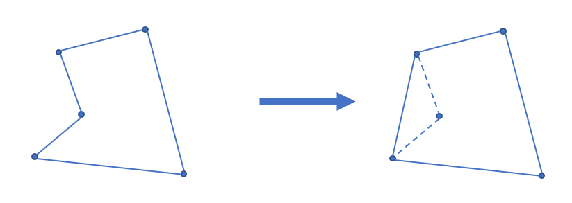

> [!NOTE] **ATTENTION**
> 
> 维护凸包过程中，假定先后有 $a, b, c$ 三个点，其中 $a, b$ 是已在凸包栈中的点
> 
> 则: 既可以求 $c-a, b-a$ 叉积，也可以求 $c-b, b-a$ 叉积，效果是一样的

## 二维凸包

### 凸多边形

凸多边形是指所有内角大小都在 $[0,\pi]$ 范围内的 **简单多边形**。

### 凸包

在平面上能包含所有给定点的最小凸多边形叫做凸包。

其定义为：对于给定集合 $X$，所有包含 $X$ 的凸集的交集 $S$ 被称为 $X$ 的 **凸包**。

实际上可以理解为用一个橡皮筋包含住所有给定点的形态。

凸包用最小的周长围住了给定的所有点。如果一个凹多边形围住了所有的点，它的周长一定不是最小，如下图。根据三角不等式，凸多边形在周长上一定是最优的。



### 凸包的求法

常用的求法有 Graham 扫描法和 Andrew 算法，这里主要介绍 Andrew 算法。

#### Andrew 算法求凸包

该算法的时间复杂度为 $O(n\log n)$，其中 $n$ 为待求凸包点集的大小，同时复杂度的瓶颈也在于对所有点坐标的双关键字排序。

首先把所有点以横坐标为第一关键字，纵坐标为第二关键字排序。

显然排序后最小的元素和最大的元素一定在凸包上。而且因为是凸多边形，我们如果从一个点出发逆时针走，轨迹总是“左拐”的，一旦出现右拐，就说明这一段不在凸包上。因此我们可以用一个单调栈来维护上下凸壳。

因为从左向右看，上下凸壳所旋转的方向不同，为了让单调栈起作用，我们首先 **升序枚举** 求出下凸壳，然后 **降序** 求出上凸壳。

求凸壳时，一旦发现即将进栈的点（$P$）和栈顶的两个点（$S_1,S_2$，其中 $S_1$ 为栈顶）行进的方向向右旋转，即叉积小于 $0$：$\overrightarrow{S_2S_1}\times \overrightarrow{S_1P}<0$，则弹出栈顶，回到上一步，继续检测，直到 $\overrightarrow{S_2S_1}\times \overrightarrow{S_1P}\ge 0$ 或者栈内仅剩一个元素为止。

通常情况下不需要保留位于凸包边上的点，因此上面一段中 $\overrightarrow{S_2S_1}\times \overrightarrow{S_1P}<0$ 这个条件中的“$<$”可以视情况改为 $\le$，同时后面一个条件应改为 $>$。


```cpp
// C++ Version
// stk[] 是整型，存的是下标
// p[] 存储向量或点
tp = 0;                       // 初始化栈
std::sort(p + 1, p + 1 + n);  // 对点进行排序
stk[++tp] = 1;
//栈内添加第一个元素，且不更新 used，使得 1 在最后封闭凸包时也对单调栈更新
for (int i = 2; i <= n; ++i) {
    while (tp >= 2  // 下一行 * 操作符被重载为叉积
           && (p[stk[tp]] - p[stk[tp - 1]]) * (p[i] - p[stk[tp]]) <= 0)
        used[stk[tp--]] = 0;
    used[i] = 1;  // used 表示在凸壳上
    stk[++tp] = i;
}
int tmp = tp;  // tmp 表示下凸壳大小
for (int i = n - 1; i > 0; --i)
    if (!used[i]) {
        //      ↓求上凸壳时不影响下凸壳
        while (tp > tmp &&
               (p[stk[tp]] - p[stk[tp - 1]]) * (p[i] - p[stk[tp]]) <= 0)
            used[stk[tp--]] = 0;
        used[i] = 1;
        stk[++tp] = i;
    }
for (int i = 1; i <= tp; ++i)  // 复制到新数组中去
    h[i] = p[stk[i]];
int ans = tp - 1;
```
    
```python
    # Python Version
    stk = [] # 是整型，存的是下标
    p = [] # 存储向量或点
    tp = 0 # 初始化栈
    p.sort() # 对点进行排序
    stk[tp] = 1
    tp = tp + 1
    # 栈内添加第一个元素，且不更新 used，使得 1 在最后封闭凸包时也对单调栈更新
    for i in range(2, n + 1):
        while tp >= 2 and (p[stk[tp]] - p[stk[tp - 1]]) * (p[i] - p[stk[tp]]) <= 0:
            # 下一行 * 操作符被重载为叉积
            used[stk[tp]] = 0
            tp = tp - 1
            used[i] = 1 # used 表示在凸壳上
            stk[tp] = i
            tp = tp + 1
    tmp = tp # tmp 表示下凸壳大小
    for i in range(n - 1, 0, -1):
        if used[i] == False:
            #      ↓求上凸壳时不影响下凸壳
            while tp > tmp and (p[stk[tp]] - p[stk[tp - 1]]) * (p[i] - p[stk[tp]]) <= 0:
                used[stk[tp]] = 0
                tp = tp - 1
                used[i] = 1
                stk[tp] = i
                tp = tp + 1
    for i in range(1, tp + 1):
        h[i] = p[stk[i]]
    ans = tp - 1
```

根据上面的代码，最后凸包上有 $\textit{ans}$ 个元素（额外存储了 $1$ 号点，因此 $h$ 数组中有 $\textit{ans}+1$ 个元素），并且按逆时针方向排序。周长就是

$$
\sum_{i=1}^{\textit{ans}}\left|\overrightarrow{h_ih_{i+1}}\right|
$$

### 例题

[UVA11626 Convex Hull](https://uva.onlinejudge.org/index.php?option=com_onlinejudge&Itemid=8&category=78&page=show_problem&problem=2673)

[「USACO5.1」圈奶牛 Fencing the Cows](https://www.luogu.com.cn/problem/P2742)

[POJ1873 The Fortified Forest](http://poj.org/problem?id=1873)

[POJ1113 Wall](http://poj.org/problem?id=1113)

[「SHOI2012」信用卡凸包](https://www.luogu.com.cn/problem/P3829)

## 习题

> [!NOTE] **[AcWing 1401. 围住奶牛](https://www.acwing.com/problem/content/1403/)**
> 
> 题意: TODO

> [!TIP] **思路**
> 
> 

<details>
<summary>详细代码</summary>
<!-- tabs:start -->

##### **C++**

```cpp
// 求凸包模板题
#include <bits/stdc++.h>
using namespace std;

using PDD = pair<double, double>;
#define x first
#define y second

const int N = 10010;

int n;
PDD q[N];
int stk[N], top;
bool used[N];

PDD operator- (PDD a, PDD b) {
    return {a.x - b.x, a.y - b.y};
}

double operator* (PDD a, PDD b) {
    return a.x * b.y - a.y * b.x;
}

double area(PDD a, PDD b, PDD c) {
    return (b - a) * (c - a);
}

double get_dist(PDD a, PDD b) {
    double dx = a.x - b.x;
    double dy = a.y - b.y;
    return sqrt(dx * dx + dy * dy);
}

double get_convex() {
    sort(q, q + n);
    for (int i = 0; i < n; ++ i ) {
        while (top >= 2 && area(q[stk[top - 1]], q[stk[top]], q[i]) <= 0) {
            if (area(q[stk[top - 1]], q[stk[top]], q[i]) < 0)
                used[stk[top -- ]] = false;
            else top -- ;
        }
        stk[ ++ top] = i;
        used[i] = true;
    }
    used[0] = false;
    for (int i = n - 1; i >= 0; -- i ) {
        if (used[i]) continue;
        while (top >= 2 && area(q[stk[top - 1]], q[stk[top]], q[i]) <= 0)
            top -- ;
        stk[ ++ top] = i;
    }
    
    double res = 0;
    for (int i = 1; i < top; ++ i )
        res += get_dist(q[stk[i]], q[stk[i + 1]]);
    return res;
}

int main() {
    cin >> n;
    for (int i = 0; i < n; ++ i ) cin >> q[i].x >> q[i].y;
    printf("%.2lf\n", get_convex());
    
    return 0;
}
```

##### **Python**

```python

```

<!-- tabs:end -->
</details>

<br>

* * *

> [!NOTE] **[LeetCode 587. 安装栅栏](https://leetcode.cn/problems/erect-the-fence/)**
> 
> 题意: TODO

> [!TIP] **思路**
> 
> 

<details>
<summary>详细代码</summary>
<!-- tabs:start -->

##### **C++**

```cpp
class Solution {
public:
    // 二维叉积
    // ->a X ->b = [->a] X [->b] sin(P1起始到P2的夹角)
    int cross(int x1, int y1, int x2, int y2) {
        return x1 * y2 - x2 * y1;
    }

    // 对于向量 v X w   为正【本质是sin为正】说明 w 在 v 左侧
    int area(vector<int> & a, vector<int> & b, vector<int> & c) {
        return cross(b[0] - a[0], b[1] - a[1], c[0] - a[0], c[1] - a[1]);
    }

    // 排序 先排x再y
    // 先扫上半边[正序] 再扫下半边[逆序]
    vector<vector<int>> outerTrees(vector<vector<int>>& points) {
        sort(points.begin(), points.end());
        int n = points.size();
        vector<bool> used(n);
        vector<int> hull(n + 2);
        int top = 0;
        for (int i = 0; i < n; ++ i ) {
            while (top >= 2 && area(points[hull[top - 1]], points[hull[top]], points[i]) > 0)
                used[hull[top -- ]] = false;
            hull[ ++ top] = i;
            used[i] = true;
        }
        used[0] = false;
        for (int i = n - 1; i >= 0; -- i ) {
            if (used[i]) continue;
            while (top >= 2 && area(points[hull[top - 1]], points[hull[top]], points[i]) > 0)
                -- top;
            hull[ ++ top] = i;
        }
        -- top;
        vector<vector<int>> res;
        for (int i = 1; i <= top; ++ i ) res.push_back(points[hull[i]]);
        return res;
    }
};
```

##### **Python**

```python

```

<!-- tabs:end -->
</details>

<br>

* * *