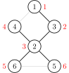

相关阅读：[双连通分量](./bcc.md)，

割点和桥更严谨的定义参见 [图论相关概念](./concept.md)。

## 割点

> 对于一个无向图，如果把一个点删除后这个图的极大连通分量数增加了，那么这个点就是这个图的割点（又称割顶）。

### 如何实现？

如果我们尝试删除每个点，并且判断这个图的连通性，那么复杂度会特别的高。所以要介绍一个常用的算法：Tarjan。

首先，我们上一个图：


很容易的看出割点是 2，而且这个图仅有这一个割点。

首先，我们按照 DFS 序给他打上时间戳（访问的顺序）。



这些信息被我们保存在一个叫做 `num` 的数组中。

还需要另外一个数组 `low`，用它来存储不经过其父亲能到达的最小的时间戳。

例如 `low[2]` 的话是 1，`low[5]` 和 `low[6]` 是 3。

然后我们开始 DFS，我们判断某个点是否是割点的根据是：对于某个顶点 $u$，如果存在至少一个顶点 $v$（$u$ 的儿子），使得 $low_v \geq num_u$，即不能回到祖先，那么 $u$ 点为割点。

另外，如果搜到了自己（在环中），如果他有两个及以上的儿子，那么他一定是割点了，如果只有一个儿子，那么把它删掉，不会有任何的影响。比如下面这个图，此处形成了一个环，从树上来讲它有 2 个儿子：


我们在访问 1 的儿子时候，假设先 DFS 到了 2，然后标记用过，然后递归往下，来到了 4，4 又来到了 3，当递归回溯的时候，会发现 3 已经被访问过了，所以不是割点。

更新 `low` 的伪代码如下：

```cpp
如果 v 是 u 的儿子 low[u] = min(low[u], low[v]);
否则
low[u] = min(low[u], num[v]);
```

## 割边

和割点差不多，叫做桥。

> 对于一个无向图，如果删掉一条边后图中的连通分量数增加了，则称这条边为桥或者割边。严谨来说，就是：假设有连通图 $G=\{V,E\}$，$e$ 是其中一条边（即 $e \in E$），如果 $G-e$ 是不连通的，则边 $e$ 是图 $G$ 的一条割边（桥）。

比如说，下图中，


红色的边就是割边。

### 实现

和割点差不多，只要改一处：$low_v>num_u$ 就可以了，而且不需要考虑根节点的问题。

割边是和是不是根节点没关系的，原来我们求割点的时候是指点 $v$ 是不可能不经过父节点 $u$ 为回到祖先节点（包括父节点），所以顶点 $u$ 是割点。如果 $low_v=num_u$ 表示还可以回到父节点，如果顶点 $v$ 不能回到祖先也没有另外一条回到父亲的路，那么 $u-v$ 这条边就是割边。

### 代码实现

下面代码实现了求割边，其中，当 `isbridge[x]` 为真时，`(father[x],x)` 为一条割边。

```cpp
// C++ Version
int low[MAXN], dfn[MAXN], iscut[MAXN], dfs_clock;
bool isbridge[MAXN];
vector<int> G[MAXN];
int cnt_bridge;
int father[MAXN];

void tarjan(int u, int fa) {
    father[u] = fa;
    low[u] = dfn[u] = ++dfs_clock;
    for (int i = 0; i < G[u].size(); i++) {
        int v = G[u][i];
        if (!dfn[v]) {
            tarjan(v, u);
            low[u] = min(low[u], low[v]);
            if (low[v] > dfn[u]) {
                isbridge[v] = true;
                ++cnt_bridge;
            }
        } else if (dfn[v] < dfn[u] && v != fa) {
            low[u] = min(low[u], dfn[v]);
        }
    }
}
```

```python
# Python Version
low = [] * MAXN; dfn = [] * MAXN; iscut = [] * MAXN; dfs_clock = 0
isbridge = [False] * MAXN
G = [[0 for i in range(MAXN)] for j in range(MAXN)]
cnt_bridge = 0
father = [] * MAXN

def tarjan(u, fa):
    father[u] = fa
    low[u] = dfn[u] = dfs_clock
    dfs_clock = dfs_clock + 1
    for i in range(0, len(G[u])):
        v = G[u][i]
        if dfn[v] == False:
            tarjan(v, u)
            low[u] = min(low[u], low[v])
            if low[v] > dfn[u]:
                isbridge[v] = True
                cnt_bridge = cnt_bridge + 1
        elif dfn[v] < dfn[u] and v != fa:
            low[u] = min(low[u], dfn[v])
```

## 练习

- [P3388【模板】割点（割顶）](https://www.luogu.com.cn/problem/P3388)
- [POJ2117 Electricity](https://vjudge.net/problem/POJ-2117)
- [HDU4738 Caocao's Bridges](https://vjudge.net/problem/HDU-4738)
- [HDU2460 Network](https://vjudge.net/problem/HDU-2460)
- [POJ1523 SPF](https://vjudge.net/problem/POJ-1523)

Tarjan 算法还有许多用途，常用的例如求强连通分量，缩点，还有求 2-SAT 的用途等。

## 习题

> [!NOTE] **[Luogu 【模板】割点（割顶）](https://www.luogu.com.cn/problem/P3388)**
> 
> 题意: TODO

> [!TIP] **思路**
> 
> 模版 dfn[u] <= low[j]
> 
> 两种情况：1.跟节点有多于两个子 2.非根dfn low
> 
> 遍历跑 tarjan 时需更新 root

<details>
<summary>详细代码</summary>
<!-- tabs:start -->

##### **C++**

```cpp
#include <bits/stdc++.h>
using namespace std;

// 割点 存在于无向图中
// 1. 对于根节点 有两颗以上的子树 就是割点
// 2. 非根节点对于其子 v 有 low[v] >= dfn[u]  则 u 是割点

const int N = 2e4 + 10, M = 2e5 + 10;

int n, m, cnt;
int h[N], e[M], ne[M], idx;

int dfn[N], low[N], timestamp;
bool cut[N];
int root;

void init() {
    memset(h, -1, sizeof h);
    idx = 0;
}

void add(int a, int b) {
    e[idx] = b, ne[idx] = h[a], h[a] = idx ++ ;
}

void tarjan(int u) {
    dfn[u] = low[u] = ++ timestamp;
    // 此处不需要得到双连通分量dcc 所以不需要栈
    
    if (u == root && h[u] == -1)
        return;
    
    int cnt = 0;
    for (int i = h[u]; ~i; i = ne[i]) {
        int j = e[i];
        if (!dfn[j]) {
            tarjan(j);
            low[u] = min(low[u], low[j]);
            if (dfn[u] <= low[j]) {
                cnt ++ ;
                if (u != root || cnt > 1)
                    cut[u] = true;
                // ... 其他题目在此处理dcc
            }
        } else
            low[u] = min(low[u], dfn[j]);
    }
    // 其他题目 还可在此处理cnt 表示切掉本节点后有多少个分量
}

int main() {
    init();
    
    cin >> n >> m;
    while (m -- ) {
        int a, b;
        cin >> a >> b;
        add(a, b), add(b, a);
    }
    
    // ATTENTION
    for (root = 1; root <= n; ++ root )
        if (!dfn[root])
            tarjan(root);
    
    int res = 0;
    for (int i = 1; i <= n; ++ i )
        if (cut[i])
            res ++ ;
    cout << res << endl;
    for (int i = 1; i <= n; ++ i )
        if (cut[i])
            cout << i << ' ';
    cout << endl;
    
    return 0;
}
```

##### **Python**

```python

```

<!-- tabs:end -->
</details>

<br>

* * *

> [!NOTE] **[LeetCode 1192. 查找集群内的「关键连接」](https://leetcode.cn/problems/critical-connections-in-a-network/)**
> 
> 题意: TODO

> [!TIP] **思路**
> 
> 求桥

<details>
<summary>详细代码</summary>
<!-- tabs:start -->

##### **C++**

```cpp
class Solution {
public:
    vector<vector<int>> v;
    vector<int> dfn, low;
    int timestamps;
    vector<vector<int>> ret;
    
    void tarjan(int x, int fa) {
        dfn[x] = low[x] = ++ timestamps;
        for (auto y : v[x]) {
            if (y == fa) continue;
            if (!dfn[y]) {
                tarjan(y, x);
                low[x] = min(low[x], low[y]);
                if (low[y] > dfn[x]) ret.push_back({x, y});
            } else low[x] = min(low[x], dfn[y]);
        }
    }
    
    vector<vector<int>> criticalConnections(int n, vector<vector<int>>& connections) {
        v = vector<vector<int>>(n);
        dfn = low = vector<int>(n);
        timestamps = 0;
        ret.clear();
        for (auto e : connections) {
            v[e[0]].push_back(e[1]);
            v[e[1]].push_back(e[0]);
        }
        for (int i = 0; i < n; ++ i )
            if (!dfn[i]) tarjan(i, -1);
        return ret;
    }
};
```

##### **Python**

```python

```

<!-- tabs:end -->
</details>

<br>

* * *