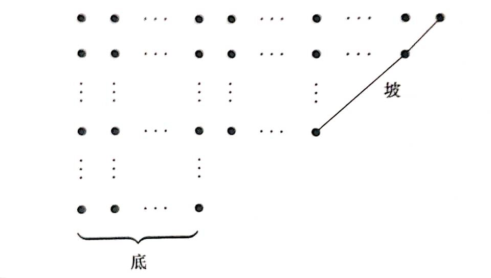

分拆：将自然数 $n$ 写成递降正整数和的表示。

$$
n=r_1+r_2+\ldots+r_k \quad r_1 \ge r_2 \ge \ldots \ge r_k \ge 1
$$

和式中每个正整数称为一个部分。

分拆数：$p_n$。自然数 $n$ 的分拆方法数。

自 $0$ 开始的分拆数：

| n     | 0   | 1   | 2   | 3   | 4   | 5   | 6   | 7   | 8   |
| ----- | --- | --- | --- | --- | --- | --- | --- | --- | --- |
| $p_n$ | 1   | 1   | 2   | 3   | 5   | 7   | 11  | 15  | 22  |

## k 部分拆数

将 $n$ 分成恰有 $k$ 个部分的分拆，称为 $k$ 部分拆数，记作 $p(n,k)$。

显然，$k$ 部分拆数 $p(n,k)$ 同时也是下面方程的解数：

$$
n-k=y_1+y_2+\ldots+y_k\quad y_1\ge y_2\ge\ldots\ge y_k\ge 0
$$

如果这个方程里面恰有 $j$ 个部分非 0，则恰有 $p(n-k,j)$ 个解。因此有和式：

$$
p(n,k)=\sum_{j=1}^k p(n-k,j)
$$

相邻两个和式作差，得：

$$
p(n,k)=p(n-1,k-1)+p(n-k,k)
$$

如果列出表格，每个格里的数，等于左上方的数，加上该格向上方数，所在列数个格子中的数。

| k        | 0   | 1   | 2   | 3   | 4   | 5   | 6   | 7   | 8   |
| -------- | --- | --- | --- | --- | --- | --- | --- | --- | --- |
| $p(0,k)$ | 1   | 0   | 0   | 0   | 0   | 0   | 0   | 0   | 0   |
| $p(1,k)$ | 0   | 1   | 0   | 0   | 0   | 0   | 0   | 0   | 0   |
| $p(2,k)$ | 0   | 1   | 1   | 0   | 0   | 0   | 0   | 0   | 0   |
| $p(3,k)$ | 0   | 1   | 1   | 1   | 0   | 0   | 0   | 0   | 0   |
| $p(4,k)$ | 0   | 1   | 2   | 1   | 1   | 0   | 0   | 0   | 0   |
| $p(5,k)$ | 0   | 1   | 2   | 2   | 1   | 1   | 0   | 0   | 0   |
| $p(6,k)$ | 0   | 1   | 3   | 3   | 2   | 1   | 1   | 0   | 0   |
| $p(7,k)$ | 0   | 1   | 3   | 4   | 3   | 2   | 1   | 1   | 0   |
| $p(8,k)$ | 0   | 1   | 4   | 5   | 5   | 3   | 2   | 1   | 1   |

### 例题

> [!NOTE] **计算k部分拆数**
> 
> 计算 $k$ 部分拆数 $p(n,k)$。多组输入，其中 $n$ 上界为 $10000$，$k$ 上界为 $1000$，对 $1000007$ 取模。
> 
> 观察表格与递推式，按列更新对于存储更有利。不难写出程序：
    
```cpp
#include <stdio.h>
#include <string.h>
    
int p[10005][1005]; /*将自然数n分拆为k个部分的方法数*/
    
int main() {
    int n, k;
    while (~scanf("%d%d", &n, &k)) {
        memset(p, 0, sizeof(p));
        p[0][0] = 1;
        int i;
        for (i = 1; i <= n; ++i) {
            int j;
            for (j = 1; j <= k; ++j) {
                if (i - j >= 0) /*p[i-j][j]所有部分大于1*/
                {
                    p[i][j] = (p[i - j][j] + p[i - 1][j - 1]) %
                              1000007; /*p[i-1][j-1]至少有一个部分为1。*/
                }
            }
        }
        printf("%d\n", p[n][k]);
    }
}
```

### 生成函数

生成函数：一种幂级数。各项的系数为数列中的对应项。

由等比数列求和公式，有：

$$
\frac{1}{1-x^k}=1+x^k+x^{2k}+x^{3k}+\ldots
$$

$$
1+p_1 x+p_2 x^2+p_3 x^3+\ldots=\frac{1}{1-x}  \frac{1}{1-x^2}  \frac{1}{1-x^3}…
$$

对于 $k$ 部分拆数，生成函数稍微复杂。具体写出如下：

$$
\sum_{n,k=0}^\infty {p(n,k) x^n y^k }=\frac{1}{1-xy}  \frac{1}{1-x^2 y}  \frac{1}{1-x^3 y}…
$$

### Ferrers 图

Ferrers 图：将分拆的每个部分用点组成的行表示。每行点的个数为这个部分的大小。

根据分拆的定义，Ferrers 图中不同的行按照递减的次序排放。最长行在最上面。

例如：分拆 $12=5+4+2+1$ 的 Ferrers 图。


将一个 Ferrers 图沿着对角线翻转，得到的新 Ferrers 图称为原图的共轭，新分拆称为原分拆的共轭。显然，共轭是对称的关系。

例如上述分拆 $12=5+4+2+1$ 的共轭是分拆 $12=4+3+2+2+1$。

最大 $k$ 分拆数：自然数 $n$ 的最大部分为 $k$ 的分拆个数。

根据共轭的定义，有显然结论：

最大 $k$ 分拆数与 $k$ 部分拆数相同，均为 $p(n,k)$。

## 互异分拆数

互异分拆数：$pd_n$。自然数 $n$ 的各部分互不相同的分拆方法数。（Different）

| n      | 0   | 1   | 2   | 3   | 4   | 5   | 6   | 7   | 8   |
| ------ | --- | --- | --- | --- | --- | --- | --- | --- | --- |
| $pd_n$ | 1   | 1   | 1   | 2   | 2   | 3   | 4   | 5   | 6   |

同样地，定义互异 $k$ 部分拆数 $pd(n,k)$，表示最大拆出 $k$ 个部分的互异分拆，是这个方程的解数：

$$
n=r_1+r_2+\ldots+r_k\quad r_1>r_2>\ldots>r_k\ge 1
$$

完全同上，也是这个方程的解数：

$$
n-k=y_1+y_2+\ldots+y_k\quad y_1>y_2>\ldots>y_k\ge 0
$$

这里与上面不同的是，由于互异，新方程中至多只有一个部分非零。有不变的结论：恰有 $j$ 个部分非 $0$，则恰有 $pd(n-k,j)$ 个解，这里 $j$ 只取 $k$ 或 $k-1$。因此直接得到递推：

$$
pd(n,k)=pd(n-k,k-1)+pd(n-k,k)
$$

同样像组合数一样列出表格，每个格里的数，等于该格前一列上数，所在列数个格子中的数，加上该格向上方数，所在列数个格子中的数。

| k         | 0   | 1   | 2   | 3   | 4   | 5   | 6   | 7   | 8   |
| --------- | --- | --- | --- | --- | --- | --- | --- | --- | --- |
| $pd(0,k)$ | 1   | 0   | 0   | 0   | 0   | 0   | 0   | 0   | 0   |
| $pd(1,k)$ | 0   | 1   | 0   | 0   | 0   | 0   | 0   | 0   | 0   |
| $pd(2,k)$ | 0   | 1   | 0   | 0   | 0   | 0   | 0   | 0   | 0   |
| $pd(3,k)$ | 0   | 1   | 1   | 0   | 0   | 0   | 0   | 0   | 0   |
| $pd(4,k)$ | 0   | 1   | 1   | 0   | 0   | 0   | 0   | 0   | 0   |
| $pd(5,k)$ | 0   | 1   | 2   | 0   | 0   | 0   | 0   | 0   | 0   |
| $pd(6,k)$ | 0   | 1   | 2   | 1   | 0   | 0   | 0   | 0   | 0   |
| $pd(7,k)$ | 0   | 1   | 3   | 1   | 0   | 0   | 0   | 0   | 0   |
| $pd(8,k)$ | 0   | 1   | 3   | 2   | 0   | 0   | 0   | 0   | 0   |

### 例题

> [!NOTE] **计算互异分拆数**
    计算互异分拆数 $pd_n$。多组输入，其中 $n$ 上界为 $50000$，对 $1000007$ 取模。
    
    观察表格与递推式，按列更新对于存储更有利。代码中将后一位缩减了空间，仅保留相邻两项。
    
```cpp
#include <stdio.h>
#include <string.h>

int pd[50005][2]; /*将自然数n分拆为k个部分的互异方法数*/
    
int main() {
    int n;
    while (~scanf("%d", &n)) {
        memset(pd, 0, sizeof(pd));
        pd[0][0] = 1;
        int ans = 0;
        int j;
        for (j = 1; j < 350; ++j) {
            int i;
            for (i = 0; i < 350; ++i) {
                pd[i][j & 1] = 0; /*pd[i][j]只与pd[][j]和pd[][j-1]有关*/
            }
            for (i = 0; i <= n; ++i) {
                if (i - j >= 0) /*pd[i-j][j]所有部分大于1*/
                {
                    pd[i][j & 1] = (pd[i - j][j & 1] + pd[i - j][(j - 1) & 1]) %
                                  1000007; /*pd[i-j][j-1]至少有一个部分为1。*/
                }
            }
            ans = (ans + pd[n][j & 1]) % 1000007;
        }
        printf("%d\n", ans);
    }
}
```

### 奇分拆数

奇分拆数：$po_n$。自然数 $n$ 的各部分都是奇数的分拆方法数。（Odd）

有一个显然的等式：

$$
\prod_{i=1}^\infty (1+x^i ) =\frac{\prod_{i=1}^\infty (1-x^{2i} ) }{\prod_{i=1}^\infty (1-x^i ) }=\prod_{i=1}^\infty \frac{1}{1-x^{2i-1} }
$$

最左边是互异分拆数的生成函数，最右边是奇分拆数的生成函数。两者对应系数相同，因此，奇分拆数和互异分拆数相同：

$$
po_n=pd_n
$$

但显然 $k$ 部奇分拆数和互异 $k$ 部分拆数不是一个概念，这里就不列出了。

再引入两个概念：

互异偶分拆数：$pde_n$。自然数 $n$ 的部分数为偶数的互异分拆方法数。（Even）

互异奇分拆数：$pdo_n$。自然数 $n$ 的部分数为奇数的互异分拆方法数。（Odd）

因此有：

$$
pd_n=pde_n+pdo_n
$$

同样也有相应的 $k$ 部概念。由于过于复杂，不再列出。

## 五边形数定理

单独观察分拆数的生成函数的分母部分：

$$
\prod_{i=1}^\infty (1-x^i ) 
$$

将这部分展开，可以想到互异分拆，与互异分拆拆出的部分数奇偶性有关。

具体地，互异偶部分拆在展开式中被正向计数，互异奇部分拆在展开式中被负向计数。因此展开式中各项系数为两方法数之差。即：

$$
\sum_{i=0}^\infty ({pde}_n-{pdo}_n ) x^n =\prod_{i=1}^\infty (1-x^i ) 
$$

接下来说明，多数情况下，上述两方法数相等，在展开式中系数为 $0$；仅在少数位置，两方法数相差 $1$ 或 $-1$。

这里可以借助构造对应的办法。

画出每个互异分拆的 Ferrers 图。最后一行称为这个图的底，底上点的个数记为 $b$（Bottom）；连接最上面一行的最后一个点与图中某点的最长 $45$ 度角线段，称为这个图的坡，坡上点的个数记为 $s$（Slide）。



要想在互异偶部分拆与互异奇部分拆之间构造对应，就要定义变换，在保证互异条件不变的前提下，使得行数改变 $1$：

变换 A：当 $b$ 小于等于 $s$ 的时候，就将底移到右边，成为一个新坡。

变换 B：当 $b$ 大于 $s$ 的时候，就将坡移到下边，成为一个新底。

这两个变换，对于多数时候的 $n$，恰有一个变换可以进行，就在互异偶部分拆与互异奇部分拆之间构造了一个一一对应。已经构造了一一对应的两部分分拆个数相等，因此这时展开式中第 $n$ 项系数为 $0$。

变换 A 不能进行的条件：底与坡有一个公共点，且 $b=s$。这种情形只发生于：

$$
n=b+(b+1)+\ldots+(b+b-1)=\frac{b(3b-1)}{2}
$$

这时，展开式中第 $n$ 项为：

$$
\prod_{i=0}^{b-1} (-x)^{b+i} =(-1)^b \prod_{i=0}^{b-1} x^{b+i} =(-1)^b x^n
$$

变换 B 不能进行的条件：底与坡有一个公共点，且 $b=s+1$。这种情形只发生于：

$$
n=(s+1)+(s+2)+\ldots+(s+s)=\frac{s(3s-1)}{2}
$$

这时，展开式中第 $n$ 项为：

$$
\prod_{i=1}^s (-x)^{s+i} =(-1)^s \prod_{i=1}^s x^{s+i} =(-1)^s x^n
$$

至此，我们就证明了：

$$
(1-x)(1-x^2 )(1-x^3 )…=\ldots+x^{26}-x^{15}+x^7-x^2+1-x+x^5-x^{12}+x^{22}-…=\sum_{k=-\infty}^{+\infty} (-1)^k x^{\frac{k(3k-1)}{2}} 
$$

将这个式子整理，对比两边各项系数，就得到递推式。

$$
(1+p_1 x+p_2 x^2+p_3 x^3+\ldots)(1-x-x^2+x^5+x^7-x^{12}-x^{15}+x^{22}+x^{26}-…)=1
$$

$$
p_n=p_{n-1}+p_{n-2}-p_{n-5}-p_{n-7}+\ldots
$$

这个递推式有无限项，但是如果规定负数的分拆数是 $0$（$0$ 的分拆数已经定义为 $1$），那么就简化为了有限项。

### 例题

> [!NOTE] **计算分拆数**
> 
> 计算分拆数 $p_n$。多组输入，其中 $n$ 上界为 $50000$，对 $1000007$ 取模。
> 
> 采用五边形数定理的方法。有代码：
    

<details>
<summary>详细代码</summary>
<!-- tabs:start -->

##### **C++**

```cpp
```

##### **Python**

```python
```

<!-- tabs:end -->
</details>

<br>
