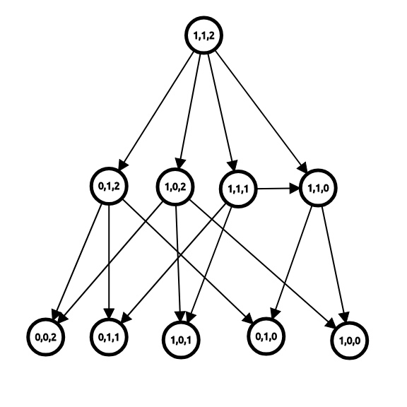

经典的公平组合游戏有很多，包括取数游戏，31 点，以及 Nim 游戏等。

## Nim 游戏

$n$ 堆物品，每堆有 $a_i$ 个，两个玩家轮流取走任意一堆的任意个物品，但不能不取。

取走最后一个物品的人获胜。

例如，如果现在有 $n=3$ 堆物品，而每堆分别有 $2, 5, 4$ 个，那么可以取走第 $1$ 堆中的 $2$ 个物品，局面就变成了 $0, 5, 4$；或者也可以取走第 $2$ 堆的 $4$ 个物品，局面就变成了 $2, 1, 4$。

如果现在的局面为 $0, 0, 5$，甲取走了第 $3$ 堆的 $5$ 个物品，也就是取走了最后一个物品，此时甲获胜。

## 博弈图和状态

如果将每个状态视为一个节点，再从每个状态向它的后继状态连边，我们就可以得到一个博弈状态图。

例如，如果节点 $(i, j, k)$ 表示局面为 $i, j, k$ 时的状态，则我们可以画出下面的博弈图（由于篇幅有限，故仅显示部分状态节点和部分边）：



定义 **必胜状态** 为 **先手必胜的状态**，**必败状态** 为 **先手必败的状态**。

通过推理，我们可以得出下面三条定理：

- 定理 1：没有后继状态的状态是必败状态。
- 定理 2：一个状态是必胜状态当且仅当存在至少一个必败状态为它的后继状态。
- 定理 3：一个状态是必败状态当且仅当它的所有后继状态均为必胜状态。

对于定理 1，如果游戏进行不下去了，那么这个玩家就输掉了游戏。

对于定理 2，如果该状态至少有一个后继状态为必败状态，那么玩家可以通过操作到该必败状态；此时对手的状态为必败状态——对手必定是失败的，而相反地，自己就获得了胜利。

对于定理 3，如果不存在一个后继状态为必败状态，那么无论如何，玩家只能操作到必胜状态；此时对手的状态为必胜状态——对手必定是胜利的，自己就输掉了游戏。

如果博弈图是一个有向无环图，则通过这三个定理，我们可以在绘出博弈图的情况下用 $O(N+M)$ 的时间（其中 $N$ 为状态种数，$M$ 为边数）得出每个状态是必胜状态还是必败状态。

## Nim 和

让我们再次回顾 Nim 游戏。

通过绘画博弈图，我们可以在 $O(\prod_{i=1}^n a_i)$ 的时间里求出该局面是否先手必赢。

但是，这样的时间复杂度实在太高。有没有什么巧妙而快速的方法呢？

定义 Nim 和 $=a_1 \oplus a_2 \oplus \ldots \oplus a_n$。

当且仅当 Nim 和为 $0$ 时，该状态为必败状态；否则该状态为必胜状态。

### 证明

为什么异或值会和状态的胜负有关？下面给出了这个定理的证明过程。

为了证明该定理，只需要证明下面三个定理：

- 定理 1：没有后继状态的状态是必败状态。
- 定理 2：对于 $a_1 \oplus a_2 \oplus \ldots \oplus a_n \neq 0$ 的局面，一定存在某种移动使得 $a_1 \oplus a_2 \oplus \ldots \oplus a_n = 0$。
- 定理 3：对于 $a_1 \oplus a_2 \oplus \ldots \oplus a_n = 0$ 的局面，一定不存在某种移动使得 $a_1 \oplus a_2 \oplus \ldots \oplus a_n = 0$。

对于定理 1，没有后继状态的状态只有一个，即全 $0$ 局面。此时 $a_1 \oplus a_2 \oplus \ldots \oplus a_n = 0$。

对于定理 2，不妨假设 $a_1 \oplus a_2 \oplus \ldots a_n = k \neq 0$。如果我们要将 $a_i$ 改为 $a_i'$，则 $a_i'=a_i \oplus k$。

根据异或定义，一定有奇数个 $a_i$ 在 $k$ 在二进制下的最高位为 $1$。满足这个条件的 $a_i$ 一定也满足 $a_i > a_i \oplus k$，因而这也是个合法的移动。

对于定理 3，如果我们要将 $a_i$ 改为 $a_i'$，则根据异或运算律可以得出 $a_i=a_i'$，因而这不是个合法的移动。

## 有向图游戏与 SG 函数

有向图游戏是一个经典的博弈游戏——实际上，大部分的公平组合游戏都可以转换为有向图游戏。

在一个有向无环图中，只有一个起点，上面有一个棋子，两个玩家轮流沿着有向边推动棋子，不能走的玩家判负。

定义 $\operatorname{mex}$ 函数的值为不属于集合 $S$ 中的最小非负整数，即：

$$
\operatorname{mex}(S)=\min\{x\} \quad (x \notin S, x \in N)
$$

例如 $\operatorname{mex}(\{0, 2, 4\})=1$，$\operatorname{mex}(\{1, 2\})=0$。

对于状态 $x$ 和它的所有 $k$ 个后继状态 $y_1, y_2, \ldots, y_k$，定义 $\operatorname{SG}$ 函数：

$$
\operatorname{SG}(x)=\operatorname{mex}\{\operatorname{SG}(y_1), \operatorname{SG}(y_2), \ldots, \operatorname{SG}(y_k)\}
$$

而对于由 $n$ 个有向图游戏组成的组合游戏，设它们的起点分别为 $s_1, s_2, \ldots, s_n$，则有定理：**当且仅当 $\operatorname{SG}(s_1) \oplus \operatorname{SG}(s_2) \oplus \ldots \oplus \operatorname{SG}(s_n) \neq 0$ 时，这个游戏是先手必胜的。同时，这是这一个组合游戏的游戏状态 $x$ 的 SG 值。**

这一定理被称作 **Sprague-Grundy 定理**(Sprague-Grundy Theorem), 简称 SG 定理。

### SG 定理的证明

可以使用数学归纳法来证明。

我们假设对于游戏状态 $x'$，其当前节点 $s_1', s_2', \ldots, s_n'$（对于任意 $i$ 有 $s_i' < s_i$），皆满足 SG 定理。

显然当 $\operatorname{SG}(s_1)'=\operatorname{SG}(s_2)'=\ldots \operatorname{SG}(s_n)'=0$ 时，该状态能满足 SG 定理。

那么只需要证明对于游戏状态 $x$，其当前节点 $s_1', s_2', \ldots, s_n'$ 符合 SG 定理，SG 定理便成立。

事实上这一个状态可以看作一个 Nim 游戏，对于某个节点 $s_i$，它可以移动到任意一个 $\operatorname{SG}$ 值比它小或比它大的节点。

在有向图游戏中，当一方将某一节点 $s_i$ 移动到 $\operatorname{SG}$ 值比它大的节点时，另一方可以移动回和 $\operatorname{SG}$ 值和 $\operatorname{SG}(s_i)$ 一样的节点，所以向 SG 值较大节点移动是无效操作。

当移动到 SG 值较小的节点时，情况则会和 Nim 游戏一样，能够到达任何一个游戏状态 $x'$ 使得 $\operatorname{SG}(x')= \operatorname{SG}(s_1') \oplus \operatorname{SG}(s_2') \oplus \ldots \oplus \operatorname{SG}(s_n') < \operatorname{SG}(X)$（注意到前文已经假设 $x'$ 满足 SG 定理），但到达不了 SG 值为 $\operatorname{SG}(s_1) \oplus \operatorname{SG}(s_2) \oplus \ldots \oplus \operatorname{SG}(s_n)$ 的节点。

所以状态 $x$ 符合 SG 定理。

### SG 定理的应用

SG 定理适用于 **任何公平的两人游戏**, 它常被用于决定游戏的输赢结果。

计算给定状态的 Grundy 值的步骤一般包括：

- 获取从此状态所有可能的转换；

- 每个转换都可以导致 **一系列独立的博弈**（退化情况下只有一个）。计算每个独立博弈的 Grundy 值并对它们进行 **异或求和**。

- 在为每个转换计算了 Grundy 值之后，状态的值是这些数字的 $\operatorname{mex}$。

- 如果该值为零，则当前状态为输，否则为赢。

## 将 Nim 游戏转换为有向图游戏

我们可以将一个有 $x$ 个物品的堆视为节点 $x$，则当且仅当 $y<x$ 时，节点 $x$ 可以到达 $y$。

那么，由 $n$ 个堆组成的 Nim 游戏，就可以视为 $n$ 个有向图游戏了。

根据上面的推论，可以得出 $\operatorname{SG}(x)=x$。再根据 SG 定理，就可以得出 Nim 和的结论了。

## 参考文献

[（转载）Nim 游戏博弈（收集完全版）- exponent - 博客园](http://www.cnblogs.com/exponent/articles/2141477.html)

[\[组合游戏与博弈论\]【学习笔记】- Candy? - 博客园](https://www.cnblogs.com/candy99/p/6548836.html)


## 习题

### NIM

> [!NOTE] **[AcWing 891. Nim游戏](https://www.acwing.com/problem/content/893/)**
> 
> 题意: TODO

> [!TIP] **思路**
> 
> 先手必胜状态：先手操作完，可以走到某一个必败状态
> 
> 先手必败状态：先手操作完，走不到任何一个必败状态
> 
> 先手必败状态：$a_1 ^{\wedge} a_2 ^{\wedge} a_3 ^{\wedge} ... ^{\wedge} a_n = 0$
> 
> 先手必胜状态：$a_1 ^{\wedge} a_2 ^{\wedge} a_3 ^{\wedge} ... ^{\wedge} a_n ≠ 0$

<details>
<summary>详细代码</summary>
<!-- tabs:start -->

##### **C++**

```cpp
#include <bits/stdc++.h>
using namespace std;

int n, v;

int main() {
    cin >> n;
    int res = 0;
    while (n--) {
        cin >> v;
        res ^= v;
    }
    if (res == 0)
        cout << "No" << endl;
    else
        cout << "Yes" << endl;
}
```

##### **Python**

```python

```

<!-- tabs:end -->
</details>

<br>

* * *

> [!NOTE] **[AcWing 892. 台阶-Nim游戏]()**
> 
> 题意: TODO

> [!TIP] **思路**
> 
> 台阶Nim游戏是普通的Nim博弈的进阶版，最后的输赢与奇数台阶上的石子有关。
> 
> 如果后手移动偶数阶的石子，那么先手将后手移动到奇数阶的石子再次移动，就可以发现偶数阶的石子对博弈是没有影响的。
> 
> 如果后手移动奇数阶的石子，先手同样移动奇数阶的石子。
> 
> 当奇数阶上没有石子时，由于先手走最后一步，所以此时后手只能移动偶数阶上的石子，先手将后手移动的石子再移动一次，就一定可以取胜。

<details>
<summary>详细代码</summary>
<!-- tabs:start -->

##### **C++**

```cpp
#include <bits/stdc++.h>
using namespace std;

int n, v;

int main() {
    cin >> n;
    int res = 0;
    for (int i = 1; i <= n; ++i) {
        cin >> v;
        if (i & 1) res ^= v;
    }
    if (res == 0)
        cout << "No" << endl;
    else
        cout << "Yes" << endl;
}
```

##### **Python**

```python

```

<!-- tabs:end -->
</details>

<br>

* * *

> [!NOTE] **[AcWing 893. 集合-Nim游戏](https://www.acwing.com/problem/content/895/)**
> 
> 题意: TODO

> [!TIP] **思路**
> 
> 定理 1：
> 
> $$
> 对于集合 S , mex(S) = mex({x1, x2 ... }) = S 中没有出现的最小非负整数
> $$
> 
> 定理 2.1：
> 
> $$
> sg(n) = mex({sg(i1), sg(i2), sg(i3) ... })
> 
> n 为结点；i1, i2, i3 ... 是 n 的后继结点
> $$
> 
> 定理2.2：
> 
> $$
> sg(G) = sg(head). G是一个有向图, head是G的头结点。 
> $$
> 
> 定理3：
> 
> $$
> sg(G1) ^{\wedge} sg(G2) ^{\wedge} sg(G3) ^{\wedge} ... ^{\wedge} sg(Gn) 为 n 个有向图的异或和
> $$
> 
> 对于 $n$ 个有向图游戏, 这个异或和就是它的答案（和 $nim$ 类似，这个定理感兴趣可以去证明）

<details>
<summary>详细代码</summary>
<!-- tabs:start -->

##### **C++**

```cpp
#include <bits/stdc++.h>
using namespace std;

const int maxn = 105;
const int maxv = 10005;
int n, m, x;
int s[maxn], f[maxv];

int sg(int x) {
    if (f[x] != -1) return f[x];
    unordered_set<int> S;
    for (int i = 0; i < m; ++i) {
        int sum = s[i];
        if (x >= sum) S.insert(sg(x - sum));
    }
    for (int i = 0;; ++i) {
        if (!S.count(i)) return f[x] = i;
    }
}

int main() {
    cin >> m;
    for (int i = 0; i < m; ++i) cin >> s[i];  // 集合中的数

    memset(f, -1, sizeof f);
    int res = 0;
    cin >> n;
    for (int i = 0; i < n; ++i) {
        cin >> x;
        res ^= sg(x);
    }
    cout << (res ? "Yes" : "No") << endl;
}
```

##### **Python**

```python

```

<!-- tabs:end -->
</details>

<br>

* * *

> [!NOTE] **[AcWing 894. 拆分-Nim游戏](https://www.acwing.com/problem/content/896/)**
> 
> 题意: TODO

> [!TIP] **思路**
> 
> 相比于 $集合-Nim$ ，这里的每一堆可以变成不大于原来那堆的任意大小的两堆
> 
> 即 $a[i]$ 可以拆分成 $(b[i], b[j])$ , 为了避免重复规定 $b[i] >= b[j]$ , 即： $a[i] >= b[i] >= b[j]$ 相当于一个局面拆分成了两个局面
> 
> 由 $SG$ 函数理论，多个独立局面的 $SG$ 值，等于这些局面 $SG$ 值的异或和。 因此需要存储的状态就是 $sg(b[i]) ^{\wedge} sg(b[j])$（与 $集合-Nim$ 的唯一区别）

<details>
<summary>详细代码</summary>
<!-- tabs:start -->

##### **C++**

```cpp
#include <bits/stdc++.h>
using namespace std;

const int maxn = 105;

int n, x;
int f[maxn];

int sg(int x) {
    if (f[x] != -1) return f[x];
    unordered_set<int> S;
    for (int i = 0; i < x; ++i)
        for (int j = 0; j <= i; ++j) S.insert(sg(i) ^ sg(j));
    for (int i = 0;; ++i)
        if (!S.count(i)) return f[x] = i;
}

int main() {
    cin >> n;
    memset(f, -1, sizeof f);
    int res = 0;
    while (n--) {
        cin >> x;
        res ^= sg(x);
    }
    cout << (res ? "Yes" : "No") << endl;
}
```

##### **Python**

```python

```

<!-- tabs:end -->
</details>

<br>

* * *

### 石子游戏

> [!NOTE] **[LeetCode 1140. 石子游戏 II](https://leetcode-cn.com/problems/stone-game-ii/)**
> 
> 题意: TODO

> [!TIP] **思路**
> 
> 博弈 + 记忆化
> 
> 注意状态定义与其他人略有不同，因此返回时 $(s[n] + t) / 2$

<details>
<summary>详细代码</summary>
<!-- tabs:start -->

##### **C++**

```cpp
class Solution {
public:
    using PII = pair<int, int>;
    const static int N = 110;
    const int INF = 0x3f3f3f3f;
    
    int n;
    int s[N];
    map<PII, int> hash;
    
    int dp(int x, int m) {
        if (x == n)
            return 0;
        PII pi = {x, m};
        if (hash.count(pi))
            return hash[pi];
        
        int t = -INF, top = min(n, x + 2 * m);
        for (int i = x + 1; i <= top; ++ i )
            t = max(t, s[i] - s[x] - dp(i, max(m, i - x)));
        
        return hash[pi] = t;
    }
    
    int stoneGameII(vector<int>& piles) {
        this->n = piles.size();
        memset(s, 0, sizeof s);
        for (int i = 1; i <= n; ++ i )
            s[i] = s[i - 1] + piles[i - 1];
        
        int t = dp(0, 1);
        
        return (s[n] + t) / 2;
    }
};
```

##### **Python**

```python

```

<!-- tabs:end -->
</details>

<br>

* * *

> [!NOTE] **[LeetCode 1406. 石子游戏 III](https://leetcode-cn.com/problems/stone-game-iii/)**
> 
> 题意: TODO

> [!TIP] **思路**
> 
> 一排石子每个人可以从左取1-3堆 求取完谁分数最大

<details>
<summary>详细代码</summary>
<!-- tabs:start -->

##### **C++**

```cpp
class Solution {
public:
    string stoneGameIII(vector<int>& stoneValue) {
        int n = stoneValue.size();
        vector<int> dp(n + 1);
        for (int i = n - 1; i >= 0; --i) {
            dp[i] = INT_MIN;
            int sum = 0;
            for (int j = i; j < n && j < i + 3; ++j) {
                sum += stoneValue[j];
                dp[i] = max(dp[i], sum - dp[j + 1]);
            }
        }
        if (dp[0] > 0)
            return "Alice";
        else if (dp[0] < 0)
            return "Bob";
        else
            return "Tie";
    }
};
```

##### **Python**

```python

```

<!-- tabs:end -->
</details>

<br>

* * *

> [!NOTE] **[LeetCode 1510. 石子游戏 IV](https://leetcode-cn.com/problems/stone-game-iv/)**
> 
> 题意: TODO

> [!TIP] **思路**
> 
> 博弈dp 决策是取平方数

<details>
<summary>详细代码</summary>
<!-- tabs:start -->

##### **C++**

```cpp
class Solution {
public:
    bool winnerSquareGame(int n) {
        vector<bool> f(n + 1);
        for (int i = 1; i <= n; ++i)
            for (int j = 1; i - j * j >= 0; ++j) {
                f[i] = !f[i - j * j];
                if (f[i]) break;
            }
        return f[n];
    }
};
```

##### **Python**

```python

```

<!-- tabs:end -->
</details>

<br>

* * *

> [!NOTE] **[LeetCode 1686. 石子游戏 VI](https://leetcode-cn.com/problems/stone-game-vi/)**
> 
> 题意: TODO

> [!TIP] **思路**
> 
> 直接按和排序而 **无需考虑对于 alice bob 来说和相同时是否需要选择对自己更有利的正确性证明**


<details>
<summary>详细代码</summary>
<!-- tabs:start -->

##### **C++**

```cpp
class Solution {
public:
    typedef pair<int, int> PII;
    int stoneGameVI(vector<int>& av, vector<int>& bv) {
        int n = av.size();
        vector<PII> ve;
        for (int i = 0; i < n; ++ i ) ve.push_back({av[i] + bv[i], i});
        sort(ve.begin(), ve.end(), greater<PII>());
        int v1 = 0, v2 = 0;
        for (int i = 0; i < n; ++ i ) {
            // cout << "i = " << i << " val = " << ve[i].first << " idx = " << ve[i].second;
            int idx = ve[i].second;
            if (i & 1) v2 += bv[idx];
            else v1 += av[idx];
        }
            
        // cout << " v1 = " << v1 << "  v2 = " << v2 << endl;
        if (v1 < v2) return -1;
        else if (v1 > v2) return 1;
        return 0;
    }
};
```

##### **Python**

```python

```

<!-- tabs:end -->
</details>

<br>

* * *

> [!NOTE] **[LeetCode 1690. 石子游戏 VII](https://leetcode-cn.com/problems/stone-game-vii/)**
> 
> 题意: TODO

> [!TIP] **思路**
> 
> 

<details>
<summary>详细代码</summary>
<!-- tabs:start -->

##### **C++**

```cpp
class Solution {
public:
    int stoneGameVII(vector<int>& stones) {
        int n = stones.size();
        vector<int> s(n + 1);
        for (int i = 1; i <= n; ++ i ) s[i] = s[i - 1] + stones[i - 1];
        vector<vector<int>> f(n + 1, vector<int>(n + 1));
        // len = 1 时剩余和为0 也即f[i][i]为0 故直接从2开始
        for (int len = 2; len <= n; ++ len )
            for (int l = 1; l + len - 1 <= n; ++ l ) {
                int r = l + len - 1;
                f[l][r] = max(s[r] - s[l] - f[l + 1][r], s[r - 1] - s[l - 1] - f[l][r - 1]);
            }
        return f[1][n];
    }
};
```

##### **Python**

```python

```

<!-- tabs:end -->
</details>

<br>

* * *

> [!NOTE] **[LeetCode 1872. 石子游戏 VIII](https://leetcode-cn.com/problems/stone-game-viii/)** [TAG]
> 
> 题意: TODO

> [!TIP] **思路**
> 
> 博弈 dp
> 
> 注意 **类似 LCIS 的常数优化** TODO

<details>
<summary>详细代码</summary>
<!-- tabs:start -->

##### **C++**

```cpp
class Solution {
public:
    int stoneGameVIII(vector<int>& stones) {
        int n = stones.size();
        reverse(stones.begin(), stones.end());
        vector<int> f(n + 1), s(n + 1);
        for (int i = 1; i <= n; ++ i )
            s[i] = s[i - 1] + stones[i - 1];
        int v = s[n] - s[0] + f[1];
        for (int i = 2; i <= n; ++ i ) {
            // 优化
            f[i] = v;
            v = max(v, s[n] - s[i - 1] - f[i]);
            // 本次操作之后 下次剩余至多 i - 2 + 1
            // f[i] = INT_MIN;
            // for (int j = 1; j <= i - 1; ++ j )
            //     f[i] = max(f[i], s[n] - s[j - 1] - f[j]);
        }
        return f[n];
    }
};
```

##### **Python**

```python

```

<!-- tabs:end -->
</details>

<br>

* * *

### 图上博弈

> [!NOTE] **[Codeforces A Lot of Games](http://codeforces.com/problemset/problem/455/B)**
> 
> 题意: 
> 
> 给出 $n$ 个非空字符串。在游戏中，两位玩家一起建造一个单词。开始时，单词是一个空字符串。两位玩家轮流操作。
> 
> - 一位玩家在他的回合中，必须在单词的后面添加一个字母，使得添加后的单词是 $n$ 个字符串中至少一个的前缀。
> 
> - 当一位玩家不能操作时，他就输掉了游戏。
> 
> Andrew 和 Alex 决定玩 $k$ 次。**上一局的负者是下一局的先手**。
> 
> 他们决定，在最后一局中获胜的人获得整场游戏的胜利。Fedor 想知道，如果他们两个足够聪明，谁会胜利。

> [!TIP] **思路**
> 
> 较直观的，显然先建立 Trie 树再计算每个节点的必胜状态 $f[i]$
> 
> 有意思的是，**每个角色可以主动选择失败，来保持先手的状态，直到最后一局**
> 
> 故还需计算 **当前节点是否能够主动选择必败 $g[i]$**
> 
> 注意 $g[i]$ 的计算细节即可，最后分情况讨论

<details>
<summary>详细代码</summary>
<!-- tabs:start -->

##### **C++**

```cpp
// Problem: B. A Lot of Games
// Contest: Codeforces - Codeforces Round #260 (Div. 1)
// URL: https://codeforces.com/problemset/problem/455/B
// Memory Limit: 256 MB
// Time Limit: 1000 ms

#include <bits/stdc++.h>
using namespace std;

// 局面一致，且上一局的负者是下一局的先手，则两者对称
// ==> 如果k是奇数直接返回先手结果，如果是偶数则反一下即可 ==> WA
// 实际上，必须考虑【一个人会不会选择主动输，进而一直掌握先手】

const static int N = 1e5 + 10;

int n, k;
string s;

int son[N][26], cnt[N], idx;
void insert() {
    int p = 0, m = s.size();
    for (int i = 0; i < m; ++i) {
        int u = s[i] - 'a';
        if (!son[p][u])
            son[p][u] = ++idx;
        p = son[p][u];
    }
    cnt[p]++;
}

int f[N],  // f 表示当前局面先手是否可以必胜
    g[N];  // g 表示是否可以必败 【思路正确】
void dfs(int u) {
    // 必胜还是必败，默认必败（对于无法再追加字符的情况）
    bool flag1 = false, flag2 = false, has_son = false;
    for (int i = 0; i < 26; ++i) {
        int p = son[u][i];
        if (p) {
            dfs(p);
            if (!f[p])
                flag1 = true;  // 可以让对方必败，则本轮次必胜
            // ATTENTION 更新细节
            // IF 【如果子节点没有必败的选择，则当前点可以必败】
            if (!g[p])
                flag2 = true;
            has_son = true;
        }
    }
    if (!has_son)
        flag2 = true;
    f[u] = flag1, g[u] = flag2;
}

string res[2] = {"First", "Second"};

int main() {
    ios::sync_with_stdio(false);
    cin.tie(nullptr);
    cout.tie(nullptr);

    cin >> n >> k;

    memset(cnt, 0, sizeof cnt);
    idx = 0;
    for (int i = 1; i <= n; ++i) {
        cin >> s;
        insert();
    }

    memset(f, 0, sizeof f);
    dfs(0);
    // cout << " f0 = " << f[0] << " g0 = " << g[0] << endl;

    if (!f[0])
        // case 1: 先手必败，则它永远是先手，永远必败
        cout << res[1] << endl;
    else {
        // case 2: 先手必胜，则会交替成为先手
        // ATTENTION:
        // Trick: 如果先手可以选择失败(如果可能)从而一直保持先手 最终直接取胜
        if (g[0])
            cout << res[0] << endl;
        else {
            // case: 必须要连续交换，因为不能主动失败
            if (k & 1)
                cout << res[0] << endl;
            else
                cout << res[1] << endl;
        }
    }

    return 0;
}
```

##### **Python**

```python

```

<!-- tabs:end -->
</details>

<br>

* * *
