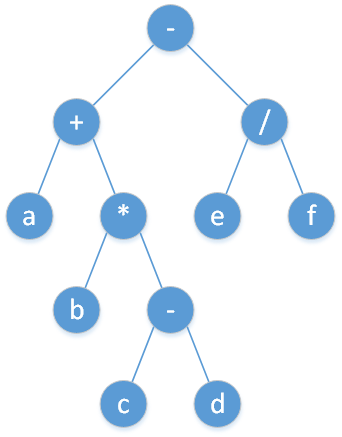

> [!NOTE] **调度场算法**
>
> ref: https://zhuanlan.zhihu.com/p/147623236
> 
> 为了把较难处理的中缀表达式转化为容易处理的后缀表达式，Dijsktra 引入了一个算法，称为**调度场算法**。
>
> **一般加减乘除**
>
> 1.   依次按顺序读入
>
>      [1] 读到数字：直接输出；
>
>      [2] 读到运算符：如果栈顶的运算符优先级不低于该运算符，则输出栈顶运算符并使之出栈，直到栈空或不满足上述条件为止；然后入栈。    
>
> 2.   当读入完毕时，依次输出并弹出栈顶运算符，直到栈被清空。
>
> +**括号**
>
> 1.   依次按顺序读入，
>
>      [1] 读到数字：直接输出；
>
>      [2] 读到**一般**运算符：如果栈顶的运算符优先级不低于该运算符，则输出栈顶运算符并使之出栈，直到栈空或不满足上述条件为止；然后入栈；
>
>      [3] 读到**左括号**：直接入栈；
>
>      [4] 读到**右括号**：输出栈顶运算符并使之出栈，直到栈顶为左括号为止；令左括号出栈。
>
> 2.   当读入完毕时，依次输出并弹出栈顶运算符，直到栈被清空。
>
> +**右结合运算符**
>
> 1.  依次按顺序读入，
>
>     [1]  读到数字：直接输出；
> 
>     [2]  读到**左结合**运算符：如果栈顶的运算符优先级**不低于**该运算符，则输出栈顶运算符并使之出栈，直到栈空或不满足上述条件为止；然后入栈；
> 
>     [3]  读到**右结合**运算符：如果栈顶的运算符优先级**高于**该运算符，则输出栈顶运算符并使之出栈，直到栈空或不满足上述条件为止；然后入栈；
> 
>     [4]  读到**左括号**：直接入栈；
> 
>     [5]  读到**右括号**：输出栈顶运算符并使之出栈，直到栈顶为左括号为止；令左括号出栈。
>
> 2.  当读入完毕时，依次输出并弹出栈顶运算符，直到栈被清空。
>
> 


表达式求值要解决的问题一般是输入一个字符串表示的表达式，要求输出它的值。当然也有变种比如表达式中是否包含括号，指数运算，含多少变量，判断多个表达式是否等价，等等。

其中判断表达式等价的部分使用了拉格朗日插值法等数学工具，在此暂不进行展开。

一般的思路分为两种，一种递归一种非递归。

## 递归

递归的方法是把表达式拆分成如图所示的表达式树，然后在树结构上自底向上进行运算。

表达式树上进行 [树的遍历](graph/tree-basic.md#_10) 可以得到不同类型的表达式。

- 前序遍历对应前缀表达式（波兰式）
- 中序遍历对应中缀表达式
- 后序遍历对应后缀表达式（逆波兰式）

## 非递归

非递归的方法是定义两个 [栈](ds/stack.md) 来分别存储运算符和运算数。每当遇到一个数直接放进数的栈；每当遇到一个操作符时，要查找之前运算符栈中的元素，按照预先定义好的优先级来进行适当的弹出操作（弹出的同时求出对应的子表达式的值）。

我们要知道：算术表达式分为三种，分别是前缀表达式、中缀表达式、后缀表达式。其中，中缀表达式是我们日常生活中最常用的表达式；后缀表达式是计算机最容易理解的表达式。为什么说后缀表达式最容易被计算机理解呢？因为后缀表达式不需要括号表示，它的运算顺序是唯一确定的。举个例子：在后缀表达式 $3~2~*~1~-$ 中，首先计算 $3 \times 2 = 6$（使用最后一个运算符，即栈顶运算符），然后计算 $6 - 1 = 5$。可以看到：对于一个后缀表达式，只需要 **维护一个数字栈，每次遇到一个运算符，就取出两个栈顶元素，将运算结果重新压入栈中**。最后，栈中唯一一个元素就是该后缀表达式的运算结果时间复杂度 $O(n)$。

所以说，对于普通中缀表达式的计算，我们可以将其转化为后缀表达式再进行计算。转换方法也十分简单。只要建立一个用于存放运算符的栈，扫描该中缀表达式：

1. 如果遇到数字，直接将该数字输出到后缀表达式（以下部分用「输出」表示输出到后缀表达式）；
2. 如果遇到左括号，入栈；
3. 如果遇到右括号，不断输出栈顶元素，直至遇到左括号（左括号出栈，但不输出）；
4. 如果遇到其他运算符，不断去除所有运算优先级大于等于当前运算符的运算符，输出。最后，新的符号入栈；
5. 把栈中剩下的符号依次输出，表达式转换结束。

时间复杂度 $O(n)$。


```cpp
// 下面代码摘自笔者 NOIP2005 等价表达式
std::string convert(const std::string &s) {  // 把中缀表达式转换为后缀表达式
    std::stack<char> oper;
    std::stringstream ss;
    ss << s;
    std::string t, tmp;
    while (ss >> tmp) {
        if (isdigit(tmp[0]))
            t += tmp + ' ';  // 1. 如果遇到一个数，输出该数
        else if (tmp[0] == '(')
            oper.push(tmp[0]);  // 2. 如果遇到左括号，把左括号入栈
        else if (tmp[0] == ')') {  // 3. 如果遇到右括号，
            while (!oper.empty() && oper.top() != '(')
                t += std::string(1, oper.top()) + ' ',
                    oper.pop();  // 不断取出栈顶并输出，直到栈顶为左括号，
            oper.pop();  // 然后把左括号出栈
        } else {         // 4. 如果遇到运算符
            while (!oper.empty() && level[oper.top()] >= level[tmp[0]])
                t += std::string(1, oper.top()) + ' ',
                    oper.pop();  // 只要栈顶符号的优先级不低于新符号，就不断取出栈顶并输出
            oper.push(tmp[0]);   // 最后把新符号进栈
        }
    }
    while (!oper.empty()) t += std::string(1, oper.top()) + ' ', oper.pop();
    return t;
}
int calc(const std::string &s) {  // 计算转换好的后缀表达式
    std::stack<int> num;
    std::stringstream ss;
    ss << s;
    std::string t, tmp;
    while (ss >> tmp) {
        if (isdigit(tmp[0]))
            num.push(stoi(tmp));
        else {
            int b, a;  // 取出栈顶元素，注意顺序
            if (!num.empty()) b = num.top();
            num.pop();
            if (!num.empty()) a = num.top();
            num.pop();
            if (tmp[0] == '+') num.push(a + b);
            if (tmp[0] == '-') num.push(a - b);
            if (tmp[0] == '*') num.push(a * b);
            if (tmp[0] == '^') num.push(qpow(a, b));
        }
    }
    return num.top();
}
```

## 习题

1. [表达式求值（NOIP2013）](https://vijos.org/p/1849)
2. [后缀表达式](https://www.luogu.com.cn/problem/P1449)
3. [Transform the Expression](https://www.spoj.com/problems/ONP/)


## 双栈表达式求值，包括前缀/后缀/中缀表达式

### 前缀

### 中缀

#### 表达式

> [!NOTE] **[LeetCode 1896. 反转表达式值的最少操作次数](https://leetcode-cn.com/problems/minimum-cost-to-change-the-final-value-of-expression/)** [TAG]
> 
> [biweekly-54](https://github.com/OpenKikCoc/LeetCode/tree/master/Contest/2021-06-12_Biweekly-54#1896-反转表达式值的最少操作次数-tag)
> 
> 题意: TODO

> [!TIP] **思路**
> 
> **中缀表达式 + 树形DP**
> 
> 最终变成：要求表达式树的值，但对于中缀表达式的形式可以直接借助栈，无需完整建树

<details>
<summary>详细代码</summary>
<!-- tabs:start -->

##### **C++**

```cpp
class Solution {
public:
    stack<vector<int>> num; // 取0 取1分别需要操作多少次
    stack<char> op;
    
    int get_min(vector<int> s) {
        int x = INT_MAX;
        for (auto v : s)
            x = min(x, v);
        return x;
    }
    
    void eval() {
        auto a = num.top(); num.pop();
        auto b = num.top(); num.pop();
        char c = op.top(); op.pop();
        
        if (c == '&') {
            // 得到 0 需 {0, 0}, {0, 1}, {1, 0}, 或改变符号后 {0, 0} + 1
            vector<int> s0 = {a[0] + b[0], a[0] + b[1], a[1] + b[0], a[0] + b[0] + 1};
            // 得到 1 ...
            vector<int> s1 = {a[1] + b[1], a[1] + b[0] + 1, a[0] + b[1] + 1, a[1] + b[1] + 1};
            num.push({get_min(s0), get_min(s1)});
        } else {
            vector<int> s0 = {a[0] + b[0], a[0] + b[1] + 1, a[1] + b[0] + 1, a[0] + b[0] + 1};
            vector<int> s1 = {a[1] + b[1], a[0] + b[1], a[1] + b[0], a[1] + b[1] + 1};
            num.push({get_min(s0), get_min(s1)});
        }
    }
    
    int minOperationsToFlip(string expression) {
        for (auto c : expression)
            if (isdigit(c)) {
                if (c == '0')
                    num.push({0, 1});
                else
                    num.push({1, 0});
            } else if (c == '(') {
                op.push(c);
            } else if (c == ')') {
                while (op.top() != '(')
                    eval();
                op.pop();   // (
            } else {
                // 一般字符
                // 中缀表达式 故先把前面算完
                while (op.size() && op.top() != '(')
                    eval();
                op.push(c);
            }
        
        while (op.size())
            eval();
        // 一定有一个是0(即什么都不修改时的值) 而非0的较大的数即为所求
        return max(num.top()[0], num.top()[1]);
    }
};
```

##### **Python**

```python

```

<!-- tabs:end -->
</details>

<br>

* * *

> [!NOTE] **[LeetCode 2019. 解出数学表达式的学生分数](https://leetcode-cn.com/problems/the-score-of-students-solving-math-expression/)** [TAG]
> 
> 题意: TODO

> [!TIP] **思路**
> 
> **带优先级的表达式求值 + 区间DP**
> 
> 重点在于区间DP细节及剪枝

<details>
<summary>详细代码</summary>
<!-- tabs:start -->

##### **C++**

```cpp
class Solution {
public:
    stack<int> num;
    stack<char> op;
    void eval() {
        auto a = num.top(); num.pop();
        auto b = num.top(); num.pop();
        auto c = op.top(); op.pop();
        int r;
        if (c == '+')
            r = a + b;
        else
            r = a * b;
        num.push(r);
    }
    int calc(string s) {
        unordered_map<char, int> pr;
        pr['+'] = pr['-'] = 1, pr['*'] = pr['/'] = 2;
        for (int i = 0; i < s.size(); ++ i ) {
            char c = s[i];
            if (c == ' ')
                continue;
            if (isdigit(c)) {
                int x = 0, j = i;
                while (j < s.size() && isdigit(s[j]))
                    x = x * 10 + s[j] - '0', j ++ ;
                num.push(x);
                i = j - 1;
            } else {
                while (op.size() && pr[op.top()] >= pr[c])
                    eval();
                op.push(c);
            }
        }
        while (op.size())
            eval();
        return num.top();
    }

    int scoreOfStudents(string s, vector<int>& answers) {
        int tar = calc(s), n = s.size();

        unordered_set<int> f[32][32];
        for (int len = 1; len <= n; ++ len )
            for (int l = 0; l + len - 1 < n; l += 2 ) {
                int r = l + len - 1;
                if (l == r)
                    f[l][r].insert(s[l] - '0');
                else {
                    for (int k = l; k < r; k += 2)
                        for (auto v1 : f[l][k])
                            for (auto v2 : f[k + 2][r]) {
                                int t = 0;
                                if (s[k + 1] == '+')
                                    t = v1 + v2;
                                else
                                    t = v1 * v2;
                                if (t > 1000)
                                    continue;
                                f[l][r].insert(t);
                            }
                }
            }
        
        int res = 0;
        for (auto v : answers)
            if (v == tar)
                res += 5;
            else if (f[0][n - 1].count(v))
                res += 2;
        return res;
    }
};
```

##### **C++ TLE**

```cpp
// TLE
class Solution {
public:
    using PON = pair<vector<char>, vector<int>>;
    using PONI = pair<PON, int>;
        
    int n, tar;
    unordered_set<int> S;
    set<PONI> hash;
    
    PON parse(string s) {
        vector<char> ops;
        vector<int> nums;
        int n = s.size();
        for (int i = 0; i < n; ++ i ) {
            int j = i, v = 0;
            while (j < n && isdigit(s[j]))
                v = v * 10 + s[j] - '0', j ++ ;
            nums.push_back(v);
            if (j < n)
                ops.push_back(s[j]);
            i = j;
        }
        return {ops, nums};
    }
    
    int op(char c, int a, int b) {
        if (c == '+')
            return a + b;
        return a * b;
    }
    
    void dfs(vector<char> ops, vector<int> nums, int cnt) {
        // MEM
        PONI t = {{ops, nums}, cnt};
        if (hash.count(t))
            return;
        hash.insert(t);
        
        if (ops.empty()) {
            // cout << "cnt = " << cnt << " nums[0] = " << nums[0] << endl;
            if (cnt == 0)
                this->tar = nums[0];
            else
                S.insert(nums[0]);
            return;
        }
        
        int n = ops.size(), p = 0;
        for (int i = 0; i < n; ++ i )
            if (ops[i] == '*') {
                p = i;
                break;
            }
        
        for (int i = 0; i < n; ++ i ) {
            int v = op(ops[i], nums[i], nums[i + 1]);
            // ATTENTION 增加一个剪枝
            if (v >= 1000)
                continue;
            
            vector<char> t_ops;
            vector<int> t_nums;
            for (int j = 0; j < i; ++ j )
                t_ops.push_back(ops[j]), t_nums.push_back(nums[j]);
            t_nums.push_back(v);
            for (int j = i + 1; j < n; ++ j )
                t_ops.push_back(ops[j]), t_nums.push_back(nums[j + 1]);
            dfs(t_ops, t_nums, cnt + (i != p));
        }
    }
    
    int scoreOfStudents(string s, vector<int>& answers) {
        this->n = s.size();
        auto [ops, nums] = parse(s);
        
        dfs(ops, nums, 0);
        
        // cout << "tar = " << tar << endl;
        
        int res = 0;
        for (auto v : answers)
            if (v == tar)
                res += 5;
            else if (S.count(v))
                res += 2;
        return res;
    }
};
```

##### **Python**

```python

```

<!-- tabs:end -->
</details>

<br>

* * *

#### 基本计算器

> [!NOTE] **[LeetCode 224. 基本计算器](https://leetcode-cn.com/problems/basic-calculator/)**
> 
> 题意: TODO

> [!TIP] **思路**
> 
> 

<details>
<summary>详细代码</summary>
<!-- tabs:start -->

##### **C++**

```cpp
class Solution {
public:
    stack<int> num;
    stack<char> op;

    void eval() {
        auto b = num.top(); num.pop();
        auto a = num.top(); num.pop();
        auto c = op.top(); op.pop();
        int r;
        if (c == '+') r = a + b;
        else r = a - b;
        num.push(r);
    }

    int calculate(string rs) {
        string s;
        for (auto c: rs)
            if (c != ' ')   // 过滤空格 方便直接 s[i - 1] 去特判
                s += c;

        for (int i = 0; i < s.size(); ++ i ) {
            auto c = s[i];
            if (isdigit(c)) {
                int x = 0, j = i;
                while (j < s.size() && isdigit(s[j])) x = x * 10 + (s[j ++ ] - '0');
                i = j - 1;
                num.push(x);
            } else if (c == '(')
                op.push(c);
            else if (c == ')') {
                while (op.top() != '(') eval(num, op);
                op.pop();
            } else {
                // 2021 leetcode更新数据
                // -2+ 1
                // 如果当前栈空 压入操作符前先加入0
                //
                // 2022 更新数据
                // "1-(     -2)" 需要对前面的位置特判
                if (!i || s[i - 1] == '(' || s[i - 1] == '+' || s[i - 1] == '-')  // 特殊处理符号和正号
                    num.push(0);
                while (op.size() && op.top() != '(') eval(num, op);
                op.push(c);
            }
        }
        while (op.size()) eval(num, op);
        return num.top();
    }
};
```

##### **Python**

```python
"""
(栈,表达式求值) O(n)
开两个栈，一个记录数字，一个记录操作符。
然后从前往后扫描整个表达式：

如果遇到 (、+、-，直接入栈；
如果遇到数字，则判断操作符栈的栈顶元素，如果不是 (，则弹出操作符的栈顶元素，并用相应操作更新数字栈的栈顶元素。从而保证操作符栈的栈顶最多有一个连续的+或-；
如果遇到 )，此时操作符栈顶一定是 (，将其弹出。然后根据新栈顶的操作符，对数字栈顶的两个元素进行相应操作；
时间复杂度分析：每个数字和操作进栈出栈一次，所以总时间复杂度是 O(n)。
"""

class Solution:
    def calculate(self, s: str) -> int:
        res = 0
        stack = []
        sign = 1
        i = 0
        n = len(s)
        while i < n:
            if s[i] == " ":
                i += 1
            elif s[i] == "-":
                sign = -1
                i += 1
            elif s[i] == "+":
                sign = 1
                i += 1
            elif s[i] == "(":
                stack.append(res)
                stack.append(sign)
                res = 0
                sign = 1
                i += 1
            elif s[i] == ")":
                # print(stack)
                res = res * stack.pop() + stack.pop()
                i += 1
            elif s[i].isdigit():
                tmp = int(s[i])
                i += 1
                while i < n and s[i].isdigit():
                    tmp = tmp * 10 + int(s[i])
                    i += 1
                res += tmp * sign
        return res
```

<!-- tabs:end -->
</details>

<br>

* * *

> [!NOTE] **[LeetCode 227. 基本计算器 II](https://leetcode-cn.com/problems/basic-calculator-ii/)**
> 
> 题意: TODO

> [!TIP] **思路**
> 
> 

<details>
<summary>详细代码</summary>
<!-- tabs:start -->

##### **C++**

```cpp
class Solution {
public:
    stack<int> num;
    stack<char> op;

    void eval() {
        int b = num.top(); num.pop();
        int a = num.top(); num.pop();
        char c = op.top(); op.pop();
        int r;
        if (c == '+') r = a + b;
        else if (c == '-') r = a - b;
        else if (c == '*') r = a * b;
        else r = a / b;
        num.push(r);
    }

    int calculate(string s) {
        unordered_map<char, int> pr;
        pr['+'] = pr['-'] = 1, pr['*'] = pr['/'] = 2;
        for (int i = 0; i < s.size(); i ++ ) {
            char c = s[i];
            if (c == ' ') continue;
            if (isdigit(c)) {
                int x = 0, j = i;
                while (j < s.size() && isdigit(s[j])) x = x * 10 + (s[j ++ ] - '0');
                num.push(x);
                i = j - 1;
            } else {
                while (op.size() && pr[op.top()] >= pr[c]) eval();
                op.push(c);
            }
        }
        while (op.size()) eval();
        return num.top();
    }
};
```

##### **Python**

```python
"""
(栈) O(n)
这道题主要是需要考虑加减和乘除的优先级问题，用栈来处理，遇到加减就把数字压栈，遇到乘除就把栈顶弹出，与数字进行乘除处理。主要注意的是运算符是放在两个数字的中间，而我们想要的是在遇到运算符时，用于运算的两个数字已经被解析出来了，因此用sign来记录前一个运算符，在遇到一个新的运算符或者到字符串的结尾时再考虑对前一个运算符进行处理。
"""
class Solution:
    def calculate(self, s: str) -> int:
        nums = []
        ops = []
        i = 0
        while i < len(s):
            if s[i] == " ":
                i += 1
            elif s[i] in ["+","-","*","/"]:
                ops.append(s[i])
                i += 1
            else:
                a = 0
                while i < len(s) and "0" <= s[i] <= "9":
                    a *= 10
                    a += int(s[i])
                    i += 1
                if ops:
                    if ops[-1] == "*":
                        nums[-1] *= a
                        ops.pop()
                    elif ops[-1] == "/":
                        nums[-1] = int(nums[-1] / a)
                        ops.pop()
                    else:
                        nums.append(a)
                else:
                    nums.append(a)
        for i in range(len(ops)):
            if ops[i] == "+":
                nums[0] += nums[i + 1]
            else:
                nums[0] -= nums[i + 1]
        return nums[0]
```

<!-- tabs:end -->
</details>

<br>

* * *

> [!NOTE] **[LeetCode 770. 基本计算器 IV](https://leetcode-cn.com/problems/basic-calculator-iv/)**
> 
> 题意: TODO

> [!TIP] **思路**
> 
> **综合题 重复**

<details>
<summary>详细代码</summary>
<!-- tabs:start -->

##### **C++**

```cpp
class Solution {
public:
    struct Item {
        int c;  // 系数
        multiset<string> vars;  // 所有自变量
        bool operator< (const Item& t) const {
            if (vars.size() != t.vars.size()) return vars.size() > t.vars.size();
            return vars < t.vars;
        }
        bool operator== (const Item& t) const {
            return vars == t.vars;
        }
        string convert_to_string() {
            string res = to_string(c);
            for (auto& var: vars) res += '*' + var;
            return res;
        }
    };  // 项
    unordered_map<string, int> value;
    stack<vector<Item>> num;
    stack<char> op;

    vector<Item> add(vector<Item> a, vector<Item> b, int sign) {
        vector<Item> res;
        int i = 0, j = 0;
        while (i < a.size() && j < b.size()) {  // 二路归并
            if (a[i] == b[j]) {
                Item t{a[i].c + b[j].c * sign, a[i].vars};
                if (t.c) res.push_back(t);
                i ++, j ++ ;
            } else if (a[i] < b[j]) {
                res.push_back(a[i ++ ]);
            } else {
                res.push_back({b[j].c * sign, b[j].vars}), j ++ ;
            }
        }
        while (i < a.size()) res.push_back(a[i ++ ]);
        while (j < b.size()) res.push_back({b[j].c * sign, b[j].vars}), j ++ ;
        return res;
    }

    vector<Item> mul(vector<Item> a, vector<Item> b) {
        vector<Item> res;
        for (auto& x: a) {
            vector<Item> items;
            for (auto& y: b) {
                Item t{x.c * y.c, x.vars};
                for (auto& v: y.vars) t.vars.insert(v);
                items.push_back(t);
            }
            res = add(res, items, 1);
        }
        return res;
    }

    void eval() {
        auto b = num.top(); num.pop();
        auto a = num.top(); num.pop();
        auto c = op.top(); op.pop();
        vector<Item> x;
        if (c == '+') x = add(a, b, 1);
        else if (c == '-') x = add(a, b, -1);
        else x = mul(a, b);
        num.push(x);
    }

    vector<Item> calc(string& str) {
        unordered_map<char, int> pr{{'+', 1}, {'-', 1}, {'*', 2}};
        for (int i = 0; i < str.size(); i ++ ) {
            if (str[i] == ' ') continue;
            if (str[i] >= 'a' && str[i] <= 'z' || isdigit(str[i])) {
                vector<Item> items;
                if (str[i] >= 'a' && str[i] <= 'z') {
                    string var;
                    int j = i;
                    while (j < str.size() && str[j] >= 'a' && str[j] <= 'z') var += str[j ++ ];
                    i = j - 1;
                    if (value.count(var)) {
                        if (value[var]) items.push_back({value[var], {}});
                    } else {
                        items.push_back({1, {var}});
                    }
                } else {
                    int x = 0, j = i;
                    while (j < str.size() && isdigit(str[j])) x = x * 10 + str[j ++ ] - '0';
                    i = j - 1;
                    if (x) items.push_back({x, {}});
                }
                num.push(items);
            } else if (str[i] == '(') {
                op.push(str[i]);
            } else if (str[i] == ')') {
                while (op.top() != '(') eval();
                op.pop();
            } else {
                while (op.size() && op.top() != '(' && pr[op.top()] >= pr[str[i]]) eval();
                op.push(str[i]);
            }
        }
        while (op.size()) eval();
        return num.top();
    }

    vector<string> basicCalculatorIV(string expression, vector<string>& evalvars, vector<int>& evalints) {
        for (int i = 0; i < evalvars.size(); i ++ ) value[evalvars[i]] = evalints[i];
        auto t = calc(expression);
        vector<string> res;
        for (auto& item: t) res.push_back(item.convert_to_string());
        return res;
    }
};
```

##### **Python**

```python

```

<!-- tabs:end -->
</details>

<br>

* * *

### 后缀

> [!NOTE] **[LeetCode 150. 逆波兰表达式求值](https://leetcode-cn.com/problems/evaluate-reverse-polish-notation/)**
> 
> 题意: TODO

> [!TIP] **思路**
> 
> 

<details>
<summary>详细代码</summary>
<!-- tabs:start -->

##### **C++**

```cpp
class Solution {
public:
    int evalRPN(vector<string>& tokens) {
        stack<int> stk;
        for (auto &t : tokens)
            if (t == "+" || t == "-" || t == "*" || t == "/") {
                int a = stk.top();
                stk.pop();
                int b = stk.top();
                stk.pop();
                if (t == "+") stk.push(a + b);
                else if (t == "-") stk.push(b - a);
                else if (t == "*") stk.push(a * b);
                else stk.push(b / a);
            }
            else stk.push(atoi(t.c_str()));
            // else stk.push(stoi(t));
        return stk.top();
    }
};
```

##### **Python**

```python
# 后续遍历
# 遍历所有元素。用一个栈来实现整个序列。如果当前元素是整数，那就压入栈；如果是运算符，则将栈顶两个元素弹出作出相应运算，再将结果入栈。

class Solution:
    def evalRPN(self, tokens: List[str]) -> int:
        def eval(s):
            a = int(stack.pop())
            b = int(stack.pop())
            if s == '+':
                stack.append(b+a)
            elif s == '-':
                stack.append(b-a)
            elif s == '*':
                stack.append(b*a)
            else:
                stack.append(int(b/a))
        
        stack = []
        for t in tokens:
            if t == "+" or t == "-" or t == "*" or t == "/":
                eval(t)
            else:
                stack.append(int(t))
        return stack[-1]
```

<!-- tabs:end -->
</details>

<br>

* * *

> [!NOTE] **[Luogu 后缀表达式](https://www.luogu.com.cn/problem/P1449)**
> 
> 题意: TODO

> [!TIP] **思路**
> 
> 

<details>
<summary>详细代码</summary>
<!-- tabs:start -->

##### **C++**

```cpp
#include <bits/stdc++.h>
using namespace std;

string s;
int n;

unordered_map<char, int> pr;
stack<int> num;
stack<char> op;

void eval() {
    int b = num.top(); num.pop();
    int a = num.top(); num.pop();
    char c = op.top(); op.pop();
    int r;
    if (c == '+')
        r = a + b;
    else if (c == '-')
        r = a - b;
    else if (c == '*')
        r = a * b;
    else
        r = a / b;
    num.push(r);
}

int main() {
    cin >> s;
    n = s.size();
    
    for (int i = 0; i < n; ++ i ) {
        char c = s[i];
        if (c == '.')
            continue;
        if (c == '@')
            break;
        if (isdigit(c)) {
            int x = 0, j = i;
            while (j < n && isdigit(s[j]))
                x = x * 10 + (s[j ++ ] - '0');
            num.push(x);
            i = j - 1;
        } else {
            op.push(c);
            while (op.size())
                eval();
        }
    }
    while (op.size())
        eval();
    cout << num.top() << endl;
    
    return 0;
}
```

##### **Python**

```python

```

<!-- tabs:end -->
</details>

<br>

* * *